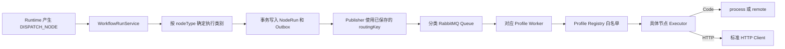

# AI Workflow Go Executor

如果你还不熟悉 RabbitMQ，可以先读 [MQ_GUIDE.md](./MQ_GUIDE.md)。这份文档会从 NestJS 和 Go 怎么通过 RabbitMQ 传递消息开始讲起，并说明 Ack、Nack、Reject、死信队列以及项目里的异常消息处理流程。

该应用是 RabbitMQ 单节点 Worker。它只执行 Protocol Command，不读取完整 Workflow，也不负责 DAG 调度。
Worker 支持 `legacy`、`compute`、`model`、`http` 和 `sandbox` Profile；未配置
`EXECUTOR_PROFILE` 时默认 `legacy`，继续使用原来的单队列和全量 Registry，保证已有本地与滚动部署
不受影响。

## 分级隔离改动的核心逻辑与阅读入口

这次改动不是把所有节点统一放进沙箱，而是让 Server 在派发节点时确定执行类别并把路由固化到
Outbox，再由 RabbitMQ 把 Command 交给对应 Profile 的 Go Worker。Worker 只消费自己的 Queue，Registry
也只注册该 Profile 允许的 Executor；Code 在 Sandbox Profile 中继续根据配置选择本地进程或远程强
沙箱边界。

这条链路有四个关键约束：

1. 路由只在创建 Command 时解析一次，`executionClass` 和 `routingKey` 与 Command 一起写入 Outbox；
   Publisher 重试只使用已保存的值，避免配置切换使同一 Command 漂移到不同 Worker。
2. Queue 隔离和 Registry 白名单同时生效。分类 Worker 收到错误节点时返回
   `EXECUTOR_PROFILE_MISMATCH`，不会回退到其他 Executor。
3. Result Exchange、Result Queue 和 Protocol v1 保持不变，因此 Server 原有结果处理、租约和幂等链路
   可以继续使用。
4. Server 路由、Go Profile 和 Code 后端默认都使用兼容模式；只有显式启用分类配置后才改变实际执行位置。

推荐按以下顺序阅读：

1. 先看[节点分级隔离实现方案](../../docs/node-execution-isolation-implementation.md)，理解五种执行类别、
   发布顺序和兼容边界。
2. 看 Server 的
   [`WorkflowExecutionRoutingService`](../server/src/infra/workflow-mq/workflow-execution-routing.service.ts)，
   理解 `nodeType` 到执行类别和 Routing Key 的映射；调用入口是
   [`WorkflowRunService.prepareDispatch()`](../server/src/services/workflow-run.service.ts)。
3. 看 [`WorkflowCommandOutbox`](../server/prisma/models/workflow-command-outbox.prisma)、
   [`WorkflowRunRepository`](../server/src/repositories/workflow-run.repository.ts) 和
   [`WorkflowOutboxPublisher`](../server/src/infra/workflow-mq/workflow-outbox.publisher.ts)，理解路由如何与
   Command 同事务持久化以及如何按固定 Routing Key 发布。
4. 看 Server 的
   [`workflow-mq.constants.ts`](../server/src/infra/workflow-mq/workflow-mq.constants.ts) 和 Go 的
   [`topology.go`](./internal/mq/topology.go)，理解分类 Queue、Routing Key 和 DLQ 的对应关系。
5. 看 [`profile.go`](./internal/executorprofile/profile.go)、
   [`register.go`](./internal/executors/register.go) 和 [`worker.go`](./internal/mq/worker.go)，理解 Worker
   如何选择 Queue、限制节点能力并拒绝错投节点。
6. 最后看 Code 的 [`runner.go`](./internal/executors/code/runner.go) 与
   [`remote_runner.go`](./internal/executors/code/remote_runner.go)，理解 Code 节点的额外执行边界。

如果只想先抓住主干，优先阅读 `WorkflowExecutionRoutingService`、`WorkflowOutboxPublisher` 和
`RegisterProfile`。这三个入口分别对应“决定去哪里”“按固定路由发布”和“Worker 实际允许执行什么”。

## Worker 执行与配置

处理顺序固定为：

1. 从当前 Profile 对应的持久队列手动消费 Command；
2. 使用 `workflow-protocol` JSON Schema 解码和校验消息；
3. 校验 `deadlineAt` 与 Server Command 租约，按 `nodeType` 从 Registry 解析 Executor；
4. 调用节点 Executor 并校验 Result；
5. 将 Result 持久发布到 `ai-workflow.result.v1`，收到 Publisher Confirm 后才 Ack Command。

Profile 与队列对应关系：

| Profile   | 节点                            | Command Queue                         |
| --------- | ------------------------------- | ------------------------------------- |
| `legacy`  | LLM、RAG、HTTP、Code、Condition | `ai-workflow.node.execute.v1`         |
| `compute` | Condition                       | `ai-workflow.node.execute.compute.v1` |
| `model`   | LLM、RAG                        | `ai-workflow.node.execute.model.v1`   |
| `http`    | HTTP                            | `ai-workflow.node.execute.http.v1`    |
| `sandbox` | Code                            | `ai-workflow.node.execute.sandbox.v1` |

非法 Command 会进入当前 Profile 的 Command DLQ；Result 失败时原 Command 会重新入队。Worker
断线后每 2 秒重连，RabbitMQ URL 通过 `RABBITMQ_URL` 配置，默认连接根目录 `compose.dev.yaml`
创建的开发 vhost。分类 Profile 收到不属于自己的节点时返回 `EXECUTOR_PROFILE_MISMATCH`，不会回退到
其他 Executor。

Command 租约地址通过 `COMMAND_RUNTIME_LEASE_URL` 配置，默认是
`http://127.0.0.1:3000/internal/executor/commands/lease`。Worker 消费前先检查，执行期间每 500ms
复查；Run 因前端 SSE 断开或主动暂停进入终态后，排队消息会直接 Ack 丢弃，执行中的 Command context
会被取消。租约服务暂时不可用时新命令不会盲目执行，而是重新入队等待。
`EXECUTOR_INTERNAL_AUTH_TOKEN` 可为租约和模型解析请求增加 Bearer Token；Server 未配置时保持现有
本地行为，生产环境应在两端配置相同且独立的内部令牌。
两端设置 `EXECUTOR_REQUIRE_INTERNAL_AUTH=true` 后，缺少令牌会在启动阶段直接失败，避免生产环境
静默运行在无认证模式。

Registry 不提供 fallback。`legacy` Profile 注册 `llm`、`rag`、`code`、`http`、`condition`；分类
Profile 只注册自己的节点。legacy 未注册节点返回 `NODE_EXECUTOR_NOT_REGISTERED`，分类 Profile 错投
返回 `EXECUTOR_PROFILE_MISMATCH`。每个目录自行实现 `NodeExecutor`、打印不含输入、配置或凭证的命令
身份并组装协议 Result。

LLM 已接入真实执行逻辑：`config.go` 对齐 Core 的模型引用、上下文、参数和异常处理契约；Provider Registry 动态注册 OpenAI、DeepSeek 与 Ollama 适配器。运行时只信任 `groupId` 和 `configuredModelId`，Go 使用当前 Command 的 NodeRun 身份与租约向 Server 解析真实模型、Base URL 和凭证，不使用 `modelId`、`providerType` 展示快照。API Key 不进入 RabbitMQ Command，也不会写入日志。节点只公开最终 `result`：优先使用供应商的最终回答；最终回答为空时，才把 OpenAI 兼容接口的 `reasoning_content` / `reasoning` / `thinking` 或 Ollama 的 `message.thinking` 归一为 `result` 兜底，不向前端单独暴露模型推理过程。

模型解析地址通过 `MODEL_RUNTIME_RESOLVER_URL` 配置，默认是 `http://127.0.0.1:3000/internal/executor/models/resolve`。该接口会返回本次调用需要的明文凭证，部署时只能暴露在 Server 与 Executor 的受控内部网络中，并应使用 TLS；不得经过公网网关、缓存或访问日志正文。

HTTP、Code 与 Condition 已接入真实执行逻辑。三者在进入业务逻辑前都会严格解析节点 Config；HTTP
和 Code 与 LLM 共用 Core 的 `none`、`default_value`、`error_branch` 异常处理语义，避免各节点分别
组装不一致的 Result。RAG 仍是最小实现。Server 对所有 Executor Result 统一按 Protocol 处理，不
识别临时实现标识，也不从版本快照改写或补齐输出。

HTTP Executor 支持 GET、POST、PUT、PATCH、DELETE、Headers、Query Params，以及 none、form-data、
x-www-form-urlencoded、JSON、raw 和 binary Body。Runtime 在派发前显式解析配置中的
`VariableValue`，Go 只接收静态 JSON。空 Key 行会被忽略；JSON 字符串 Body 必须是合法 JSON；
binary 接受字符串或 0 到 255 的数字数组。form-data 文件值可以直接使用字符串内容，也可以使用
`{ name, content, contentType?, encoding?: 'base64' }` 对象。请求使用节点连接超时与 Command
deadline 中较早到期者，响应体上限为 10 MiB；2xx 响应输出
`response.status / headers / data / durationMs`，JSON Content-Type 会自动解码。未显式配置
`Idempotency-Key` 时会使用 Protocol `idempotencyKey`，便于支持该 Header 的上游服务消除重复副作用。

Condition Executor 按配置顺序计算普通分支，AND 要求全部规则成立，OR 要求任一规则成立，首个命中
分支生效，其余情况进入最后的 ELSE。equals/not_equals 对 JSON 值做结构比较；contains 支持字符串
子串、数组元素和对象 Key；is_empty/is_not_empty 支持 null、字符串、数组和对象。

Code Executor 为每次执行创建独立临时目录和 Node.js 22+ ESM 子进程，源码可以使用静态或动态
`import`、`node:*`、原生 `fetch`、文件系统、网络、`worker_threads` 与 `child_process`；同步和
异步 `main(inputs)` 都统一通过 `await` 调用。`main` 必须返回可序列化 JSON 对象，对象字段直接
作为节点 outputs。Command context 到期或取消时会终止 Node 进程组，V8 Heap 限制为 64 MiB、
调用栈限制为 1 MiB，外层继续限制 256 KiB 源码和 4 MiB 输出。

Code 执行后端通过 `CODE_SANDBOX_BACKEND` 选择：

- `process`：默认兼容模式，复用上述 Node 子进程，不构成强安全边界；
- `remote`：把带 `commandId`、deadline、源码和输入的幂等任务发送给
  `CODE_SANDBOX_CONTROLLER_URL`，由独立 Sandbox Controller 执行。

`CODE_SANDBOX_REQUIRE_REMOTE=true` 会在配置不是 `remote` 时拒绝启动，用于防止生产环境静默降级。
Controller 可使用 `CODE_SANDBOX_CONTROLLER_TOKEN` Bearer Token 认证。仓库当前实现的是 Worker 侧
远程契约和结果/错误边界；真正的逐任务容器、gVisor 或 microVM 由部署的 Controller 提供。
生产还应设置 `CODE_SANDBOX_REQUIRE_TLS=true` 和 `CODE_SANDBOX_REQUIRE_AUTH=true`，避免 Controller
通信意外使用明文或无认证模式。
调用端已经覆盖的能力、当前默认行为以及尚未实现的 Controller 职责，见
[远程沙箱调用实现状态](../../docs/remote-sandbox-call-implementation-status.md)。

第三方包从 `CODE_NODE_MODULES_PATH` 指定的目录加载；未配置时，Executor 会从自身启动目录逐级
向上查找首个 `node_modules`。`CODE_NODE_BINARY` 可以覆盖默认的 `node` 命令。传给用户代码的
环境变量经过最小化处理，不包含 RabbitMQ、模型凭证等 Executor 私密配置。

完整 Node.js 能力意味着 Code 进程可以访问 Executor 容器内的文件、网络和进程 API，因此这里的
安全边界是专用 Executor 容器及其运行用户，而不是 Node 子进程本身。生产环境必须让 Executor
使用最小权限非 root 用户、只读根文件系统、独立临时目录、网络策略和容器级 CPU/内存/PID 限制，
不得与 Server 或数据库共享宿主文件系统和高权限凭证。

HTTP Executor 不对目标 URL 应用白名单或内网地址过滤，所有合法的 HTTP/HTTPS 地址都使用标准
HTTP Client 请求。生产环境如需限制目标网络，应在 HTTP Worker 的部署网络策略或独立出站网关中实现。

Start/End 仍由 TypeScript Runtime 本地推进，不产生无业务价值的 MQ 往返。
