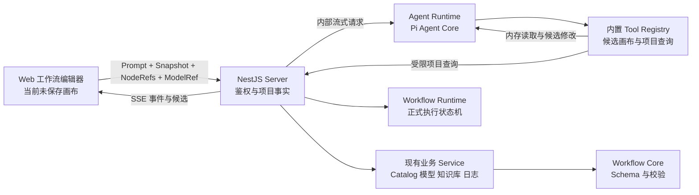

# AI Agent Runtime 设计方案

## 1. 文档状态

- 状态：实施中（详细进度见第 18 节）
- 基线日期：2026-10-08
- 适用范围：Web 工作流编辑器与 Assistant UI、Server 项目上下文、独立 Agent Runtime、Agent 内置 Tools
- 核心结论：新增独立应用 `apps/agent-runtime`，使用 `@earendil-works/pi-agent-core` 承载模型会话、
  Tool Loop、流式事件和取消；现有 `apps/server` 继续负责用户权限、模型凭证、项目数据与工作流校验。

本文中的 Agent Runtime 与现有 `@ai-workflow/runtime` 是两个不同组件：

- Agent Runtime 根据用户目标读取项目上下文，生成和修正候选工作流；
- `@ai-workflow/runtime` 执行已经发布或测试的工作流状态机，不接入 Pi，也不承担 Agent 会话。

第一阶段使用 `@earendil-works/pi-agent-core`，不使用带文件、Shell 和项目资源发现能力的
`@earendil-works/pi-coding-agent`，也不使用仍在快速演进的 `pi-durable`。当前 Pi Agent Core 1.1
要求 Node.js `>=22.19.0`，实施时需要把仓库和镜像的 Node.js 基线同步提升到该补丁版本。

## 2. 目标与非目标

### 2.1 目标

1. 用户从工作流画布打开 AI 面板，用自然语言创建或修改当前工作流。
2. Agent 可以通过内置 Tools 读取当前画布、节点目录、项目资源和工作流运行日志。
3. Agent 生成的候选定义必须经过现有 Core Schema、插件 Catalog 和工作流校验后才能返回给 Web。
4. Agent Runtime 作为独立 workspace 应用部署，Pi 依赖和会话生命周期不进入 Server、Web 或工作流执行包。
5. Agent 核心只依赖模型、Prompt、Tools 和事件输出，不直接依赖 NestJS、Prisma、React 或项目业务 Service。
6. Web 在应用候选前展示结果，并确保 Agent 运行期间产生的用户编辑不会被静默覆盖。
7. Web 使用 Assistant UI 展示完整的可审计执行轨迹，包括安全的思考摘要、每次 Tool 调用、状态、耗时和结果摘要。
8. 用户可以从输入框选择当前工作流节点作为上下文，也可以把画布当前选中的节点加入本轮对话。

### 2.2 第一阶段非目标

- 不让 Agent 直接保存草稿、发布应用、触发工作流、取消真实 Run 或修改模型和知识库。
- 不提供文件系统、Shell、MCP、自定义脚本和第三方 Agent Tool 插件。
- 不实现多 Agent、子 Agent、后台任务编排和跨进程恢复。
- 不引入第二套 Workflow、Node、Edge、变量或静态校验模型。
- 不用 Agent Runtime 替代 Go Executor、RabbitMQ 或 `@ai-workflow/runtime`。
- 不自动合并 Agent 候选与运行期间发生的用户画布修改。
- 不暴露模型隐藏的原始思维链；界面中的“思考”只表示模型明确返回的 reasoning summary 或 Runtime 生成的结构化进度摘要。
- 第一阶段不支持 Agent 运行中的 steering、消息排队或暂停后恢复；用户只能停止本轮，再发送下一条消息。

## 3. 总体架构



Agent Runtime 不连接 PostgreSQL、Redis、RabbitMQ 或对象存储。所有项目事实通过 Server 的受控内部接口
读取，因此 owner、app、插件安装和日志范围仍由现有业务服务统一判断。Runtime 也不接收用户 JWT；
Server 在用户鉴权后签发短期上下文令牌，把本次 Agent Run 固定到一个用户、一个应用和一组允许的 Tools。

## 4. 组件职责

| 组件             | 职责                                                                                                                    | 明确不负责                       |
| ---------------- | ----------------------------------------------------------------------------------------------------------------------- | -------------------------------- |
| Web              | 提交当前编辑器快照、Prompt、节点上下文和 Agent 模型引用；用 Assistant UI 展示消息、思考摘要与 Tool 轨迹；预览并应用候选 | 模型调用、权限判断、服务端校验   |
| Server           | 用户与应用鉴权、短期上下文令牌、模型配置解析、项目查询、工作流校验、SSE 代理和审计                                      | Pi 会话循环、Agent Prompt 推理   |
| Agent Runtime    | 创建 Pi Agent、维护短期会话、注册内置 Tools、执行 Tool Loop、归一化事件、取消和资源限制                                 | 数据库访问、真实工作流保存与执行 |
| Agent Protocol   | 定义 Server、Runtime 和 Web 共用的版本化请求、事件与内部 Tool 调用协议                                                  | 业务查询实现和 Pi 类型           |
| Workflow Core    | Workflow Schema、节点 Catalog、端口和保存／执行前校验                                                                   | Agent 会话、HTTP 和持久化        |
| Workflow Runtime | 执行已校验的不可变工作流版本                                                                                            | 生成或编辑工作流                 |

## 5. Workspace 规划

### 5.1 Agent Runtime 应用

新增 workspace 应用：

```text
apps/agent-runtime/
├── package.json
├── tsconfig.json
└── src/
    ├── main.ts
    ├── config.ts
    ├── http-server.ts
    ├── agent-runtime.ts
    ├── agent-session.ts
    ├── pi-model.ts
    ├── server-client.ts
    ├── tool-context.ts
    └── tools/
        ├── index.ts
        ├── canvas.ts
        ├── catalog.ts
        ├── project.ts
        └── workflow-runs.ts
```

只在真实实现超过单文件职责时继续拆目录。第一阶段不预建插件系统、Repository、Service 层或通用 DI
容器。

`agent-runtime.ts` 是 Pi 适配边界，只接收以下运行参数：

- 已解析的模型配置；
- System Prompt；
- `AgentTool[]`；
- 当前 Tool Context；
- 运行限制和事件接收函数。

它不能导入 `apps/server`、`apps/web` 或 Prisma。项目能力由 `server-client.ts` 和内置 Tool 在应用组合
入口注入。仓库内其他应用也不直接导入 Agent Runtime 源码，只通过 HTTP 协议通信。

### 5.2 Agent Protocol 包

新增 `packages/agent-protocol`，包名为 `@ai-workflow/agent-protocol`。该包只包含可序列化 Schema、
类型和事件判别联合，并同时提供 ESM 与 Node CommonJS 入口，避免 Server 和 Runtime 复制协议。

协议至少覆盖：

- Web 到 Server 的 Agent Turn 请求；
- Server 到 Runtime 的内部 Run 请求；
- Runtime 流式事件；
- Server 项目 Tool Gateway 的请求与响应；
- 节点上下文引用和可安全展示的 Tool 调用投影；
- 稳定错误结构 `{ code, message, details?, retryable }`。

协议不得导出 Pi、NestJS、Prisma、Express、React 或模型供应商 SDK 类型。跨版本结构使用显式
`protocolVersion: 1`。Assistant UI 的消息类型只在 Web 适配层使用，不能进入跨进程协议。新增该 package
时，应按项目规范同步登记 `$ai-workflow-packages` 技能引用。

## 6. Pi 接入方式

Runtime 直接使用 `@earendil-works/pi-agent-core` 的 `Agent`，并通过 `@earendil-works/pi-ai` 创建本次
会话所需模型。只引入 Agent Core，不创建 Coding Agent Session，因此不会自动加载当前目录、
`AGENTS.md`、Skills、Shell、文件读写或用户主目录配置。

第一阶段配置：

- Tool 执行统一使用 `sequential`，避免读取、校验和候选修改并发产生顺序歧义；
- 使用 `beforeToolCall` 复核 Tool 白名单和本次上下文授权；
- 使用 `afterToolCall` 记录名称、耗时和结果状态，但不记录完整参数、结果、Prompt 或模型凭证；
- 使用 AbortSignal 贯通模型请求、Server 查询和用户取消；
- 每个 Run 设置总时限、最大模型轮次和最大 Tool 调用数，达到限制后返回稳定错误；
- Runtime 只向 Web 转发归一化事件，不透传 Pi 内部对象；Tool 生命周期和安全的 reasoning summary
  分别归一化为稳定事件。

Server 从现有模型组中解析用户明确选择且已启用的 Chat 模型，并把本次所需的 provider、model ID、
Base URL 和临时使用的 API Key 通过内部请求交给 Runtime。该配置只保存在本次 Run 内存中，不能进入
Agent transcript、Tool Context、日志或响应。解析逻辑应从现有 `ExecutorModelService` 的私有实现中
提取为可复用的服务端模型解析能力，不能在 Runtime 读取数据库或复制凭证解密逻辑。

OpenAI、DeepSeek 和 Ollama 由 `pi-model.ts` 映射到 Pi AI 已支持的 API 实现。模型是否真正支持 Tool
Calling 仍取决于用户选择的具体模型；不支持时返回 `MODEL_TOOL_CALL_UNSUPPORTED`，不降级为解析自由文本
JSON。

## 7. Agent 会话与候选状态

第一阶段使用 Runtime 进程内会话，不新增 Prisma 表，也不接入 `pi-durable`：

- `sessionId` 对应一个 Pi Agent 和一份 Tool Context；
- 每次 Turn 开始前，用 Web 提交的最新 Snapshot 刷新画布基线；
- 会话设置空闲过期时间和数量上限，过期后释放 Agent、消息和模型凭证；
- Runtime 重启后会话丢失，Web 收到 `SESSION_NOT_FOUND` 后可以创建新会话；
- 第一阶段只部署一个 Runtime 实例，不承诺跨实例会话迁移。

Tool Context 保存两份状态：

```text
baselineSnapshot  用户发起本轮时的只读画布
workingCandidate  Agent 在内存中修改并已校验的候选定义
```

Agent 不直接修改浏览器画布。最终候选携带 `baseSnapshotHash`；Web 应用前重新计算当前快照 Hash：

- Hash 一致：建立一次编辑历史检查点，替换完整工作流定义并执行现有自动布局；
- Hash 不一致：提示画布已变化，保留候选供比较，但不自动覆盖或合并。

草稿数据库 `revision` 仍由现有保存接口处理。`baseSnapshotHash` 解决的是尚未保存的浏览器编辑冲突，
不能用数据库 revision 替代。

## 8. 第一阶段内置 Tools

所有 Tools 在 Runtime 启动时注册，模型不能动态创建 Tool。除候选画布外，第一阶段全部只读。

| Tool                        | 作用                                                                                      | 数据来源                          | 副作用       |
| --------------------------- | ----------------------------------------------------------------------------------------- | --------------------------------- | ------------ |
| `read_canvas`               | 读取本轮基线或当前候选；可用 `nodeIds` 聚焦指定节点及相邻连接，也可读取完整 Workflow 摘要 | Runtime Tool Context              | 无           |
| `list_node_types`           | 搜索当前应用可用的内置和插件节点，返回类型、名称和说明                                    | Server Catalog Gateway            | 无           |
| `get_node_type`             | 获取单个节点的初始配置、表单字段、变量区、固定输出和指定配置下的端口                      | Server Catalog Gateway            | 无           |
| `inspect_project_resources` | 按 `models`、`knowledge_bases`、`sub_workflows` 或 `app` 读取项目资源摘要                 | 现有 Server Service               | 无           |
| `list_workflow_runs`        | 按状态、触发方式、时间和搜索词读取最近运行记录                                            | `WorkflowRunService.listRuns`     | 无           |
| `get_workflow_run`          | 读取一个 Run 的输入、输出、错误、节点执行和 Trace                                         | `WorkflowRunService.getRunDetail` | 无           |
| `validate_workflow`         | 对候选执行结构校验、保存校验和可执行校验，返回结构化问题                                  | Core + `WorkflowCatalogResolver`  | 无           |
| `set_canvas_candidate`      | 校验完整候选定义，通过后替换内存中的 `workingCandidate`                                   | Runtime + Server 校验             | 只改内存候选 |

### 8.1 Catalog Tool 输出

Agent 不能从 React 组件或源代码猜测节点配置。Server 应从当前工作流插件锁对应的
`WorkflowServerCatalog` 投影可序列化描述：

- `type`、`label`、`description`；
- 初始 `config`、`inputs` 和 `outputs`；
- `form` 与 `variableForm` 元数据；
- 固定输出；
- 使用指定配置调用 `getNodePorts()` 得到的输入／输出端口；
- Catalog fingerprint 和插件来源摘要。

Tool 不返回 Zod 实例、函数、执行路由、插件制品路径或权限内部实现。候选的最终正确性仍以 Server
调用节点 Schema 和 Core 校验的结果为准。

### 8.2 项目资源 Tool 输出

`inspect_project_resources` 只返回生成工作流需要的公开元数据：

- Chat 模型：模型组 ID、配置模型 ID、显示名称、供应商和启用状态；
- 知识库：ID、名称、图标、描述、分段模式和当前可用状态；
- 子工作流：已发布应用及其公开输入／输出契约；
- 应用：ID、名称、描述和当前发布状态。

禁止返回 API Key、加密凭证、Secret 环境变量值、对象存储路径、插件 storage key 或其他用户资源。

### 8.3 工作流日志 Tool 输出

日志工具复用现有 owner 与 app 范围，不直接查询 Prisma。列表默认返回紧凑字段；只有
`get_workflow_run` 才读取完整 Trace。大字段需要限制长度并明确标记截断，避免单次 Tool Result 把
模型上下文占满。工作流定义中的 Secret 继续使用现有脱敏规则。

### 8.4 候选修改方式

第一阶段只接受完整 Workflow 定义，不设计 JSON Patch、节点级 CRUD Tool 或第二套简化 DSL。
`set_canvas_candidate` 必须按以下顺序处理：

1. `workflowSchema.safeParse()`；
2. 使用候选插件锁解析 `WorkflowServerCatalog`；
3. `validateWorkflow()`；
4. `validateExecutorWorkflow()`；
5. 全部通过后才替换 `workingCandidate`。

布局不交给模型生成。Runtime 返回 Workflow 定义，Web 保留仍存在节点的位置，对新增节点使用默认位置，
随后调用现有自动布局。这样不会让坐标数据消耗模型上下文，也避免模型生成非法 Loop 子节点位置。

## 9. Web AI 面板与 Assistant UI

### 9.1 接入方式

`apps/web` 增加 `@assistant-ui/react`，使用 Assistant UI 的 React Runtime 和可组合组件实现 AI 面板。
第一阶段不接入 Assistant Cloud，也不把 Assistant UI 引入 `packages/ui`；AI 对话是工作流编辑器的业务能力，
相关组件放在 `apps/web/src/features/workflow` 内。

Web 使用 `useLocalRuntime()` 和一个项目内 `ChatModelAdapter`：

1. Adapter 从 Assistant UI 的本轮用户消息中读取文本和节点上下文附件；
2. Adapter 连同当前 Snapshot、`baseSnapshotHash` 和模型引用请求 Server SSE；
3. Adapter 把协议事件累积转换为 Assistant UI 的 `reasoning`、`tool-call`、`text` 和自定义 data part；
4. `abortSignal` 同时关闭 SSE 并调用现有 Agent abort 接口；
5. `sessionId` 由面板适配层保存并在后续 Turn 复用，不写入用户消息正文。

选择 `LocalRuntime` 是因为当前 Web 没有独立的聊天 Store，而且第一阶段会话只需跟随 AI 面板生命周期。
不使用 Assistant Transport 或 External Store Runtime，也不把 Server 协议改造成 Assistant UI 私有协议。Pi 执行
Tools，Assistant UI 只管理 Web 端消息状态和渲染，不在浏览器重复执行同名 Tool。

`AssistantRuntimeProvider` 挂在工作流编辑器作用域，打开和关闭侧边面板只切换可见性，不销毁 Runtime，保证
本页内的完整轨迹可以继续查看。第一阶段刷新页面后不恢复 Web transcript；这与 Runtime 进程内 Session 的
非持久化边界保持一致。

面板使用 Assistant UI 的 `Thread`、`ComposerPrimitive`、`MessagePrimitive` 和 Reasoning 组件作为基础，复制到
仓库的 registry 组件只保留当前面板实际使用的部分，并适配现有 Tailwind Token 和 `@ai-workflow/ui` 组件。
AI 面板复用现有 `WorkflowAuxiliaryPanel` 的右侧浮动位置、`w-100` 宽度、圆角、边框、阴影和 Motion 进出
动画，新增 `ai-agent` 面板类型；它与运行历史、检查清单等辅助面板互斥，但仍可与节点配置面板并排显示。
窄视口无法容纳两块面板时暂时隐藏节点配置面板，关闭 AI 面板后恢复，不清除节点选择。

面板的最小布局如下：

```text
┌ AI 助手 ───── 正在读取画布 · 12s ┐
│ 用户消息 + 节点上下文             │
│ 思考摘要                          │
│ 读取画布   运行中／成功   1.2s    │
│ 校验工作流 成功          0.4s    │
│ 最终回答                          │
│ 工作流候选                 [应用] │
├──────────────────────────────────┤
│ [节点 A ×] [节点 B ×]            │
│ [+ 添加节点] [添加所选节点（2）]  │
│ 输入下一条消息…             [停止] │
└──────────────────────────────────┘
```

### 9.2 执行轨迹与消息部分

一个 Agent Turn 在同一条 assistant message 中按实际发生顺序展示思考摘要、Tool 调用和最终回答：

| Agent Protocol 事件                                          | Assistant UI 映射              | 展示行为                                         |
| ------------------------------------------------------------ | ------------------------------ | ------------------------------------------------ |
| `reasoning_started`、`reasoning_delta`、`reasoning_finished` | `reasoning` part               | 运行时展开并自动跟随，完成后可折叠，保留耗时     |
| `tool_queued`                                                | `tool-call` part               | 显示等待执行的 Tool、专属图标和安全参数投影      |
| `tool_started`                                               | `tool-call` part               | 立即显示 Tool 名称、专属图标、状态和安全参数投影 |
| `tool_progress`                                              | 更新同一 `tool-call` part      | 显示经过裁剪的进度文案或真实数值进度             |
| `tool_finished`                                              | 更新同一 `tool-call` part      | 显示成功、失败、取消、耗时和安全结果投影         |
| `assistant_delta`                                            | `text` part                    | 流式展示面向用户的最终说明                       |
| `candidate_ready`                                            | `data-workflow-candidate` part | 展示候选摘要、冲突状态和“应用到画布”操作         |
| `agent_cancelled`                                            | message `incomplete` status    | 保留部分内容并标记为用户停止                     |
| `agent_failed`                                               | message `incomplete` status    | 保留已完成轨迹，并在末尾显示稳定错误             |

这里的“完整执行轨迹”指所有 reasoning summary 与 Tool 生命周期都按顺序可见，不把多个 Tool 静默压缩成
一句“已处理”。Tool 展示只使用经过 Tool 专属投影和脱敏后的 `displayArgs`、`displayResult`；完整内部参数、
大段日志、Secret 和上下文令牌不进入浏览器。运行中的 Tool 默认展开，结束后收起详情但保留一行结果，用户
可以重新展开查看本次会话内的完整安全载荷。

原始隐式思维链不是协议能力，也不能通过日志或 Pi 内部事件旁路暴露。`reasoning_*` 只允许两类来源：

- 模型供应商明确返回、允许展示的 reasoning summary；
- Runtime 根据可观察状态生成的结构化进度，例如“正在读取画布”“正在校验候选工作流”。

如果当前模型不提供 reasoning summary，界面仍展示 Runtime 进度和完整 Tool 轨迹，不伪造模型思考内容。
相邻 `reasoning` part 使用 `MessagePrimitive.GroupedParts` 合并为一个折叠区；Tool 调用会打断分组并保留在原始
时间位置，因此 Tool 前后的思考摘要不会被错误重排。

### 9.3 Tool 专属展示与图标

Web 维护一个穷举的 `AgentToolPresentation` 映射，Key 为协议中的 Tool 名称，Value 为中文标题、Lucide 图标、
成功摘要格式和参数／结果渲染器。图标不由 Runtime 下发，避免任意 URL、跨端不一致和同一 Tool 在不同消息中
变化。第一阶段映射如下：

| Tool                        | 标题         | 图标           |
| --------------------------- | ------------ | -------------- |
| `read_canvas`               | 读取画布     | `Workflow`     |
| `list_node_types`           | 查询节点类型 | `ListTree`     |
| `get_node_type`             | 读取节点定义 | `Blocks`       |
| `inspect_project_resources` | 查询项目资源 | `Database`     |
| `list_workflow_runs`        | 查询运行记录 | `History`      |
| `get_workflow_run`          | 读取运行详情 | `ScrollText`   |
| `validate_workflow`         | 校验工作流   | `ShieldCheck`  |
| `set_canvas_candidate`      | 生成画布候选 | `WandSparkles` |

未知 Tool 使用 `Wrench` 回退并展示原始 Tool 名称，不能导致消息渲染失败。Tool Card 共用状态、耗时、折叠和
错误外壳，只为参数与结果内容提供小型专属 renderer，不为八个 Tool 复制完整卡片组件。
这些 renderer 通过 `MessagePrimitive.Parts` 的 tool-call 渲染覆盖接入，不在 Web 注册可执行 Tool，避免
Assistant UI 对 Runtime 已执行的 Tool 再调用一次。

### 9.4 输入框节点上下文

节点上下文使用 Assistant UI 的自定义外部附件能力，附件类型定义为 `workflow-node`。它不是文件上传，也不把
节点完整配置序列化进输入文本；附件只保存稳定引用：

```ts
interface WorkflowNodeContextRef {
  nodeId: string
  nodeType: string
  label: string
}
```

Composer 提供两个入口：

1. “添加节点”打开当前画布节点选择器，支持按节点名称和类型搜索并多选；
2. 画布存在选中节点时，显示“添加所选节点（N）”，一次加入当前选择。

加入后的节点使用 `ComposerPrimitive.Attachments` 显示在输入框上方，可单独移除。节点 Chip 复用
`@ai-workflow/nodes-ui` 的 `NodeIconBadge`，因此内置节点、插件节点和图标失败回退与画布保持一致。相同
`nodeId` 自动去重，第一阶段最多添加 20 个节点，避免一次 Turn 注入整张大型画布。选择器只列出 Snapshot 中
可持久化的业务节点，不展示 Loop 容器内部仅用于画布交互的系统节点。

当前 `useWorkflowEditor()` 已维护 `selectedNodeIds`，实施时只需向编辑器组件暴露只读的 `selectedNodes`，不再
创建第二份画布选择状态。“添加所选节点”只复制点击当时的引用；之后画布选择变化不会悄悄改变已加入的对话
上下文。节点在发送前被删除时，Web 移除失效附件并给出提示。

发送请求时，Adapter 把附件转换为独立的 `contextNodeIds` 字段。Server 必须确认每个 ID 都存在于同一请求的
Snapshot，去重并执行数量限制；Runtime 把这些 ID 记录为本轮 `focusedNodeIds`。Agent 可调用
`read_canvas({ nodeIds: focusedNodeIds })` 读取节点配置及相邻边，不能信任附件中的 `label` 或 `nodeType` 作为
项目事实。

### 9.5 Agent 运行状态机

Web 只维护一套可判别的 Run 状态，不用多个 `loading` Boolean 拼接。消息 Part 状态由 Assistant UI 管理，
面板级状态用于标题、Composer、画布工具栏入口和错误恢复：

| 状态        | 进入条件                                | 面板主要反馈                                  | 可用操作                       |
| ----------- | --------------------------------------- | --------------------------------------------- | ------------------------------ |
| `idle`      | 尚未发送或上一轮已结束                  | 标题不显示运行状态，Composer 可发送           | 选择模型、节点和发送           |
| `starting`  | 用户提交后、收到 `session_started` 前   | 立即插入 assistant 占位，显示“正在准备上下文” | 停止                           |
| `running`   | 收到 `session_started`                  | 标题显示当前阶段和累计耗时，轨迹持续追加      | 停止、关闭面板、编辑下一条草稿 |
| `stopping`  | 用户点击停止后、终止事件前              | 显示“正在停止”，停止按钮禁用，保留已产生内容  | 关闭面板                       |
| `completed` | 收到 `agent_finished`                   | 固化耗时和完整轨迹，展示最终回答及可选候选    | 继续对话、应用候选             |
| `cancelled` | 收到 `agent_cancelled`                  | 消息标记“已停止”，保留部分回答和 Tool 结果    | 继续对话、重新发送             |
| `timed_out` | 收到 `agent_failed(code=AGENT_TIMEOUT)` | 标记“运行超时”，保留完整已执行轨迹            | 使用当前画布重试               |
| `failed`    | 收到 `agent_failed` 或流异常结束        | 当前消息保留并显示内联错误与恢复操作          | 重试、更换模型、继续对话       |

`running` 下的当前阶段由最近事件派生，不另建后端状态：

- 尚无模型输出：`正在分析请求`；
- reasoning 流式输出：`正在思考`；
- Tool 执行：使用 Tool 展示名，例如 `正在读取画布`；
- Tool 全部结束且模型继续输出：`正在整理结果`；
- 候选已经生成但最终说明未结束：`正在完成校验`。

界面只展示真实阶段和累计耗时，不显示无法准确计算的百分比、剩余时间或无限循环的步骤文案。所有终态都把
Composer 恢复为可发送状态；终态保留在消息上，面板级状态随后可以回到 `idle`，避免上一轮成功状态阻塞下一轮。
单个 Tool 失败不直接把整轮切到 `failed`，因为 Agent 可能改用其他 Tool 恢复；只有 `agent_failed` 才结束整轮。
同理，`candidate_ready` 只表示候选可展示，收到 `agent_finished` 前仍保持 `running`。

### 9.6 运行中的界面行为

#### 面板标题与画布入口

- 标题保持“AI 助手”，右侧紧凑显示当前阶段和秒级累计耗时；模型选择器运行时禁用，防止一轮中途切换模型。
- 关闭面板只隐藏 UI，不停止 Agent。`AssistantRuntimeProvider` 仍在编辑器作用域，重新打开后继续显示同一轨迹。
- 离开工作流路由或编辑器卸载时主动中止当前 Run；第一阶段没有流恢复能力，不能让用户以为后台仍会可靠完成。
- 底部 AI 入口继续放在现有 `WorkflowToolbarGroup` 中，但按钮改用与撤销／重做一致的 Ghost 语言，避免当前
  `outline` 按钮在已有边框组内形成双层轮廓，并复用 `ToolbarTooltip`。
- AI 入口空闲时显示 `Bot`；运行时显示 `LoaderCircle`；面板关闭后完成显示 success 小圆点，失败显示
  destructive 小圆点，用户重新打开面板后清除未读标记。按钮同步更新 `aria-label`、`aria-pressed` 和
  `aria-busy`，不能只靠颜色或动画表达状态。

#### Composer

- 提交后清空已发送文本和节点附件，并把它们固化在用户消息中；后续画布选择变化不能修改已发送上下文。
- Agent 运行时输入框仍可编辑下一条草稿，但第一阶段不启用消息队列，因此不能发送第二条消息。
- Send 位置在运行时替换为明确的“停止”按钮和 `Square` 图标；停止不可恢复，因此不用“暂停”文案。
- 点击停止后立即进入 `stopping`，阻止重复请求。终止确认后按钮恢复为发送，用户未发送的下一条草稿保留。
- 添加节点和移除草稿附件在运行时仍可用，它们只属于下一条消息；已发送消息中的节点 Chip 为只读。

#### 画布与候选冲突

- Agent 运行时不锁定画布，用户仍可查看和编辑节点。
- Web 持续比较当前 Snapshot Hash 与本轮 `baseSnapshotHash`。首次出现差异时，在消息轨迹上方显示一次弱警告：
  “画布已在 Agent 运行期间发生变化，候选完成后需要重新确认”。
- Hash 不一致时，候选卡片禁用“应用到画布”，主操作改为“基于当前画布重新生成”；不能把冲突只放在点击
  应用后的 Toast 中。

### 9.7 Reasoning 与 Tool 微状态

Reasoning 区域的运行态使用文字 shimmer 或轻量状态点，完成后停止动画并显示实际耗时。Tool Card 支持以下
状态，且每个状态同时使用图标、文字和语义色：

| Tool 状态   | 视觉与交互                                                         |
| ----------- | ------------------------------------------------------------------ |
| `queued`    | 弱化 Clock 图标和“等待执行”，用于同一模型响应声明的后续串行 Tool   |
| `running`   | primary Loader、当前动作和实时耗时，默认展开安全参数摘要           |
| `progress`  | 在同一卡片内更新安全进度文案；只有 Tool 提供真实数值时才显示进度条 |
| `succeeded` | success Check、固化耗时和一行结果摘要，详情默认收起但可重新展开    |
| `failed`    | destructive CircleX，默认展开错误和可恢复建议，不自动折叠          |
| `cancelled` | muted Ban 和“已停止”，保留终止前已经返回的安全结果                 |

Pi 的 `toolcall_end` 归一化为 `tool_queued`，`tool_execution_start/update/end` 分别归一化为
`tool_started`、`tool_progress` 和 `tool_finished`。这样串行 Tool 不会在等待期间从界面消失。

耗时由事件携带的时间戳计算。Web 使用一个共享时钟更新当前 reasoning 和 Tool 的耗时，不为每张卡片创建独立
定时器。运行超过 10 秒只把文案改为“仍在处理中 · 10s”，不增加虚假进度；接近服务端总超时时也不猜测剩余
时间。

### 9.8 滚动、焦点与无障碍

- 用户位于消息底部时才自动跟随流式内容；用户向上查看历史后停止自动滚动，并显示“回到最新”浮动按钮。
- Agent 完成、失败或 Tool 状态变化时不抢走画布和输入框焦点。面板首次打开且当前空闲时才聚焦 Composer。
- `aria-live="polite"` 只播报“开始运行”“开始／完成 Tool”“运行完成／失败／已停止”等离散状态，不逐 Token
  播报 text 或 reasoning delta。
- 面板根节点使用 `aria-busy` 表达活跃 Run；Tool 详情按钮使用 `aria-expanded` 与 `aria-controls`；停止按钮提供
  明确名称。
- Esc 沿用编辑器既有层级关闭 AI 辅助面板，但不会停止 Agent。停止必须由显式按钮触发。
- spinner、shimmer、自动滚动和展开动画遵循 reduced motion；关闭动画时仍保留静态状态图标和文字。
- 状态色只使用现有 `primary`、`success`、`warning`、`destructive` 和 `muted` 语义 Token，不增加硬编码颜色、
  `ring-*` 或外扩焦点阴影。

### 9.9 完成、失败与恢复

候选卡片区分四种终态：

- `ready`：校验通过且 Hash 一致，使用 Confirm 主按钮“应用到画布”；
- `conflicted`：画布已变化，显示 warning 说明并只提供“基于当前画布重新生成”；
- `applied`：显示“已应用到画布，可使用撤销恢复”，禁止重复应用；
- `no_changes`：Agent 判断无需修改时只显示说明，不渲染空候选卡片。

错误不以 Toast 作为唯一载体，而是在失败消息末尾显示错误原因和就地操作。第一阶段至少区分：

| 错误                    | 用户文案                            | 恢复操作                         |
| ----------------------- | ----------------------------------- | -------------------------------- |
| 模型不支持 Tool Calling | 所选模型不支持 Agent 工具调用       | 更换模型                         |
| 请求限流                | 请求过于频繁，请稍后重试            | 服务端允许后重试                 |
| Agent 超时              | Agent 运行超时，已保留当前执行记录  | 使用当前画布重试                 |
| Session 失效            | Agent 会话已失效                    | 新建会话并重新发送               |
| SSE／网络中断           | 连接已中断，本轮未完成              | 使用当前画布重试                 |
| Tool 失败               | 在对应 Tool Card 中显示具体安全错误 | Agent 可恢复时继续，否则重试整轮 |

“重试”复用原 Prompt 和节点引用，但必须重新获取当前 Snapshot 与 Hash，不能重放旧画布快照。面板隐藏时完成
或失败，可以额外显示一次 Toast 提醒；面板可见时只使用消息内状态，避免重复通知。

## 10. 请求与事件流程

### 10.1 Web 入口

新增受 JWT 保护的 Server 接口：

```text
POST /studio/apps/:appId/agent/runs
POST /studio/apps/:appId/agent/sessions/:sessionId/abort
```

创建 Run 的请求包含：

- 可选 `sessionId`；
- 用户 Prompt；
- `contextNodeIds`，来自本轮节点上下文附件；
- `groupId + configuredModelId`；
- 当前 `WorkflowEditorSnapshot`；
- `baseSnapshotHash`。

Server 必须校验应用归属、Workflow ID、模型归属和快照基本结构，再调用内部 Runtime。Web 不直接访问
Agent Runtime。

### 10.2 内部 Runtime 入口

Agent Runtime 只在内部网络暴露：

```text
POST /internal/runs
POST /internal/sessions/:sessionId/abort
GET  /health
```

Server 与 Runtime 使用独立的 `AGENT_RUNTIME_INTERNAL_AUTH_TOKEN` 相互认证。Server 额外签发短期
`agentContextToken`，固定 `ownerId`、`appId`、`agentRunId`、允许的 Tool 名称和过期时间。Runtime 调用
项目 Tool Gateway 时只能原样转交该 Token，不能自行指定其他 owner 或 app。

### 10.3 Server 项目 Tool Gateway

新增内部入口：

```text
POST /internal/agent/tools/execute
```

请求使用 `tool` 判别联合，Server 为每种 Tool 输入执行独立 Schema 校验，再调用现有 Service。
该 Controller 只负责内部鉴权和协议转换，业务查询、Catalog 解析和 Workflow 校验仍在 Service 层。

### 10.4 SSE 事件

Server 向 Web 代理以下稳定事件：

| 事件                 | 关键字段                                                           |
| -------------------- | ------------------------------------------------------------------ |
| `session_started`    | `sessionId`、`agentRunId`                                          |
| `reasoning_started`  | `reasoningId`、`source`、`startedAt`                               |
| `reasoning_delta`    | `reasoningId`、`delta`                                             |
| `reasoning_finished` | `reasoningId`、`completedAt`                                       |
| `assistant_delta`    | `delta`                                                            |
| `tool_queued`        | `toolCallId`、`toolName`、`displayArgs`、`queuedAt`                |
| `tool_started`       | `toolCallId`、`toolName`、`displayArgs`、`startedAt`               |
| `tool_progress`      | `toolCallId`、安全 `message`、可选真实 `completed`／`total`        |
| `tool_finished`      | `toolCallId`、`toolName`、`status`、`displayResult`、`completedAt` |
| `candidate_ready`    | `baseSnapshotHash`、完整候选 Workflow                              |
| `agent_finished`     | 最终说明、使用量摘要                                               |
| `agent_cancelled`    | `agentRunId`、`cancelledAt`、`reason`                              |
| `agent_failed`       | 稳定错误结构                                                       |

事件不返回隐藏的原始思维链、内部 Tool 参数、未裁剪 Tool Result、上下文令牌或模型凭证。
`displayArgs` 和 `displayResult` 必须由每个 Tool 的显式投影函数产生，默认拒绝透传未知字段。

## 11. 安全与可靠性

### 11.1 数据权限

- 所有项目查询必须同时校验上下文令牌、owner 和 app，不信任 Runtime 提交的资源 ID。
- 节点上下文 ID 必须存在于本轮提交且已通过结构校验的 Snapshot，不能用于读取其他草稿或应用。
- Agent 看到的画布始终保持 Secret 掩码；Server 不为 Agent 恢复真实环境变量密钥。
- Runtime 不挂载 Server 日志、插件产物、知识库原文或 Docker Socket。
- Runtime 使用只读根文件系统和临时目录，不注册文件与 Shell Tool。

### 11.2 防止误写

- `set_canvas_candidate` 只修改 Runtime 内存。
- Web 明确确认后才应用候选；应用后沿用现有 dirty、undo 和草稿 revision 保存流程。
- Agent 运行失败、超时、取消或候选校验失败时，当前画布保持不变。
- 第一阶段不提供 save、publish、test-run、delete 或 credential Tool。

### 11.3 资源限制

- Prompt、Snapshot、Tool 输入和 Tool 输出均设置大小限制；
- 日志列表限制条数，Run 详情对大输入和输出做可识别截断；
- 每个用户和应用限制并发 Agent Run；
- 客户端取消或 SSE 断开时，由 Server 中止内部请求，Runtime 调用 `Agent.abort()`；
- 会话过期或 Runtime 关闭时必须释放监听器和模型凭证引用。

## 12. 部署变化

统一应用镜像增加 Agent Runtime 构建产物和 `agent-runtime` 启动命令。生产 Compose 新增只在内部网络
暴露端口的服务：

```text
agent-runtime
├── read_only: true
├── tmpfs: /tmp
├── cap_drop: ALL
├── no-new-privileges: true
├── healthcheck: /health
└── 不挂载数据库、Server 文件或用户目录
```

需要新增的稳定配置：

| 配置                                | 所属组件        | 作用                          |
| ----------------------------------- | --------------- | ----------------------------- |
| `AGENT_RUNTIME_URL`                 | Server          | Agent Runtime 内部地址        |
| `AGENT_RUNTIME_INTERNAL_AUTH_TOKEN` | Server、Runtime | 服务间认证                    |
| `AI_WORKFLOW_SERVER_URL`            | Runtime         | Server 内部 Tool Gateway 地址 |
| `AGENT_RUN_TIMEOUT_MS`              | Runtime         | 单次 Run 总时限               |
| `AGENT_SESSION_IDLE_TTL_MS`         | Runtime         | 内存会话空闲回收时间          |

模型 API Key 不作为 Runtime 环境变量，也不写入 secrets volume；它由 Server 针对单次 Run 解析后通过
受控内部请求传递。

## 13. 代码影响范围

| 范围                        | 预计改动                                                                                                              |
| --------------------------- | --------------------------------------------------------------------------------------------------------------------- |
| `apps/agent-runtime`        | 新增独立 ESM Node 应用、Pi 适配、会话、Tools、Server Client 和 HTTP/SSE 入口                                          |
| `packages/agent-protocol`   | 新增版本化请求、节点上下文、reasoning／Tool 事件、Tool Gateway 和错误 Schema                                          |
| `apps/server`               | 新增 Agent 管理与内部 Gateway 模块；复用现有 Catalog、模型、知识库和 Run Service；提取通用模型解析能力                |
| `apps/web`                  | 接入 Assistant UI、AI 面板、Run 状态机、SSE Adapter、执行轨迹、节点上下文附件、候选预览、Snapshot Hash 和安全应用候选 |
| `packages/workflow-core`    | 只复用公开 Schema、Catalog、端口和校验；预计不修改领域模型                                                            |
| `packages/workflow-runtime` | 无改动                                                                                                                |
| 根工程与部署                | Node 基线、Web 与 Runtime 依赖、workspace 脚本、Dockerfile、入口脚本、Compose 和 secrets 初始化                       |
| `.agents/skills`            | 新增 Agent Runtime 路由说明，并同步 Web、Server 与 Agent Protocol 的稳定边界                                          |

现有 `replaceCanvas()` 只覆盖部分 Workflow 顶层字段，Agent 候选接入时不能直接沿用该不完整语义。
Web 应增加一个明确的 Agent 候选应用入口，一次性处理 `nodes`、`edges`、`outputs`、
`environmentVariables` 和 `plugins`，保留合法旧位置后再自动布局，并建立单个 Undo 检查点。

## 14. 实施顺序

### 阶段一 Agent Runtime 骨架

1. 新增 Agent Protocol 和 `apps/agent-runtime`。
2. 接入 Pi Agent Core、Pi AI、自定义模型映射、reasoning／Tool 流式事件、取消和运行限制。
3. 实现进程内 Session 与空 Tool Registry，完成 Server 到 Runtime 的内部流式调用。

### 阶段二 Server 上下文与内置 Tools

1. 新增短期上下文令牌和内部 Tool Gateway。
2. 接入 Catalog、项目资源、Workflow Run 和校验 Tools。
3. 实现 `read_canvas` 与 `set_canvas_candidate` 的内存候选闭环。
4. 完成 Tool 审计、`displayArgs`／`displayResult` 安全投影、大小限制和稳定错误。

### 阶段三 Web AI 面板

1. 让现有 AI 按钮打开 Assistant UI 面板并选择已启用 Chat 模型。
2. 实现面板级 Run 状态机和 LocalRuntime Adapter，把 SSE 映射为 reasoning、tool-call、text 和候选 data part。
3. 完成 AI 入口、标题、Composer、停止、未读结果和面板隐藏后的持续运行状态。
4. 为每个内置 Tool 配置专属标题、图标、安全内容 renderer 和 queued／progress／终态展示。
5. 实现节点选择器、画布所选节点入口和 `workflow-node` Composer 附件。
6. 实现流式自动跟随、回到最新、焦点管理、离散状态播报和 reduced motion。
7. 展示候选摘要，检查 `baseSnapshotHash` 后应用并自动布局。
8. 支持取消当前 Run、内联错误恢复和会话失效后的重建。

### 阶段四 部署与收口

1. 把 Runtime 加入统一镜像、入口脚本和 Compose。
2. 增加健康检查、只读文件系统、内部认证和资源上限。
3. 更新根 `AGENTS.md` 技能路由和相关技能文档。

## 15. 完成标准

- Pi 依赖只存在于 `apps/agent-runtime`，Server 和 Web 不导入 Pi。
- Runtime 不访问数据库、Redis、RabbitMQ、对象存储或用户文件系统。
- Agent 可以读取当前未保存画布、当前 Catalog、项目资源和当前应用工作流日志。
- Agent 只能返回通过 Server 完整校验的候选 Workflow。
- 每次 reasoning summary 和 Tool 调用都按执行顺序呈现；失败或取消时已产生的轨迹不会丢失。
- 每个内置 Tool 使用稳定且不同的图标，未知 Tool 有一致的回退展示。
- 输入框可以选择任意当前画布节点，也可以加入画布当前多选节点；发送后 Agent 能按 ID 读取对应上下文。
- `starting`、`running`、`stopping`、`completed`、`cancelled`、`timed_out` 和 `failed` 都有明确文案、图标和可用操作。
- 关闭 AI 面板不会误停 Agent；面板隐藏时底部入口仍能表达运行中、未读完成或失败状态。
- 用户向上阅读轨迹时流式更新不会抢滚动位置，键盘和读屏软件能获知离散状态变化。
- Agent 失败、取消、超时或 Web 画布已变化时，不会覆盖当前画布。
- Web 应用候选后可以正常撤销，并沿用现有 revision 保存冲突处理。
- Tool 与事件日志不包含 Secret、API Key、上下文令牌、隐藏的原始思维链或完整敏感载荷。
- 当前 `@ai-workflow/runtime`、Go Executor 和工作流执行协议行为保持不变。

## 16. 后续升级条件

只有出现以下真实需求时再扩展：

- Runtime 重启后必须恢复会话或执行中的 Tool：评估稳定后的 `pi-durable`；
- 需要多实例 Agent Runtime：增加外部 Session Store 与实例无关的取消协调；
- 大型工作流完整定义频繁占满上下文：增加受校验的节点级候选操作，而不是通用 JSON Patch；
- 需要 Agent 自动测试或发布：为每个写操作单独设计审批、幂等和权限 Tool；
- 有第二类宿主需要复用 Agent Core：再从应用中提取通用 package，不提前抽象。

## 17. 参考资料

- [Pi Agent Core](https://github.com/earendil-works/pi/blob/main/packages/agent/README.md)
- [Pi SDK](https://pi.dev/docs/latest/sdk)
- [Pi Custom Providers](https://pi.dev/docs/latest/custom-provider)
- [Pi Durable](https://github.com/earendil-works/pi/blob/main/packages/durable/README.md)
- [Assistant UI React 文档](https://www.assistant-ui.com/docs)
- [Assistant UI LocalRuntime](https://www.assistant-ui.com/docs/runtimes/custom/local-runtime)
- [Assistant UI Reasoning](https://www.assistant-ui.com/elements/reasoning)
- [Assistant UI Tool UI](https://www.assistant-ui.com/docs/tools/tool-ui)
- [Assistant UI Attachments](https://www.assistant-ui.com/docs/guides/attachments)
- [工作流 Core 规范](../.agents/skills/ai-workflow-packages/references/workflow-core.md)
- [工作流 Runtime 规范](../.agents/skills/ai-workflow-packages/references/workflow-runtime.md)
- [Server 数据与工作流规范](../.agents/skills/app-server/references/data-and-workflow.md)

## 18. 实施进度

按第 14 节顺序推进；每一步记录实现范围、验证结果和剩余事项。状态分为待开始、进行中、已完成。

| 步骤                                | 状态   | 实现与验证记录                                                         |
| ----------------------------------- | ------ | ---------------------------------------------------------------------- |
| 1.1 Protocol 与 Runtime workspace   | 进行中 | 2026-10-08：读取设计与项目约束，核对现有公开入口、模型解析和部署结构。 |
| 1.2 Pi 模型、事件、取消与限制       | 待开始 |                                                                        |
| 1.3 Session 与 Server 流式调用      | 待开始 |                                                                        |
| 2.1 上下文令牌与 Gateway            | 待开始 |                                                                        |
| 2.2 Catalog、资源、日志与校验 Tools | 待开始 |                                                                        |
| 2.3 内存画布候选闭环                | 待开始 |                                                                        |
| 2.4 审计、安全投影与边界限制        | 待开始 |                                                                        |
| 3.1 Assistant UI 面板与模型选择     | 待开始 |                                                                        |
| 3.2 状态机与 SSE Adapter            | 待开始 |                                                                        |
| 3.3 入口、Composer、停止与未读状态  | 待开始 |                                                                        |
| 3.4 Tool 轨迹与状态展示             | 待开始 |                                                                        |
| 3.5 节点上下文附件                  | 待开始 |                                                                        |
| 3.6 滚动、焦点与无障碍              | 待开始 |                                                                        |
| 3.7 候选冲突检查与应用              | 待开始 |                                                                        |
| 3.8 取消、错误恢复与 Session 重建   | 待开始 |                                                                        |
| 4.1 镜像、入口与 Compose            | 待开始 |                                                                        |
| 4.2 健康检查、认证与资源上限        | 待开始 |                                                                        |
| 4.3 项目技能同步                    | 待开始 |                                                                        |

命令约束：不执行 dev、build 或 git 命令，不新增测试文件。验证使用类型检查、Lint 和临时断言自检；实际模型与生产部署联调单独记录。
