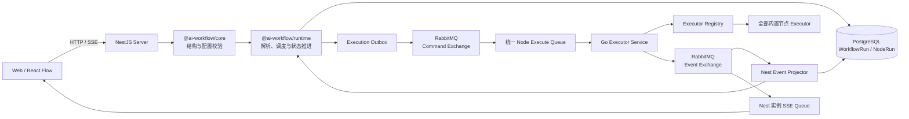
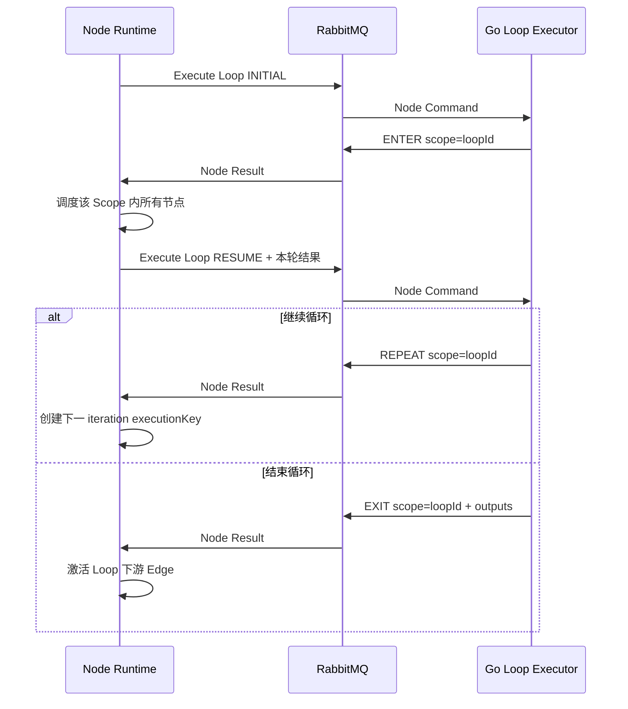
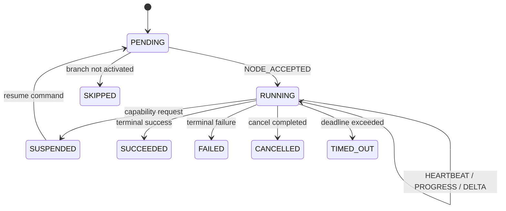

# Go 节点执行器架构设计

> 状态：目标架构设计，尚未实施。
>
> 更新日期：2026-08-01。
>
> 本文约束工作流执行链路的目标边界。当前仓库中的 `@ai-workflow/runtime`、RabbitMQ、Go
> Executor、运行接口和事件投影尚未完成；实施后需要按真实代码同步更新
> `.agents/skills/app-server` 与 `.agents/skills/ai-workflow-packages`。

## 1. 背景

当前仓库已经具备以下基础：

- `@ai-workflow/core` 定义工作流、节点、端口、变量、节点配置 Schema 和运行前校验。
- PostgreSQL 和 Prisma 已定义 `WorkflowVersion`、`WorkflowRun` 与 `WorkflowNodeRun`。
- NestJS 已接入 Prisma、Redis、认证、模型配置与知识库基础能力。
- `@ai-workflow/runtime` 仍未形成可用的工作流执行 API。
- Web 已具备测试运行和单节点运行的交互入口，但服务端执行链路尚未接入。

本次升级要求：

1. Node.js Runtime 继续负责工作流解析、依赖调度和运行状态推进。
2. 所有核心内置节点的 Executor 全部由 Go 实现。
3. Node.js 中不保留 Start、Condition、Loop 等节点的第二份执行逻辑。
4. 所有节点通过同一套执行协议和同一条任务队列进入 Go，不按节点类型拆分执行链路。
5. 工作流执行消息使用 RabbitMQ，不使用 Redis Streams。
6. PostgreSQL 继续作为工作流定义和运行状态的唯一事实来源。

## 2. 设计目标

### 2.1 核心目标

- 所有内置节点只有一份 Executor 行为实现，统一位于 Go 服务。
- Runtime 调度循环不使用 `switch (node.type)` 硬编码节点行为。
- Go 只执行单个节点，不加载、解析或调度完整 Workflow。
- 节点执行支持可靠投递、幂等、租约、重试、取消、超时和崩溃恢复。
- 工作流状态可以在 NestJS 或 Go 实例重启后继续恢复。
- 前端可以通过 SSE 接收节点状态和流式输出，并在断线后恢复。
- 节点类型和执行协议具备独立版本，已发布 Workflow 不被未来实现静默改变语义。

### 2.2 非目标

- 本阶段不把完整工作流调度器迁移到 Go。
- Go Executor 不直接读写 Prisma 业务表。
- RabbitMQ 不保存工作流最终状态，不替代 PostgreSQL。
- 不使用 RabbitMQ Direct Reply-to 实现易失的同步 RPC。
- 不承诺任意外部副作用的严格 Exactly Once；系统提供 At Least Once 与幂等能力。
- 不在本阶段引入 LangGraph 作为核心状态机。

## 3. 架构结论

目标架构采用：

> Node.js Runtime 负责“何时执行哪个节点”；Go Executor 负责“节点具体如何执行”；RabbitMQ
> 负责可靠传输；PostgreSQL 负责持久化事实状态。



## 4. 模块职责

### 4.1 `@ai-workflow/core`

Core 继续提供与运行环境无关的领域契约：

- Workflow、WorkflowNode、WorkflowEdge 和 Workflow Output Schema。
- 节点类型、节点配置 Zod Schema、静态或动态端口。
- 节点输入、输出、系统变量和环境变量引用。
- `validateWorkflow()` 与 `validateExecutorWorkflow()`。
- 编辑期配置迁移与规范化。
- 节点展示和配置表单所需的无 React 元数据。

Core 不包含 Go Client、RabbitMQ、Prisma、NestJS 或 Executor 实现。

### 4.2 `@ai-workflow/runtime`

Runtime 是与 NestJS 和 RabbitMQ 实现解耦的确定性状态机，负责：

1. 接收已经通过 Core 执行前校验的 Workflow。
2. 编译节点、Edge、端口、依赖关系和嵌套作用域。
3. 维护节点 Ready、Pending、Running 和 Terminal 状态。
4. 解析直接值、节点输出引用、系统变量和环境变量。
5. 为每次逻辑执行生成稳定 `executionKey`。
6. 通过抽象 `NodeCommandPort` 提交节点命令。
7. 消费统一的 Node Event，并根据通用 Result/Directive 推进状态。
8. 处理业务重试、租约失效、取消、超时和恢复。
9. 根据 `Workflow.outputs[].value` 解析最终输出。

Runtime 不实现任何内置节点的业务行为。调度循环禁止出现：

```ts
switch (node.type) {
  case 'condition':
  case 'loop':
  case 'llm':
}
```

Runtime 可以理解以下通用概念，但不能理解具体节点行为：

- 依赖是否满足。
- 哪些 Source Handle 被激活。
- 进入、重复或退出哪个 Scope。
- 是否需要调用平台能力并挂起当前节点。
- 节点成功、失败、取消或超时。

### 4.3 NestJS Server

NestJS 是工作流控制面和 Runtime 宿主，负责：

- HTTP API、鉴权、租户隔离和参数校验。
- WorkflowDraft、WorkflowVersion、WorkflowDeployment 生命周期。
- 创建和查询 WorkflowRun、WorkflowNodeRun。
- 执行前再次使用 Core 做结构与业务校验。
- 托管 `@ai-workflow/runtime`。
- Prisma 事务、Execution Outbox 和 Execution Inbox。
- RabbitMQ Command Publisher 与 Event Projector。
- SSE Gateway、事件回放和运行快照。
- 模型凭证、知识库和子工作流等平台能力网关。
- 取消请求、运行级超时和配额控制。

### 4.4 Go Executor Service

Go 服务是唯一的节点执行面，负责：

- 消费统一节点执行队列。
- 按 `nodeType + nodeTypeVersion` 从 Go Executor Registry 查找实现。
- 执行全部核心内置节点。
- 节点级并发、超时、上游请求和资源限制。
- 发布 Accepted、Started、Heartbeat、Progress、Delta 与 Terminal 事件。
- 对 Code 节点调用独立 JavaScript 沙箱。
- 对 LLM、RAG 和 SubWorkflow 使用受控的平台能力接口。
- 执行期日志脱敏和 Trace 透传。

Go 不读取 WorkflowDefinition，不调度 Edge，不直接读写 Prisma 业务表。

### 4.5 RabbitMQ

RabbitMQ 只承担跨进程消息传输：

- Node Command 分发。
- Node Event 传输。
- Executor 取消控制消息。
- 投递确认、背压和死信。

RabbitMQ 不是工作流状态事实源。Broker 中的消息丢失或重复不能导致 PostgreSQL 中出现不可恢复
的未知状态。

### 4.6 PostgreSQL

PostgreSQL 是以下数据的唯一事实来源：

- 不可变 WorkflowVersion。
- WorkflowRun 和 WorkflowNodeRun 当前状态。
- 节点输入、最终输出和错误。
- Outbox、Inbox、租约和业务重试计划。
- 可回放的关键 WorkflowRunEvent。

Go Executor 不直接持有数据库写权限。

## 5. 统一 Executor 契约

### 5.1 Go 接口

所有节点实现同一个接口：

```go
type Executor interface {
    Type() string
    Version() uint32
    Execute(
        ctx context.Context,
        request ExecuteNodeRequest,
    ) (ExecuteNodeResult, error)
}
```

Go Registry 统一注册全部内置节点：

```go
registry.Register(NewStartExecutor())
registry.Register(NewEndExecutor())
registry.Register(NewConditionExecutor())
registry.Register(NewLoopExecutor())
registry.Register(NewLoopStartExecutor())
registry.Register(NewLoopExitExecutor())
registry.Register(NewHTTPExecutor())
registry.Register(NewLLMExecutor())
registry.Register(NewRAGExecutor())
registry.Register(NewCodeExecutor())
registry.Register(NewSubWorkflowExecutor())
```

### 5.2 执行命令

消息 Envelope 使用版本化 JSON Schema；命令只包含单个节点本次执行所需数据，不包含完整
Workflow。

```ts
interface ExecuteNodeCommandV1 {
  protocolVersion: 1
  messageId: string
  commandId: string
  idempotencyKey: string

  runId: string
  traceId: string
  workflowVersionId: string
  tenantId: string

  nodeRunId: string
  nodeId: string
  nodeType: string
  nodeTypeVersion: number
  executionKey: string
  attempt: number

  leaseEpoch: number
  leaseDurationMs: number
  deadlineAt: string

  phase: 'INITIAL' | 'RESUME'
  config: JsonValue
  inputs: Record<string, JsonValue>
  scopeContext?: ScopeContext
  resume?: {
    continuationToken: string
    result: JsonValue
  }

  systemContext: {
    userId?: string
    appId: string
    workflowId: string
  }

  credentialRefs: string[]
  traceparent?: string
}
```

约束：

- `commandId` 标识一次节点 Attempt 的执行命令。
- `idempotencyKey` 建议使用 `runId/executionKey/attempt`。
- 同一个 Attempt 因租约失效重投时保持 `commandId`，只递增 `leaseEpoch`。
- 业务重试创建新的 Attempt 和 `commandId`。
- Secret 不进入消息体；只传稳定引用。
- 文件、二进制和大型结果只传对象存储引用，不进入 MQ。
- 单条命令需要设置应用级消息大小上限，建议初始不超过 256 KiB。

### 5.3 执行结果

```ts
interface ExecuteNodeResultV1 {
  protocolVersion: 1
  messageId: string
  commandId: string

  runId: string
  nodeRunId: string
  executionKey: string
  attempt: number
  leaseEpoch: number

  status: 'SUCCEEDED' | 'FAILED' | 'SUSPENDED'
  outputs?: Record<string, JsonValue>

  routing?: {
    activatedSourceHandles: string[]
  }

  scopeDirective?: {
    action: 'ENTER' | 'REPEAT' | 'EXIT'
    scopeId: string
    context?: Record<string, JsonValue>
  }

  capabilityRequest?: {
    name: string
    payload: JsonValue
    continuationToken: string
  }

  error?: {
    code: string
    message: string
    kind: 'VALIDATION' | 'TRANSIENT' | 'UPSTREAM' | 'TIMEOUT' | 'INTERNAL'
    retryable: boolean
    retryAfterMs?: number
    details?: JsonValue
  }
}
```

Runtime 只能依赖 Result 中的通用字段推进状态，不能再次根据 `nodeType` 解释结果。

### 5.4 节点事件

统一事件类型：

```text
NODE_ACCEPTED
NODE_STARTED
NODE_HEARTBEAT
NODE_PROGRESS
NODE_OUTPUT_DELTA
NODE_SUSPENDED
NODE_SUCCEEDED
NODE_FAILED
NODE_CANCELLED
NODE_TIMED_OUT
```

所有事件必须包含：

- `protocolVersion`
- `messageId`
- `commandId`
- `runId`
- `nodeRunId`
- `executionKey`
- `attempt`
- `leaseEpoch`
- `occurredAt`
- `traceId`
- `sequence`

Projector 通过 `messageId` 做 Inbox 幂等，并拒绝过期 `leaseEpoch` 的 Heartbeat 和 Terminal 事件。

## 6. 内置节点执行语义

所有内置节点都由 Go 执行，但它们使用相同的命令和结果协议。

| 节点         | Go Executor 职责                                             |
| ------------ | ------------------------------------------------------------ |
| Start        | 把 Workflow 输入映射为节点输出，激活 `variables` Handle      |
| End          | 接收并校验当前路径最终输入，不激活下游 Handle                |
| Condition    | 计算条件，返回匹配的 `activatedSourceHandles`                |
| Loop         | 判断最大迭代次数和终止条件，返回 `ENTER`、`REPEAT` 或 `EXIT` |
| Loop Start   | 输出当前迭代输入、次数和 Scope Context                       |
| Loop Exit    | 返回本轮结果与 `EXIT` Scope 指令                             |
| HTTP         | 发起受控 HTTP 请求并返回响应                                 |
| LLM          | 调用模型，发布 Delta 和最终结果                              |
| RAG          | 调用知识库检索能力并返回召回结果                             |
| Code         | 在隔离的 JavaScript Sandbox 中运行 `main`                    |
| Sub Workflow | 请求平台启动子 WorkflowRun，挂起后在子 Run 完成时恢复        |

### 6.1 Start 与 End

- Start 仍通过 MQ 进入 Go，不在 Runtime 中做输入映射。
- Go Start Executor 根据 Start 输出定义返回规范化输出，并激活配置的输出 Handle。
- End 仍通过 MQ 进入 Go，不在 Runtime 中直接标记工作流完成。
- Go End Executor 返回成功且没有激活 Handle。
- Runtime 在当前激活图不存在 Ready/Running 节点后，根据 `Workflow.outputs` 解析最终输出并结束
  WorkflowRun。

### 6.2 Condition

Runtime 在执行前解析 Condition 使用的变量引用，并把规范化 Config 与 Inputs 发送给 Go。

Go Condition Executor：

1. 按配置顺序计算 IF/ELIF。
2. 没有命中时选择唯一 ELSE。
3. 返回被选中的 `portId`：

```json
{
  "status": "SUCCEEDED",
  "routing": {
    "activatedSourceHandles": ["branch-port-id"]
  }
}
```

Runtime 只沿被激活 Source Handle 对应的 Edge 推进，未激活分支标记为 `SKIPPED`。

### 6.3 Loop

Loop 的条件计算和迭代判断只存在于 Go；Runtime 只维护通用 Scope 生命周期。



Runtime 编译 Workflow 时根据 `parentId` 建立 Scope Tree。它知道一个 Scope 包含哪些节点，但不
计算 Loop 的终止条件，也不判断最大迭代次数。

建议执行路径：

```text
loop-node-id/iteration-1/child-node-id
loop-node-id/iteration-2/child-node-id
```

嵌套 Loop 继续拼接父级 Scope，形成稳定 `executionKey`。

### 6.4 Sub Workflow

Go 不解析或加载子工作流。SubWorkflow Executor 使用通用 Suspend/Resume 协议：

1. Runtime 投递 SubWorkflow 节点。
2. Go 返回：

```json
{
  "status": "SUSPENDED",
  "capabilityRequest": {
    "name": "workflow.run",
    "payload": {
      "workflowId": "target-workflow-id",
      "input": {}
    },
    "continuationToken": "opaque-token"
  }
}
```

3. Runtime 创建 `parentRunId` 指向当前 Run 的子 WorkflowRun。
4. 当前 NodeRun 保持挂起状态。
5. 子 Run 进入终态后，Runtime 用 `phase=RESUME` 重新投递相同节点。
6. Go SubWorkflow Executor 接收子 Run 输出，生成节点最终输出。

`capabilityRequest` 是通用平台能力协议，不允许 Runtime 根据 `nodeType` 特判 SubWorkflow。

### 6.5 Code

当前 Code 节点保存 JavaScript `main` 函数。Go Executor 负责调度，但生产环境不能把不受信任代码
直接运行在 Go 主进程中。

推荐边界：

- Go Code Executor 启动或调用独立 QuickJS Sandbox Worker。
- Sandbox 不继承宿主环境变量和文件系统权限。
- 默认禁止网络，按产品能力显式授权。
- 限制 CPU 时间、墙钟时间、内存、输出大小和日志大小。
- 超时或资源超限强制终止 Sandbox 进程。
- 不建议把进程内 `goja` 作为生产隔离边界。

## 7. RabbitMQ 设计

### 7.1 选择 RabbitMQ

当前场景是工作任务分发、竞争消费者、确认、背压、重投和死信，不是面向大规模历史回放的事件
日志，因此选择 RabbitMQ Queue 模型。

可靠性基线：

- 生产任务队列使用 Quorum Queue。
- Publisher 开启 Publisher Confirms。
- Consumer 使用 Manual Acknowledgements。
- 消息设置持久化属性。
- 设置有限 Prefetch，避免单个 Worker 抢占过多任务。
- 使用 Dead Letter Exchange 处理无法执行的 Poison Message。

参考 RabbitMQ 官方文档：

- [Reliability Guide](https://www.rabbitmq.com/docs/reliability)
- [Quorum Queues](https://www.rabbitmq.com/docs/quorum-queues)
- [Consumer Acknowledgements and Publisher Confirms](https://www.rabbitmq.com/docs/confirms)
- [Consumer Prefetch](https://www.rabbitmq.com/docs/consumer-prefetch)
- [Dead Letter Exchanges](https://www.rabbitmq.com/docs/dlx)

### 7.2 MQ 拓扑

#### Command

```text
Exchange: workflow.node.commands.v1
  type: direct
  durable: true

Queue: workflow.node.execute.v1
  type: quorum
  durable: true
  routing-key: execute
  consumers: all Go Executor instances
```

所有内置节点进入同一条 `workflow.node.execute.v1`。禁止为 LLM、HTTP、Condition 等节点建立独立
业务队列，避免产生不同的投递和恢复语义。

未来如果出现资源隔离需求，可以在不改变 Executor 行为的前提下引入部署级 Worker Pool；该能力
必须由基础设施配置驱动，不能让 Runtime 针对节点类型维护第二套行为逻辑。

#### Event

```text
Exchange: workflow.node.events.v1
  type: topic
  durable: true

Queue: workflow.runtime.projector.v1
  type: quorum
  durable: true
  consumers: Nest Runtime instances
```

Projector Queue 使用竞争消费者；每个事件只由一个 Nest 实例完成数据库投影。

#### SSE Fanout

每个 Nest 实例声明自己的临时队列并绑定 `workflow.node.events.v1`：

```text
Queue: workflow.sse.<instance-id>
  exclusive: true
  auto-delete: true
```

该队列只服务当前实例上的实时 SSE 连接，不承担持久化。断线补偿依赖 PostgreSQL 中的
`WorkflowRunEvent`。

#### Cancel

```text
Exchange: workflow.node.cancel.v1
  type: fanout
  durable: false
```

每个 Go 实例维护独立临时 Cancel Queue。所有实例都能收到取消通知，只有持有对应
`commandId + leaseEpoch` 的 Worker 取消本地 Context。

取消请求同时持久化到 PostgreSQL；即使 Fanout 消息丢失，Heartbeat 或 Terminal Event 到达时也
必须再次检查当前租约是否已经被取消。

#### Dead Letter

```text
Exchange: workflow.node.dead.v1
  type: direct
  durable: true

Queue: workflow.node.dead.v1
  type: quorum
  durable: true
```

以下消息进入 DLQ：

- 无法解析的 Envelope。
- 不支持的协议版本。
- 缺失必要标识。
- 超过最大 Broker 重投次数的 Poison Message。

节点正常的上游失败、超时和业务失败不得进入 DLQ，应发布标准 `NODE_FAILED` 或
`NODE_TIMED_OUT` 事件，由 Runtime 决定是否产生新的业务 Attempt。

### 7.3 不使用 Direct Reply-to

节点执行结果通过持久化 Event Exchange 和 Projector Queue 返回。不能使用 Direct Reply-to 或
每次请求动态创建临时响应队列，因为它们无法满足长任务、重启恢复和数据库投影需要。

## 8. 可靠性与一致性

### 8.1 Command Outbox

创建节点执行记录和发布消息不能做数据库/MQ 双写。

Runtime 在同一个 Prisma 事务中：

1. 创建或更新 WorkflowNodeRun。
2. 插入 ExecutionOutbox。
3. 提交事务。

独立 Outbox Publisher：

1. 使用 `FOR UPDATE SKIP LOCKED` 或等价机制领取未发布记录。
2. 发布持久化 RabbitMQ 消息。
3. 等待 Publisher Confirm。
4. 只有 Confirm 成功后标记 `publishedAt`。
5. 连接中断或未收到 Confirm 时保持未发布，后续重新发送。

Outbox 重发会产生重复命令，因此消费者必须幂等。

### 8.2 Event Inbox

Nest Event Projector 收到事件后：

1. 开启数据库事务。
2. 尝试按 `messageId` 插入 ExecutionInbox。
3. 已存在则 ACK 并结束。
4. 校验 Run、NodeRun、Attempt 和 `leaseEpoch`。
5. 更新 WorkflowNodeRun、WorkflowRun 和 WorkflowRunEvent。
6. 提交事务。
7. 最后 ACK RabbitMQ Delivery。

数据库事务失败时 NACK/Requeue；不可恢复的协议错误进入 DLQ。

### 8.3 Lease 与长任务

不能让长时间执行的节点一直持有未 ACK Delivery。Go 接收 Command 后：

1. 发布 `NODE_ACCEPTED`，包含 `workerId`、`leaseEpoch` 和 `leaseExpiresAt`。
2. 等待该 Event 的 Publisher Confirm。
3. ACK 原始 Command。
4. 开始执行并定期发布 Heartbeat。

Runtime 在 PostgreSQL 中维护：

```text
commandId
leaseEpoch
leaseExpiresAt
workerId
heartbeatAt
```

租约过期：

- 相同业务 Attempt 保持不变。
- `leaseEpoch + 1`。
- 重新发布相同 `commandId`。
- 旧 Worker 返回的 Heartbeat 和 Terminal Event 被 fencing token 拒绝。

### 8.4 业务重试

业务重试由 Runtime 单点决策，Go 不在内部静默执行跨 Attempt 重试。

```text
Worker 丢失或租约过期：same attempt + new leaseEpoch
节点业务失败后重试：new attempt + new commandId + leaseEpoch=1
```

Go Result 提供：

- `error.kind`
- `error.retryable`
- `error.retryAfterMs`

Runtime 结合节点策略、最大次数、Run Deadline 和取消状态创建下一 Attempt。未来的定时重试计划
保存在 PostgreSQL `nextAttemptAt`，到期后通过 Outbox 发布，不依赖 RabbitMQ 延迟插件。

### 8.5 At Least Once 与幂等

Publisher Confirm 和 Manual ACK 提供 At Least Once，不提供任意外部副作用的 Exactly Once。

要求：

- 每个 Command 都携带 `idempotencyKey`。
- 支持幂等键的上游 API 必须透传。
- 创建子工作流、写内部资源等平台能力必须按幂等键去重。
- 无法幂等的副作用节点必须明确标记，并限制自动重试策略。
- 旧 Lease 结果必须由 `leaseEpoch` 拒绝。

### 8.6 并发与背压

- RabbitMQ Consumer 设置有限 Prefetch。
- Go 使用全局和租户级 Semaphore。
- Workflow Runtime 设置单 Run 最大并行节点数。
- 系统设置租户级最大 Running Run 和 Running Node 数。
- MQ 积压只表示等待执行，不自动把 WorkflowRun 标记为失败。
- 节点 Queue Wait Timeout 与 Node Execute Timeout 分开计算。

## 9. 运行状态模型

### 9.1 WorkflowRun

沿用现有状态：

```text
QUEUED
RUNNING
SUCCEEDED
FAILED
CANCELLED
TIMED_OUT
```

取消是异步过程，建议通过 `cancelRequestedAt` 表达请求中状态；只有所有 Running Node 停止且状态
完成收敛后才进入 `CANCELLED`。

### 9.2 WorkflowNodeRun

沿用现有状态：

```text
PENDING
RUNNING
SUCCEEDED
FAILED
SKIPPED
CANCELLED
TIMED_OUT
```

`SUSPENDED` 是 SubWorkflow 等平台能力等待时的真实状态，实施时需要新增到
`WorkflowNodeRunStatus`，不能把长时间挂起伪装成 RUNNING。

推荐状态迁移：



## 10. 数据模型增量

现有 `WorkflowRun` 与 `WorkflowNodeRun` 继续保留，只增补执行基础设施字段。

### 10.1 WorkflowRun 建议字段

```text
runtimeVersion       String
protocolVersion      Int
cancelRequestedAt    DateTime?
deadlineAt           DateTime?
lastEventSequence    BigInt
```

### 10.2 WorkflowNodeRun 建议字段

```text
commandId            String?   unique
nodeTypeVersion      Int
executorVersion      Int
leaseEpoch           Int
leaseExpiresAt       DateTime?
workerId             String?
heartbeatAt          DateTime?
retryable            Boolean?
nextAttemptAt        DateTime?
```

保留现有唯一约束：

```text
(runId, executionKey, attempt)
```

### 10.3 ExecutionOutbox

```text
id
aggregateType
aggregateId
messageId
eventType
routingKey
payload
createdAt
availableAt
publishedAt
publishAttempts
lastError
```

`messageId` 唯一。

### 10.4 ExecutionInbox

```text
messageId
consumer
processedAt
```

唯一约束：

```text
(messageId, consumer)
```

### 10.5 WorkflowRunEvent

保存关键可回放事件：

```text
id
runId
sequence
nodeRunId?
eventType
payload
occurredAt
```

唯一约束：

```text
(runId, sequence)
```

LLM Token Delta 等高频临时事件不默认逐条写 PostgreSQL；最终 Node Output 必须持久化。需要完整
流式审计时，应单独设计压缩对象存储，而不是把所有 Token 写入 Run Event 表。

## 11. 节点版本与能力发现

当前节点实例只有 `type`，目标模型增加：

```ts
interface WorkflowNode {
  id: string
  type: string
  typeVersion: number
  // ...
}
```

发布 WorkflowVersion 时固定每个节点的 `typeVersion`。Runtime 不允许使用当前最新版本替换已发布
版本中的节点语义。

Go Executor 定期报告能力：

```json
{
  "protocolVersions": [1],
  "executors": [
    { "type": "start", "versions": [1] },
    { "type": "end", "versions": [1] },
    { "type": "condition", "versions": [1] },
    { "type": "loop", "versions": [1] },
    { "type": "llm", "versions": [1] }
  ]
}
```

执行提交前，NestJS 必须确认：

- Runtime 支持 Workflow Schema Version。
- RabbitMQ 协议版本兼容。
- Workflow 使用的每个 `nodeType + typeVersion` 都存在可用 Go Executor。

缺失能力时在创建 Run 前失败，不允许运行到中途才发现 Executor 不存在。

## 12. 跨语言契约与单一来源

“Executor 只在 Go”解决行为逻辑重复，但 TypeScript/Go 之间仍需要稳定数据契约。

建议目录：

```text
contracts/
├── executor/v1/
│   ├── execute-node-command.schema.json
│   ├── execute-node-result.schema.json
│   ├── node-event.schema.json
│   └── capability.schema.json
└── nodes/v1/generated/
    ├── builtin-node-manifest.json
    └── *.schema.json
```

契约来源：

- Core Zod Schema 是编辑、保存和历史配置迁移的来源。
- Runtime 执行前调用 Zod，将历史 Config 归一化。
- 从规范化 Schema 生成 JSON Schema、Go Config DTO 与跨语言枚举。
- Go 不手工复制 Condition Operator、HTTP Method 等常量。
- Executor 行为只在 Go 手写。
- Envelope Schema 独立版本化，不与 Workflow Schema Version 混用。

无法完整表达为 JSON Schema 的 Zod Transform 只在 Runtime 进入执行边界前运行；Go 始终接收
规范化结果。Go 仍需要做防御性反序列化和必要的运行期校验，但不再实现历史配置迁移。

契约兼容原则：

- V1 内只增加可选字段。
- 删除、重命名或改变字段语义必须创建 V2。
- 未知可选字段必须忽略。
- 未知协议主版本必须拒绝并进入 DLQ。
- 所有 JSON Number 必须明确整数、浮点和范围语义。
- 所有时间统一使用 UTC RFC 3339。

## 13. Secret 与平台能力

### 13.1 Secret

模型 API Key 和 Secret 环境变量不能进入 RabbitMQ Message、NodeRun Input、Run Event 或日志。

命令只携带引用：

```json
{
  "credentialRefs": ["model-group:model-group-id"]
}
```

Go 使用内部 Credential Broker 获取短期执行凭证：

- Go 与 NestJS 之间使用 mTLS。
- 请求携带 Run-scoped 签名令牌。
- Broker 校验 Tenant、Run、NodeRun 和 CredentialRef。
- 凭证只驻留 Go 内存。
- 日志、错误和 Trace Attributes 禁止记录凭证明文。
- 后续迁移到 Vault/KMS 时只替换 Broker 实现。

### 13.2 平台能力

Go Executor 可以请求的平台能力包括：

```text
credential.resolve
knowledge.retrieve
workflow.run
artifact.put
artifact.get
```

平台能力必须通过版本化接口或 `capabilityRequest` 提供。Go 不允许为了执行节点直接访问 NestJS
私有数据库表。

## 14. SSE 与前端状态

浏览器只连接 NestJS SSE，不直接连接 RabbitMQ。

### 14.1 实时推送

- 每个 NestJS 实例通过自己的临时 SSE Queue 接收实时事件。
- SSE Event ID 使用 `runId:sequence`。
- Lifecycle Event、Progress 和 LLM Delta 使用不同事件类型。
- 对慢客户端设置每连接缓冲上限；超过上限时关闭连接，客户端使用 Last-Event-ID 重连。

### 14.2 重连

1. 客户端携带 `Last-Event-ID`。
2. NestJS 从 WorkflowRunEvent 回放缺失的关键事件。
3. 如果临时 Delta 已过期，发送完整 Run/NodeRun 快照。
4. 接入当前 Nest 实例的实时事件流。

最终数据库状态优先于实时事件。SSE 丢失不能影响 Runtime 正确性。

## 15. 取消与超时

### 15.1 取消

1. NestJS 原子写入 `WorkflowRun.cancelRequestedAt`。
2. Runtime 停止创建新的 Node Command。
3. Pending 节点进入 CANCELLED；未激活节点按产品语义进入 SKIPPED 或 CANCELLED。
4. NestJS 发布 Cancel Event。
5. 持有当前 Lease 的 Go Worker 取消 `context.Context`。
6. Go 中断上游请求或 Sandbox。
7. 所有 Running 节点收敛后 WorkflowRun 进入 CANCELLED。

取消与 Terminal Event 竞争时，数据库状态机必须使用条件更新，已经进入终态的 NodeRun 不能被旧
事件覆盖。

### 15.2 超时

区分：

- Queue Wait Timeout：等待 Worker 的最大时间。
- Node Execute Timeout：Go 实际执行节点的最大时间。
- Capability Wait Timeout：SUSPENDED 等待平台能力的最大时间。
- Workflow Deadline：完整 Run 的最大时间。

最终有效 Deadline 取节点、工作流和平台上限中的最早时间。

## 16. 观测性

### 16.1 Trace

- Web 请求、WorkflowRun、NodeRun、RabbitMQ Publish/Consume 和上游调用使用同一个 Trace。
- 消息携带 W3C `traceparent`。
- `traceId` 同时写入 WorkflowRun，便于业务查询。
- 每个 Node Attempt 创建独立 Span。

### 16.2 Metrics

至少提供：

```text
workflow_runs_total{status,trigger}
workflow_run_duration_seconds
workflow_node_runs_total{node_type,status}
workflow_node_duration_seconds{node_type}
workflow_node_queue_wait_seconds{node_type}
workflow_node_retries_total{node_type,error_kind}
workflow_node_lease_expired_total{node_type}
rabbitmq_command_publish_failures_total
rabbitmq_event_projector_lag
executor_active_tasks{worker_id}
executor_heartbeats_late_total
```

### 16.3 日志

日志至少包含：

```text
traceId
runId
nodeRunId
nodeId
nodeType
executionKey
attempt
leaseEpoch
commandId
workerId
```

禁止记录 API Key、Secret、完整 Prompt、敏感 HTTP Body 和未脱敏模型响应。

## 17. 安全要求

### 17.1 HTTP Executor

- 只允许 HTTP/HTTPS。
- 阻止本机、私网、链路本地、云元数据和保留地址，除非显式白名单。
- 每次 DNS 解析和重定向都重新校验目标地址。
- 限制重定向次数、请求体、响应体和 Header 大小。
- 设置连接、响应头、读取和总执行超时。
- 禁止在错误和事件中泄漏 Authorization Header。

### 17.2 LLM Executor

- 凭证只通过 Broker 获取。
- 限制最大输出 Token、请求并发和响应大小。
- Delta 事件设置长度和频率上限。
- 取消时主动关闭上游响应体。

### 17.3 Code Executor

- 使用独立沙箱进程或容器。
- 默认无网络、无宿主文件系统、无宿主环境变量。
- CPU、内存、线程、文件描述符、日志和输出均有限额。
- Sandbox 崩溃不能导致 Go Executor 主进程退出。

## 18. 推荐目录

```text
apps/
├── server/
│   └── src/
│       ├── modules/
│       │   └── workflow-runtime.module.ts
│       ├── services/
│       │   └── workflow-run.service.ts
│       └── infra/
│           ├── rabbitmq/
│           ├── execution-outbox/
│           ├── execution-projector/
│           └── credential-broker/
│
└── executor-go/
    ├── cmd/
    │   └── executor/main.go
    └── internal/
        ├── executor/
        │   ├── executor.go
        │   └── registry.go
        ├── executors/
        │   ├── start/
        │   ├── end/
        │   ├── condition/
        │   ├── loop/
        │   ├── loopstart/
        │   ├── loopexit/
        │   ├── http/
        │   ├── llm/
        │   ├── rag/
        │   ├── code/
        │   └── subworkflow/
        ├── platform/
        ├── sandbox/
        └── transport/rabbitmq/

contracts/
├── executor/v1/
└── nodes/v1/generated/

packages/workflow-runtime/src/
├── compiler/
├── scheduler/
├── state-machine/
├── variable/
├── scope/
├── ports/
└── index.ts
```

Redis 不从项目中移除。当前认证会话等能力仍可继续使用 Redis；本文只要求工作流执行消息不使用
Redis Streams。

## 19. 分阶段实施

### 阶段一：协议和 Runtime 骨架

- 为 WorkflowNode 增加 `typeVersion` 设计和兼容迁移。
- 建立 `contracts/executor/v1`。
- 实现 Runtime Compiler、State Machine、Variable Resolver 和抽象 Ports。
- 服务端执行前统一使用 Core 做完整校验。
- 明确 Full Run 与 Single Node Run 输入语义。

验收：Runtime 可以把静态 Workflow 编译为确定性 ExecutionPlan，且不包含内置节点执行逻辑。

### 阶段二：RabbitMQ 和持久化链路

- 开发 Compose 增加 RabbitMQ。
- 建立 Command/Event/DLX/Cancel 拓扑。
- 实现 ExecutionOutbox、ExecutionInbox 和 WorkflowRunEvent。
- 实现 WorkflowRun、WorkflowNodeRun Repository 和状态机条件更新。
- 实现 Go 通用 Consumer、Registry 和事件 Publisher。

验收：伪 Executor 可以在服务重启、消息重复和 Projector 重启后正确完成一次 NodeRun。

### 阶段三：基础内置节点

- Go 实现 Start、End、Condition、HTTP。
- 跑通 `Start -> HTTP -> Condition -> End`。
- 接入 SSE、断线重连、取消和节点超时。
- 验证所有节点都经过同一 Execute Queue。

验收：Node Runtime 中不存在这些节点的执行实现或节点类型分支。

### 阶段四：模型和知识库节点

- Go 实现 LLM 与流式 Delta。
- 实现 Credential Broker。
- Go 实现 RAG 和 Knowledge Capability。
- 增加租户限流和模型级并发控制。

验收：RabbitMQ、NodeRun、日志和 Trace 中不存在 Secret 明文。

### 阶段五：Loop 和 SubWorkflow

- 实现通用 Scope Directive。
- Go 实现 Loop、Loop Start、Loop Exit。
- 实现嵌套 Loop ExecutionKey。
- 实现通用 Suspend/Resume 与 `workflow.run` Capability。
- Go 实现 SubWorkflow。

验收：Loop 条件和迭代决策只存在于 Go，Runtime 只解释通用 Scope Directive。

### 阶段六：Code Sandbox 与生产强化

- Go 实现 Code Executor。
- 建立独立 JavaScript Sandbox Worker。
- 完善 Lease、Fencing、业务重试和 Poison Message DLQ。
- 增加 OpenTelemetry、Metrics、告警和容量压测。
- 完成多 Nest、多 Go Executor 和多 RabbitMQ 节点演练。

验收：Worker、Nest 和 RabbitMQ 单节点故障不会产生无法恢复的 Run；重复执行受到幂等与 Fencing
保护。

## 20. 最终验收标准

- 全部核心内置节点的 Executor 只存在于 Go。
- Runtime 调度循环没有基于内置 `node.type` 的执行分支。
- 所有节点使用同一 Execute Queue 和同一 Event Contract。
- Go 不读取完整 Workflow，不直接连接 Prisma 业务数据库。
- PostgreSQL 是 WorkflowRun 和 WorkflowNodeRun 唯一事实源。
- Command 使用 Outbox，Event 使用 Inbox，消息链路支持重复投递。
- 长节点使用 Lease 和 Fencing，不长期占用未 ACK Delivery。
- Condition 只通过 `activatedSourceHandles` 控制分支。
- Loop 只通过通用 Scope Directive 控制进入、重复和退出。
- SubWorkflow 使用通用 Suspend/Resume Capability。
- Secret 不进入 MQ、Run Input/Output、Event、日志或 Trace。
- SSE 支持 Last-Event-ID、状态回放和快照恢复。
- 节点版本与协议版本均可独立演进。

## 21. 已知权衡

### 21.1 每个节点都有 MQ 往返

Start、End 等轻量节点也进入 RabbitMQ，会增加单节点固定延迟。该成本是“所有节点统一一份 Executor
实现”的直接代价，本方案接受该权衡。

### 21.2 Runtime 仍理解图和 Scope

Runtime 不理解节点业务，但必须理解 Edge、Handle、Scope 和通用 Directive，否则无法调度完整
Workflow。这不属于两份 Executor 实现。

### 21.3 跨语言 Schema 仍然存在

TypeScript 需要编辑和保存 Schema，Go 需要反序列化执行 Config。通过生成 JSON Schema、Go DTO
和共享枚举减少重复，但不能消除跨语言协议本身。

### 21.4 Exactly Once 不可普遍保证

MQ、进程和网络均可能在外部副作用之后、结果持久化之前失败。系统通过 At Least Once、
Idempotency Key、Lease Epoch 和补偿策略控制风险，不对任意 HTTP 或第三方模型调用宣称严格
Exactly Once。
