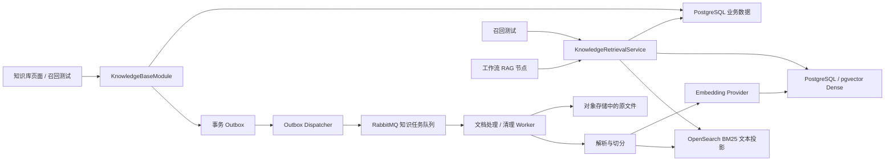
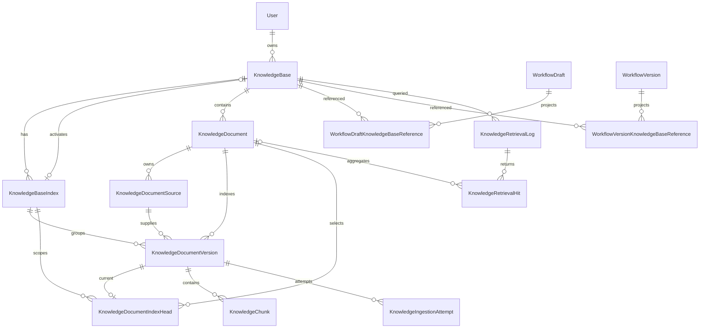
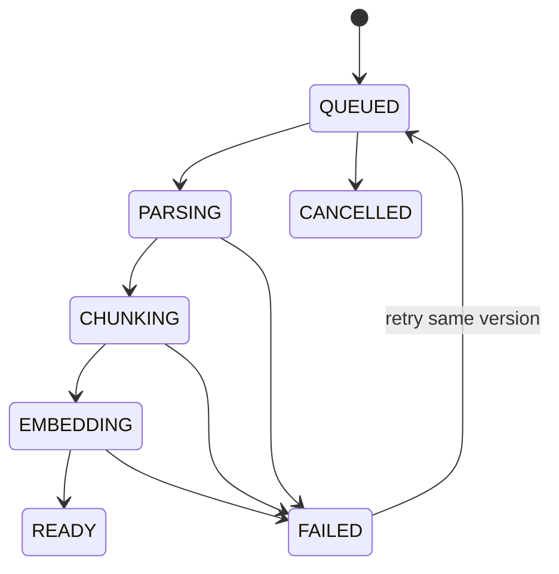

# 知识库设计方案

> 状态：目标设计持续实施中；管理、版本化入库、搜索投影和工作流 RAG 主链路已实现。
>
> 本文定义知识库从空白资源创建、文档入库、索引代际切换、分段向量化、召回、工作流引用到
> 异步删除清理的完整目标模型。当前已实现空白知识库、S3/MinIO 原文、版本化异步入库、分段查看、
> 设置与手动重新索引、Embedding、pgvector Dense、OpenSearch BM25 投影、混合召回和工作流 RAG 主链路；外部 API 安全、
> 检索质量评测、资源清理和生产运维仍按后续阶段完成，数据库模型必须保持下述一致性边界。
>
> 第一次接触知识库或 RAG 时，请先阅读 [知识库与 RAG：从零基础到生产落地](./knowledge-base-rag-learning-guide.md)，
> 了解技术栈、混合检索、准确性评测、生产难点和推荐学习顺序。
>
> 混合检索、pgvector/OpenSearch 投影、RabbitMQ 知识任务和外部 `/v1/knowledge/*` API 的生产目标以
> [生产级知识库、混合检索与外部 API 方案](./knowledge-base-production-api-design.md) 为准；本文继续
> 负责 PostgreSQL 事实模型、索引代际和一致性基础。

## 1. 目标与边界

知识库是独立的“文档入库与检索”业务域，负责：

- 管理空白知识库、文档、原始文件和索引版本。
- 保存原始文件，并异步完成解析、清洗、切分和向量化。
- 使用知识库级索引代际保证嵌入模型或切分配置变更时原子切换。
- 为召回测试和工作流 RAG 节点提供统一检索能力。
- 管理任务状态、重试记录、事务消息、资源引用、检索日志和异步清理。

知识库不负责工作流编排，也不把文件解析、清洗、切分或向量生成逻辑放入 RAG 节点。RAG 节点只保存
知识库引用和查询侧参数，通过运行时端口调用服务端提供的检索能力。

空白知识库是合法资源：它可以先创建、展示并被工作流节点选择。空白知识库的 `activeIndexId`
允许为空；只有上传文档、执行召回、测试运行或发布工作流前，才要求知识库已经配置嵌入模型并
存在可用索引。

所有知识库直接具备完整的解析、清洗、分段、索引和检索能力。后续处理能力通过可版本化的文档
结构、切分配置和检索画像演进。

## 2. 当前基础

仓库已经具备以下基础：

- 服务端已建立最小 `KnowledgeBase` 模型和迁移，并通过鉴权后的创建、列表、详情、编辑与删除
  接口按 `ownerId` 隔离数据。删除前检查当前用户工作流草稿和版本中的 RAG 引用。
- Web 知识库列表、创建弹窗和详情页已接入真实接口；列表支持搜索防抖、排序、加载态、失败重试
  和空态，不再生成客户端临时知识库。
- 文档页已接入真实分页、Markdown/TXT/文本型 PDF 上传、临时分段预览、启停、删除和手动重新索引；文档详情页按活动 Head 展示版本化 Chunk，不伪造召回次数。
- RAG 节点已有查询输入端口和 JSON 检索结果输出端口，配置通过 `knowledgeBases`
  按顺序保存一个或多个知识库的稳定 ID 与名称/图标快照，并通过正整数 `topK` 控制最大召回
  数量；编辑器只在 RAG 配置面板打开后加载真实知识库目录生成多选 Dialog，并保留已保存但
  当前不可用的引用供用户重新选择。画布直接读取持久化快照，不加载完整目录。
- 服务端使用模型页面中的嵌入模型稳定 UUID 和加密凭证，已支持 OpenAI-compatible 与 Ollama
  Embedding 调用、批量向量化和维度校验。
- PostgreSQL/pgvector 是业务与 Dense 向量事实源；RabbitMQ/Outbox 幂等 Worker、S3/MinIO Source
  Store 和 OpenSearch BM25 可重建投影已接入，待部署迁移及真实服务联调。
- Go RAG Executor 已通过受保护的内部接口调用服务端统一 Retriever，并校验 Command 身份和租约。

“创建知识库 → 上传文件 → 异步解析/切分/向量化/投影 → 查看当前 Chunk → 配置变更后构建新代际或
手动重新索引 → 召回测试/工作流 RAG”的主闭环已经完成。当前实现尚不能直接宣称企业生产级，必须
先完成迁移部署、真实环境一致性联调、黄金集评测、外部 API 安全和生产运维验收。
未接入嵌入模型的 tokenizer 前不伪造 Token 统计；当前管理页只展示可确定的字符数。

## 3. 总体架构



### 3.1 存储选择

PostgreSQL 是知识库业务事实源，pgvector 保存并按相似度查询 Chunk Dense 向量；OpenSearch 只保存
可从 PostgreSQL 重建的 BM25 文本投影。两路候选统一经过 PostgreSQL 当前 Head、状态和元数据强
一致过滤，再由应用层 RRF/Rerank 融合。检索查询分别封装在 `KnowledgeVectorStore` 与文本投影
Adapter 后，不让业务服务直接依赖 SQL 距离操作符或 OpenSearch DSL。

原始文件不得作为大字段写入 PostgreSQL。服务端通过 `ObjectStorage` 接口保存文件：

- 开发环境可以使用本地存储适配器或 MinIO。
- 生产环境使用 S3、R2、OSS 等对象存储。
- 数据库只保存对象 Key、原始文件名、大小、MIME 和校验和等元数据。

### 3.2 异步任务与事务消息

文档入库和外部资源清理通过独立 RabbitMQ 知识任务队列执行，复用项目现有 RabbitMQ 基础设施，
但不复用实时工作流 Command Queue。队列消息只保存稳定任务 ID，Worker 从数据库读取真实配置，
避免配置变化后队列中残留不一致的完整载荷。

业务记录和 `OutboxEvent` 必须在同一个 PostgreSQL 事务中创建。Dispatcher 负责把 Outbox 事件
投递到 RabbitMQ，并使用 Publisher Confirm；投递失败可从数据库重试，不能出现“数据库已经提交
但任务永久未入队”的状态。Redis 只用于限流、短缓存和协调，不作为知识任务队列或事实来源。

第一阶段可以让 Worker 与 NestJS 共用代码和部署单元，但解析、清洗、切分、向量生成和清理应保持
独立处理入口，后续可以在不改变业务契约的前提下拆成独立进程。

## 4. 模块与包职责

### 4.1 Web

- `apps/web/src/api/knowledge-bases`：知识库请求与响应契约。
- `apps/web/src/features/knowledge-base`：知识库业务组件、表单、页面状态和数据 Hook。
- `apps/web/src/pages`：读取路由参数、组合页面和管理页面级状态。
- `features/workflow/node-config-renderers/knowledge-base-field.tsx`：消费当前用户的知识库目录，
  并为 Core 声明的 RAG 知识库字段呈现动态选项。
- 添加文件使用固定的三步流程：“选择数据源 → 文本分段与清洗 → 处理并完成”。步骤 2 左侧只
  编辑文档级分段与清洗配置，右侧始终保留按文件切换的分段预览区；步骤 3 展示真实异步处理
  状态和结果。

Web 不解析文件、不生成向量，也不根据文件大小模拟字符数、文档数量、召回次数或索引状态。

### 4.2 Server

服务端在 `apps/server` 内按现有 Controller、Service、Repository 和基础设施适配器结构新增知识库
模块：

- Controller：HTTP、鉴权上下文、DTO 和状态码。
- Service：知识库用例、事务、状态迁移、权限和删除保护。
- Repository：Prisma 数据访问以及隔离后的搜索投影状态查询。
- Object Storage Adapter：原文件上传、读取和删除。
- Embedding Adapter：批量向量生成和供应商差异适配。
- Ingestion Processor：解析、清洗、切分、向量化、重试和版本切换。
- Vector Store：封装 pgvector 写入、维度校验、距离排序和强制过滤，不暴露向量 SQL 给业务层。
- Text Search Adapter：封装 OpenSearch BM25 文本投影与候选召回，不暴露 DSL 给业务层。
- Rerank Adapter：对融合候选统一精排并提供可校准的最终 score。
- Retrieval Service：召回测试、工作流和外部 API 共同使用的唯一检索入口。
- Outbox Dispatcher：可靠发布入库、重建和清理任务。
- Cleanup Processor：幂等清理对象存储、队列任务和向量数据。

### 4.3 Workspace packages

- `@ai-workflow/core` 只保存 RAG 节点的可序列化配置、端口和结构校验，不访问知识库 API。
- `@ai-workflow/runtime` 定义 `KnowledgeRetriever` 等与 NestJS 无关的执行端口，并由 RAG 执行器
  调用。
- NestJS 提供运行时端口的真实实现，注入 PostgreSQL、向量存储、模型凭证和日志能力。
- 暂不新建 `packages/knowledge-*`。只有出现明确的跨应用复用场景后，再评估抽取共享包。

## 5. 数据模型

### 5.1 设计原则

- 所有业务主键使用 UUID，时间字段使用 Prisma `DateTime`，应用层统一按 UTC 读写和序列化。
- `KnowledgeBase.ownerId` 是租户边界；查询任何子资源都必须沿知识库归属校验当前用户。
- `KnowledgeBase.activeIndexId` 是当前检索索引的唯一事实来源，不能再用每个文档的全局
  `currentVersionId` 推断知识库当前索引。
- 嵌入模型、维度、距离算法和默认切分配置保存在不可变的索引代际快照中；配置变更创建新代际，
  不原地覆盖正在服务的配置。
- 原始文件身份、文档索引版本和处理尝试分别建模，避免重试或重新索引复制、误删原文件。
- 文档数量、知识库整体可用状态和召回次数通过关系或日志聚合，不维护容易漂移的计数字段。
- JSONB 只保存需要整体快照、结构会演进或供应商扩展的配置；稳定的关系、状态和查询条件使用
  显式列、外键和枚举。
- Prisma 无法表达的部分唯一索引、复合一致性约束和 CHECK 通过自定义迁移补齐；OpenSearch mapping、
  analyzer 和 search pipeline 使用独立版本化部署配置。

### 5.2 关系概览



### 5.3 推荐枚举

```text
KnowledgeLifecycleStatus = ACTIVE | DELETING | DELETE_FAILED
KnowledgeIndexStatus = BUILDING | READY | FAILED | CANCELLED
KnowledgeDocumentSourceType = FILE
KnowledgeSegmentationMode = GENERAL | QA | PARENT_CHILD
KnowledgeDocumentVersionStatus = QUEUED | PARSING | CHUNKING | EMBEDDING | READY | FAILED | CANCELLED
KnowledgeAttemptStatus = RUNNING | SUCCEEDED | FAILED | CANCELLED | TIMED_OUT
KnowledgeDistanceMetric = COSINE | EUCLIDEAN | INNER_PRODUCT
KnowledgeRetrievalSource = RECALL_TEST | WORKFLOW
KnowledgeRetrievalStatus = SUCCEEDED | FAILED
KnowledgeCleanupTargetType = KNOWLEDGE_BASE | DOCUMENT | INDEX | SOURCE
KnowledgeTaskStatus = PENDING | RUNNING | SUCCEEDED | FAILED | CANCELLED
OutboxEventStatus = PENDING | PUBLISHED | FAILED
```

索引是否正在对外服务不重复保存在 `KnowledgeIndexStatus` 中；只有
`KnowledgeBase.activeIndexId` 决定当前代际。已经退出服务的成功代际仍保持 `READY`，通过
`retiredAt` 表示退役时间，避免出现状态字段和 active 指针互相冲突。

### 5.4 KnowledgeBase

表示用户拥有的稳定知识库身份：

| 字段              | 类型          | 约束与用途                                                |
| ----------------- | ------------- | --------------------------------------------------------- |
| `id`              | UUID          | 主键                                                      |
| `ownerId`         | UUID          | 外键到 `User.id`，删除用户时 `Restrict`                   |
| `activeIndexId`   | UUID?         | 当前对外检索的 `KnowledgeBaseIndex`；空白或尚未配置时为空 |
| `name`            | VarChar(40)   | 必填；同一用户暂不强制唯一                                |
| `description`     | VarChar(200)? | 可选描述                                                  |
| `icon`            | VarChar(32)?  | 可选图标标识                                              |
| `lifecycleStatus` | enum          | 默认 `ACTIVE`；只表达删除生命周期                         |
| `deletedAt`       | DateTime?     | 发起删除的时间，清理成功后再硬删除                        |
| `createdAt`       | DateTime      | 创建时间                                                  |
| `updatedAt`       | DateTime      | 自动更新时间                                              |

约束与索引：

- `INDEX(ownerId, lifecycleStatus, updatedAt)`：知识库列表、排序和过滤。
- `activeIndexId` 使用 `SetNull`，但正常业务只能通过索引切换或清理事务修改。
- 通过复合约束或服务层事务保证 `activeIndexId` 指向同一 `KnowledgeBase` 下的索引代际。
- 不保存 `documentCount`、`availableDocumentCount`、`recallCount` 或聚合处理状态。

当前 `KnowledgeBase` 仍只落地 `id`、`ownerId`、`name`、`description`、`icon`、`createdAt`、
`updatedAt` 和 `(ownerId, updatedAt)` 索引；分段配置、文本文档与 Chunk 由独立关系表承载。`activeIndexId`、`lifecycleStatus` 与 `deletedAt` 在索引代际或异步删除能力接入时通过后续迁移补充。

### 5.5 KnowledgeBaseIndex

表示知识库的一代完整索引配置和切换边界。空白知识库可以没有任何 Index；首次配置嵌入模型时
创建第一代，修改嵌入模型、向量维度、距离算法或知识库级默认清洗、切分配置时创建新一代。

| 字段                    | 类型         | 约束与用途                                         |
| ----------------------- | ------------ | -------------------------------------------------- |
| `id`                    | UUID         | 主键                                               |
| `knowledgeBaseId`       | UUID         | 外键到知识库，最终删除时 `Cascade`                 |
| `generation`            | Int          | 从 1 递增的代际编号                                |
| `configuredModelId`     | UUID         | 外键到 `ConfiguredModel.id`，删除模型时 `Restrict` |
| `embeddingProvider`     | VarChar(32)  | 建立代际时的供应商快照                             |
| `embeddingModelId`      | VarChar(100) | 供应商模型 ID 快照                                 |
| `embeddingDimension`    | Int          | 探测得到的真实向量维度                             |
| `distanceMetric`        | enum         | 该代际固定使用的距离算法                           |
| `defaultChunkConfig`    | JsonB        | 知识库默认切分配置快照                             |
| `defaultCleaningConfig` | JsonB        | 知识库默认清洗配置快照                             |
| `configHash`            | VarChar(64)  | 规范化配置哈希                                     |
| `status`                | enum         | `BUILDING/READY/FAILED/CANCELLED`                  |
| `errorCode`             | VarChar(64)? | 代际构建失败的标准错误码                           |
| `errorMessage`          | Text?        | 用户可读错误摘要，不保存密钥或正文                 |
| `createdAt`             | DateTime     | 创建时间                                           |
| `readyAt`               | DateTime?    | 全部文档可切换的时间                               |
| `activatedAt`           | DateTime?    | 成为 `activeIndexId` 的时间                        |
| `retiredAt`             | DateTime?    | 被新代际替换的时间                                 |

约束与索引：

- `UNIQUE(knowledgeBaseId, generation)`。
- `UNIQUE(id, knowledgeBaseId)`，供子表建立复合外键。
- `INDEX(knowledgeBaseId, status, createdAt)`。
- 第一版使用部分唯一索引限制同一知识库最多一个 `BUILDING` 代际。
- `embeddingDimension > 0`，`configHash` 只用于解释、比较和幂等，不作为代际唯一约束。
- 全量重建必须覆盖知识库内所有非删除文档，包括已禁用文档，保证重新启用时无需再补建旧维度
  向量。

### 5.6 KnowledgeDocument

表示文档稳定业务身份，不直接保存某个全局当前索引版本：

| 字段                     | 类型         | 约束与用途                                          |
| ------------------------ | ------------ | --------------------------------------------------- |
| `id`                     | UUID         | 主键                                                |
| `knowledgeBaseId`        | UUID         | 外键到知识库，最终删除时 `Cascade`                  |
| `name`                   | VarChar(255) | 用户可修改的展示名称                                |
| `sourceType`             | enum         | 第一阶段固定 `FILE`                                 |
| `segmentationMode`       | enum         | `GENERAL/QA/PARENT_CHILD`；文档当前选择的分段模式   |
| `chunkConfigOverride`    | JsonB?       | 可选的文档级切分配置；为空时继承当前 Index 默认配置 |
| `cleaningConfigOverride` | JsonB?       | 可选的文档级清洗配置；为空时继承当前 Index 默认配置 |
| `enabled`                | Boolean      | 是否参与检索，默认 `true`                           |
| `lifecycleStatus`        | enum         | 删除生命周期，默认 `ACTIVE`                         |
| `deletedAt`              | DateTime?    | 发起删除的时间                                      |
| `createdAt`              | DateTime     | 创建时间                                            |
| `updatedAt`              | DateTime     | 自动更新时间                                        |

约束与索引：

- `UNIQUE(id, knowledgeBaseId)`，供复合外键校验归属。
- `INDEX(knowledgeBaseId, lifecycleStatus, updatedAt)`。
- `INDEX(knowledgeBaseId, enabled)`。
- 重命名和启停只修改文档本身；替换文件、修改 `segmentationMode`、`chunkConfigOverride`、
  `cleaningConfigOverride` 或重新索引创建新的文档索引版本。

### 5.7 KnowledgeDocumentSource

表示不可变的原始文件对象，避免“同一文件重新索引”复制对象归属或误删仍在使用的对象：

| 字段               | 类型         | 约束与用途                       |
| ------------------ | ------------ | -------------------------------- |
| `id`               | UUID         | 主键                             |
| `documentId`       | UUID         | 外键到文档，最终删除时 `Cascade` |
| `objectKey`        | VarChar(512) | 对象存储 Key，全局唯一           |
| `originalFileName` | VarChar(255) | 上传时的文件名                   |
| `checksum`         | VarChar(128) | 文件内容校验和                   |
| `mimeType`         | VarChar(128) | 服务端识别后的 MIME              |
| `fileSize`         | BigInt       | 字节数                           |
| `createdAt`        | DateTime     | 创建时间                         |

约束与索引：

- `UNIQUE(objectKey)`。
- `UNIQUE(id, documentId)`，保证索引版本引用本文件所属的文档。
- `INDEX(documentId, createdAt)`。
- 不对 `(documentId, checksum)` 强制唯一；相同文件是拒绝、复用还是生成新 Source 由产品规则
  决定。

### 5.8 KnowledgeDocumentIndexHead

表示一个文档在某个知识库索引代际下的当前成功版本：

| 字段                   | 类型     | 约束与用途                         |
| ---------------------- | -------- | ---------------------------------- |
| `knowledgeBaseId`      | UUID     | 冗余归属列，用于复合外键保证一致性 |
| `documentId`           | UUID     | 文档 ID                            |
| `knowledgeBaseIndexId` | UUID     | 索引代际 ID                        |
| `currentVersionId`     | UUID     | 当前 `READY` 文档版本              |
| `createdAt`            | DateTime | 创建时间                           |
| `updatedAt`            | DateTime | 切换时间                           |

约束与索引：

- `PRIMARY KEY(documentId, knowledgeBaseIndexId)`。
- 复合外键保证 Document 和 Index 都属于 `knowledgeBaseId`。
- 复合外键保证 `currentVersionId` 属于相同的 `documentId + knowledgeBaseIndexId`。
- 新版本全部分段和向量写入成功后，才在事务中更新 `currentVersionId`。
- 新代际构建期间可以建立自己的 Head，不影响当前 active 代际；全部 Head 准备完成后才切换
  `KnowledgeBase.activeIndexId`。

### 5.9 KnowledgeDocumentVersion

表示一次具体的文档解析、清洗、切分和向量化结果：

| 字段                   | 类型         | 约束与用途                           |
| ---------------------- | ------------ | ------------------------------------ |
| `id`                   | UUID         | 主键                                 |
| `knowledgeBaseId`      | UUID         | 冗余归属列，用于复合一致性约束       |
| `documentId`           | UUID         | 所属文档                             |
| `sourceId`             | UUID         | 使用的不可变原始文件                 |
| `knowledgeBaseIndexId` | UUID         | 使用的知识库索引代际                 |
| `version`              | Int          | 同一文档和代际下递增                 |
| `idempotencyKey`       | VarChar(128) | 一次入库命令的幂等键，全局唯一       |
| `parserVersion`        | VarChar(64)  | 解析器版本快照                       |
| `cleanerVersion`       | VarChar(64)  | 清洗器版本快照                       |
| `cleaningConfig`       | JsonB        | 最终生效的文档清洗配置快照           |
| `segmentationMode`     | enum         | 本版本实际使用的分段模式快照         |
| `chunkConfig`          | JsonB        | 最终生效的文档切分配置快照           |
| `configHash`           | VarChar(64)  | 文件、解析、清洗、切分和索引配置哈希 |
| `status`               | enum         | 文档处理状态机                       |
| `progress`             | SmallInt     | 0 到 100，仅用于展示                 |
| `attemptCount`         | Int          | 已启动的处理尝试数                   |
| `characterCount`       | Int?         | 成功解析后的字符数                   |
| `tokenCount`           | Int?         | 成功处理后的 Token 数                |
| `chunkCount`           | Int?         | 成功处理后的分段数                   |
| `errorCode`            | VarChar(64)? | 最近一次失败的标准错误码             |
| `errorMessage`         | Text?        | 最近一次失败摘要                     |
| `queuedAt`             | DateTime     | 进入待处理状态的时间                 |
| `startedAt`            | DateTime?    | 首次开始处理时间                     |
| `readyAt`              | DateTime?    | 完成时间                             |
| `createdAt`            | DateTime     | 创建时间                             |
| `updatedAt`            | DateTime     | 状态更新时间                         |

约束与索引：

- `UNIQUE(documentId, knowledgeBaseIndexId, version)`。
- `UNIQUE(idempotencyKey)`；正常重试复用原版本，用户显式强制重新索引生成新的命令键和版本号。
- `UNIQUE(id, documentId, knowledgeBaseIndexId)`，供 Head 和 Chunk 建立复合外键。
- 复合外键保证 Source 属于同一 Document，Document 和 Index 属于同一 KnowledgeBase。
- `CHECK(progress BETWEEN 0 AND 100)`，计数字段不能为负数。
- `INDEX(knowledgeBaseIndexId, status, createdAt)`。
- `INDEX(documentId, createdAt)`。
- `READY` 必须表示所有 Chunk 均已写入，pgvector 向量维度/数量和 OpenSearch BM25 投影的
  count/checksum 均校验通过，不允许存在缺失 embedding。

### 5.10 KnowledgeChunk

表示可检索的最小单元。为降低向量查询的 Join 和过滤成本，直接保存所属文档和索引代际：

| 字段                   | 类型        | 约束与用途                         |
| ---------------------- | ----------- | ---------------------------------- |
| `id`                   | UUID        | 主键                               |
| `knowledgeBaseIndexId` | UUID        | 所属索引代际                       |
| `documentId`           | UUID        | 所属文档                           |
| `documentVersionId`    | UUID        | 所属文档索引版本                   |
| `sequence`             | Int         | 版本内稳定顺序，从 0 或 1 统一起算 |
| `content`              | Text        | 分段正文                           |
| `tokenCount`           | Int         | Token 数                           |
| `contentHash`          | VarChar(64) | 规范化正文哈希                     |
| `pageNumber`           | Int?        | 页码来源                           |
| `startOffset`          | Int?        | 来源起始位置                       |
| `endOffset`            | Int?        | 来源结束位置                       |
| `metadata`             | JsonB       | 系统产生、可过滤的来源元数据       |
| `embeddingDimension`   | Int?        | Dense 向量实际维度                 |
| `embedding`            | vector?     | pgvector Dense 向量                |
| `createdAt`            | DateTime    | 创建时间                           |

约束与索引：

- `UNIQUE(documentVersionId, sequence)`。
- 复合外键保证 Version、Document 和 Index 一致。
- 自定义约束保证 embedding 与 `embeddingDimension` 同时为空或同时存在，并检查
  `vector_dims(embedding) = embeddingDimension`；完成投影时再校验其与 Index 的维度一致。
- `CHECK(tokenCount >= 0)`、`CHECK(startOffset <= endOffset)`。
- B-tree 索引至少覆盖 `documentVersionId`、`knowledgeBaseIndexId` 和 `documentId`。
- OpenSearch 投影只保存 BM25 全文字段和必要过滤标识；向量保存在 PostgreSQL。混合维度先使用强制
  过滤后的精确距离排序，确认生产维度与容量门槛后再通过自定义 migration 创建部分 HNSW 索引。

### 5.11 KnowledgeIngestionAttempt

表示文档版本的单次 Worker 尝试，保留重试历史和可观测信息：

| 字段                | 类型          | 约束与用途                       |
| ------------------- | ------------- | -------------------------------- |
| `id`                | UUID          | 主键                             |
| `documentVersionId` | UUID          | 外键到版本，最终删除时 `Cascade` |
| `attempt`           | Int           | 从 1 递增                        |
| `traceId`           | VarChar(128)  | 全局唯一追踪 ID                  |
| `status`            | enum          | 尝试状态                         |
| `stage`             | VarChar(32)   | 当前或失败阶段                   |
| `workerId`          | VarChar(128)? | Worker 实例标识                  |
| `retryable`         | Boolean?      | 失败是否可重试                   |
| `errorCode`         | VarChar(64)?  | 标准错误码                       |
| `errorMessage`      | Text?         | 错误摘要                         |
| `errorDetails`      | JsonB?        | 脱敏后的诊断信息                 |
| `startedAt`         | DateTime      | 开始时间                         |
| `heartbeatAt`       | DateTime?     | 长任务心跳                       |
| `finishedAt`        | DateTime?     | 结束时间                         |
| `durationMs`        | Int?          | 总耗时                           |
| `createdAt`         | DateTime      | 创建时间                         |

约束与索引：

- `UNIQUE(documentVersionId, attempt)`。
- `UNIQUE(traceId)`。
- `INDEX(status, heartbeatAt)`，用于识别失联任务。
- Version 保存当前汇总状态，Attempt 保存不可覆盖的单次历史；两者不互相替代。

### 5.12 工作流知识库引用投影

工作流 JSON 仍是节点配置的事实来源。保存草稿和创建版本时，在同一事务中重建强类型引用投影，
用于删除保护、依赖分析和失效提示。RAG 节点支持引用多个知识库，因此使用两个具有真实外键
的明细表，不使用无法建立资源外键的泛型 `resourceType + resourceId` 表。

`WorkflowDraftKnowledgeBaseReference`：

- `draftId`：外键到 `WorkflowDraft.id`，草稿删除时 `Cascade`。
- `nodeId`：引用知识库的 RAG 节点 ID。
- `knowledgeBaseId`：外键到 `KnowledgeBase.id`，删除时 `Restrict`。
- `createdAt`。
- `UNIQUE(draftId, nodeId, knowledgeBaseId)`。
- `INDEX(knowledgeBaseId)`。

`WorkflowVersionKnowledgeBaseReference`：

- `versionId`：外键到 `WorkflowVersion.id`，版本删除时 `Cascade`。
- `nodeId`：引用知识库的 RAG 节点 ID。
- `knowledgeBaseId`：外键到 `KnowledgeBase.id`，删除时 `Restrict`。
- `createdAt`。
- `UNIQUE(versionId, nodeId, knowledgeBaseId)`。
- `INDEX(knowledgeBaseId)`。

部署记录已经指向 `WorkflowVersion`，不再创建重复的部署资源引用表；同一节点的多个知识库引用
通过包含 `knowledgeBaseId` 的唯一约束分别保存。

### 5.13 检索日志

`KnowledgeRetrievalLog` 表示一次完整检索：

- `id`、`knowledgeBaseId`、可选的 `knowledgeBaseIndexId`。
- `source`：`RECALL_TEST` 或 `WORKFLOW`。
- 可选的 `workflowRunId`、`workflowNodeRunId`。
- `traceId`、`queryHash`；默认不持久化原始查询正文。
- `topK`、`scoreThreshold`、`metadataFilter`。
- `embeddingDurationMs`、`vectorSearchDurationMs`、`durationMs`。
- `candidateCount`、`hitCount`。
- `status`、`errorCode`、`errorMessage`、`createdAt`。

约束与索引：

- `UNIQUE(traceId)`。
- `INDEX(knowledgeBaseId, source, createdAt)`。
- `INDEX(workflowRunId, createdAt)`。
- `knowledgeBaseIndexId` 在旧代际清理时可以 `SetNull`；日志保留必要配置和诊断快照时不得依赖
  已删除代际才能解释。

`KnowledgeRetrievalHit` 表示一次检索返回的单个命中：

- `id`、`retrievalLogId`。
- 可空的 `chunkId`、`documentId`，删除分段或文档时使用 `SetNull`。
- `documentNameSnapshot`、`contentHash`，用于日志保留期内解释历史结果，不复制完整正文。
- `rank`、`score`、`createdAt`。
- `UNIQUE(retrievalLogId, rank)`。
- `INDEX(documentId, retrievalLogId)`。

文档召回次数按生产 `WORKFLOW` 日志中的 `documentId + retrievalLogId` 去重聚合；召回测试不计入
生产召回次数，不能在高频检索路径上反复更新 `KnowledgeDocument` 行。

### 5.14 KnowledgeCleanupJob

表示对象存储、外部向量库或退役索引的可重试清理任务：

- `id`、`targetType`、`targetId`。
- `idempotencyKey`：全局唯一。
- `traceId`：全局唯一。
- `status`、`attemptCount`、`progress`。
- `payload`：清理所需的稳定资源标识，不保存密钥。
- `errorCode`、`errorMessage`。
- `availableAt`、`startedAt`、`heartbeatAt`、`finishedAt`。
- `createdAt`、`updatedAt`。
- `INDEX(status, availableAt)`。

CleanupJob 不使用指向目标业务行的强外键，使清理成功并硬删除业务数据后仍可以在保留期内审计。
业务行必须保持 `DELETING`，直到外部资源清理完成；失败时进入 `DELETE_FAILED`，允许继续重试。

### 5.15 OutboxEvent

表示需要可靠发布到 Redis 的事务事件：

- `id`、`eventType`、`aggregateType`、`aggregateId`。
- `idempotencyKey`：全局唯一，消费者据此去重。
- `payload`：只保存任务 ID 和必要路由信息。
- `status`、`attemptCount`、`availableAt`。
- `lockedBy`、`lockedAt`，防止多个 Dispatcher 重复占用。
- `publishedAt`、`errorMessage`、`createdAt`、`updatedAt`。
- `INDEX(status, availableAt)`。

Outbox 的 `PUBLISHED` 仅表示已经可靠投递，不表示 Worker 业务任务完成。业务结果分别写入
DocumentVersion、IngestionAttempt 或 CleanupJob。

### 5.16 删除与外键策略

- `User -> KnowledgeBase` 使用 `Restrict`，用户仍有知识库时不直接删除用户。
- `KnowledgeBase -> Document/Index` 只在外部资源清理成功后的最终硬删除中使用 `Cascade`。
- `Document -> Source/Version/Head` 和 `Version -> Chunk/Attempt` 在最终硬删除中使用 `Cascade`。
- `ConfiguredModel -> KnowledgeBaseIndex` 使用 `Restrict`，避免已建立索引失去模型身份。
- 工作流引用到 KnowledgeBase 使用 `Restrict`，删除前必须返回引用来源。
- 检索 Hit 到 Chunk/Document 使用 `SetNull` 并保存最小快照，避免历史日志阻止资源回收。
- 循环指针和复合归属约束由 Prisma relation 加自定义 SQL 迁移共同实现，不能只依赖应用层约定。

## 6. 核心状态与一致性流程

### 6.1 创建空白知识库

1. 只创建 `KnowledgeBase`，`activeIndexId = null`。
2. 知识库可以出现在列表和 RAG 节点选项中。
3. 编辑器保存草稿时允许引用空白知识库。
4. 上传、召回、测试运行和发布前返回明确的“尚未配置索引”或“没有可用文档”错误。

### 6.2 首次配置索引

1. 选择当前用户启用的嵌入模型，并解析平台统一的默认清洗与切分配置。
2. 服务端真实生成探测向量，确认模型可用并获取维度。
3. 创建 `KnowledgeBaseIndex(generation = 1, status = BUILDING)`。
4. 空知识库无需处理文档，可以直接标记 `READY` 并设置为 `activeIndexId`。
5. 已有文档时，全部文档版本成功后再设置为 active。

### 6.3 文档入库



1. 保存对象后，在同一事务创建 Document、Source、DocumentVersion 和 OutboxEvent。
2. Worker 为每次执行创建 IngestionAttempt，并更新 Version 的汇总状态。
3. 分段写入使用 `(documentVersionId, sequence)` 幂等 upsert 或先清理本版本的未完成分段。
4. 所有向量写入成功后将 Version 标记为 `READY`。
5. 在事务中创建或更新对应 `KnowledgeDocumentIndexHead.currentVersionId`。
6. 新版本失败时 Head 不变，继续使用旧版本。

### 6.4 单文档替换或重新索引

- 替换文件：创建新的 Source 和 Version。
- 仅重新索引：复用 Source，创建新的 Version。
- 两者都在当前 active Index 下完成，成功后只切换该文档对应的 Head。
- 不得先删除旧 Version 或 Chunk；旧数据由后续可重试清理任务回收。

### 6.5 知识库级配置变更

修改嵌入模型、维度、距离算法或知识库默认切分配置时：

1. 创建新的 `KnowledgeBaseIndex` 代际，旧 `activeIndexId` 保持不变。
2. 第一版在全量重建期间禁止上传、替换、重新索引和删除文档，避免构建集合漂移。
3. 为全部非删除文档（包括 disabled 文档）创建新代际下的 Version 和 Head。
4. 任一文档失败时新代际保持 `FAILED` 或可重试，旧代际继续服务。
5. 全部完成后，在单个事务中标记新代际 READY、切换 `activeIndexId`、写入激活/退役时间。
6. 切换后再异步清理退役代际，不在切换前删除旧向量。

该流程保证同一次检索永远不会混合不同模型、维度、距离算法或知识库级切分配置生成的向量。

### 6.6 检索

召回测试和工作流 RAG 必须调用同一个 `KnowledgeRetrievalService`：

1. 校验知识库归属、删除状态和 `activeIndexId`。
2. 读取 active Index、embedding space 和已发布 Retrieval Profile。
3. 按 embedding space 分组生成查询向量。
4. pgvector Dense SQL 应用 owner、active generation、Head、文档/Chunk 状态和 metadata 强制过滤；
   OpenSearch BM25 候选在融合前用相同 PostgreSQL 事实再次校验。
5. 每组执行标题/路径加权 BM25 + pgvector Dense + RRF；Fast 画像直接使用 RRF，Accurate 画像对合并候选
   执行标题、标题路径、精确短语、词项覆盖与 Dense 相关度的确定性二阶段重排，RRF 只用于融合和
   同分排序；短关键词没有连续字面证据时不接受仅由词项覆盖或 Dense 名次产生的分数。
6. 过滤低于画像阈值的候选，再去重、父块扩展、应用证据预算和最终 Top K；结果允许少于 Top K。
7. 在同一业务调用中写入 RetrievalLog 和 Hit；日志写入失败是否阻断检索需要在实现前确定，
   但不能静默产生错误统计。

### 6.7 删除

1. 校验工作流草稿和版本引用；存在引用时拒绝删除并返回引用节点。
2. 把 KnowledgeBase 或 Document 标记为 `DELETING`，立即从列表候选或检索条件中排除。
3. 在同一事务创建 CleanupJob 和 OutboxEvent。
4. Worker 幂等删除对象、RabbitMQ 待处理任务关联和 OpenSearch 投影；pgvector 数据随 Chunk 在最终
   数据库级联删除时回收。
5. 全部成功后硬删除业务行；失败时保留业务行和任务为 `DELETE_FAILED` 并允许重试。

## 7. 向量与搜索投影约束

生产主检索的索引组织、混合检索和多 Embedding space 设计以
[生产级知识库、混合检索与外部 API 方案](./knowledge-base-production-api-design.md) 为准。pgvector
保存 Dense 向量，OpenSearch 是可从 PostgreSQL 重建的 BM25 文本投影；只有 pgvector 向量数量、维度
以及 OpenSearch projection count/checksum 全部校验成功后，文档版本或知识库索引代际才能 READY / active。

pgvector 允许无固定维度的 `vector` 列保存不同维度数据，但近似索引只能覆盖相同维度的行。因此
第一阶段采用以下策略：

- Prisma 中将向量列声明为 `Unsupported("vector")`，扩展、列、CHECK 和向量索引使用自定义
  migration 创建。
- Chunk 保存 `embeddingDimension`，数据库校验实际向量维度一致。
- 当前所有维度在强制过滤后使用精确检索；达到容量门槛后，仅对平台明确支持的维度和距离算法建立
  表达式/部分 HNSW 索引。
- 每种距离算法使用对应的 pgvector 操作符类；查询不能运行时任意切换为未建立索引的算法。
- 向量查询始终携带 active Index 过滤；规模增大后评估分区、迭代扫描或专用向量库。

实现时以 [pgvector 官方的混合维度与部分索引说明](https://github.com/pgvector/pgvector#can-i-store-vectors-with-different-dimensions-in-the-same-column)
和 [Prisma PostgreSQL 扩展文档](https://docs.prisma.io/docs/postgres/database/postgres-extensions)
为准，不把普通 Prisma B-tree 索引误当成向量近似索引。

## 8. 文件导入、文本分段与清洗

### 8.1 统一能力与文件格式

第一阶段只支持：

- 纯文本与 Markdown。
- 文本型 PDF。
- 通用、Q&A、父子分段三种分段模式。

Chunker 根据文档结构和所选模式决定分段边界，Embedding 模型不负责切分。正式入库时，系统再
使用当前 `KnowledgeBaseIndex` 固定的 Embedding 模型向量化每个可检索单元。最终生效的模式和配置
必须在 `KnowledgeDocumentVersion` 中保存快照，使历史版本可以解释和重建。

下列能力后置：

- Word、Excel、CSV、HTML 等格式。
- 扫描 PDF 的 OCR。
- 网页、第三方文档或数据库的定时同步。
- 用户自定义复杂元数据结构。

前端 `accept` 范围必须与服务端真实支持能力一致，不能展示尚未具备解析能力的格式。

### 8.2 三种分段模式

三种模式共享同一套 Parser、Cleaner、Embedding 与检索基础设施，只改变 Chunker 生成检索单元和
返回上下文的方式：

| 模式                       | 分段与向量化方式                                                                               | 检索返回方式                                               |
| -------------------------- | ---------------------------------------------------------------------------------------------- | ---------------------------------------------------------- |
| 通用（`GENERAL`）          | 优先按标题、段落、句子和 Token 上限切分，允许相邻块重叠；每个 Chunk 生成 Embedding             | 返回命中的 Chunk 及标题路径、页码等来源信息                |
| Q&A（`QA`）                | 将显式的问题与答案解析为一个逻辑 Chunk，以问题为主、必要时拼接答案形成检索文本并生成 Embedding | 返回完整问题、答案和来源；第一版不调用 LLM 自动编造问答对  |
| 父子分段（`PARENT_CHILD`） | 先按章节形成父块，再生成更小的子块；对子块生成 Embedding，父块作为上下文单元保存               | 使用子块精准召回，命中后扩展并返回对应父块，避免只给出碎片 |

所有模式的可检索单元都同时写入 Dense 向量字段和 BM25 文本字段，查询时统一进入混合召回链路。
模式、模式参数、Parser / Cleaner / Chunker 版本和 Embedding 配置快照共同参与 `configHash`；任何
影响分段或向量的变化都创建新的 `KnowledgeDocumentVersion`，不能原地覆盖已服务版本。

### 8.3 三步导入流程

添加文件固定使用以下步骤：

1. **选择数据源**：选择一个或多个文件，完成扩展名、大小、MIME、魔数、重复文件和安全限制的
   前置校验。进入下一步不创建 `Document` 或入库任务。
2. **文本分段与清洗**：左侧选择通用、Q&A 或父子分段并配置当前模式允许调整的参数与清洗规则；
   右侧预览区始终保留，支持在本次选择的文件之间切换。用户点击“预览块”后，服务端按当前配置
   返回解析、清洗和切分后的块、父子关系、来源位置与警告；尚未预览时展示空状态，不能隐藏或
   移除右侧区域。
3. **处理并完成**：保存当前配置快照，为每个文件创建 Document、Source、Version 与入库任务，
   展示服务端返回的排队、解析、分段、向量化、完成或失败状态，不用前端计时模拟进度。

分段或清洗配置变化后，已有预览必须标记为过期并要求重新生成；不能让旧预览看起来仍与当前配置
一致。多文件预览按当前选择文件分别缓存，文件移除后立即丢弃对应预览。预览只是提交前检查，
不得创建可检索文档、Chunk、Version 或 OpenSearch 投影。

步骤 2 不提供“经济 / 高质量”、倒排 / 向量 / 混合方式或 `TopK` 等上传级选择。Embedding、BM25、
Dense、RRF、Rerank 和查询时 `TopK` 分别由知识库索引代际与检索画像管理；如果上传页需要帮助
用户理解处理结果，只能展示当前知识库索引与检索配置的只读摘要及“前往知识库设置”入口，不能
把查询参数写入文档处理配置。步骤 3 的处理摘要同样展示实际配置。

### 8.4 清洗规则

清洗目标是去除确定性噪声，同时保留可检索事实和文档结构。处理顺序固定为：

```text
原文件 -> 结构化解析 -> 保守清洗 -> 分段 -> 预览 / 正式入库
```

第一版 Cleaner 使用带版本号的确定性规则，并将最终 `cleaningConfig` 与 `cleanerVersion` 保存到
`KnowledgeDocumentVersion` 的处理配置快照中：

- 统一 `CRLF / CR` 为 `LF`，移除非法或不可见控制字符；保留结构化解析器确认有语义的换行、
  Tab、列表缩进、代码块和表格边界。
- 清除行尾空白；普通正文内连续空格归一为单个空格；连续三个及以上空行最多保留两个，以保留
  段落边界。不得把所有换行和 Tab 直接压成一个空格。
- 解析器能够按页识别且达到明确置信门槛时，移除重复页眉、页脚和独立页码；无法可靠判断时保留
  原文，并在预览警告中提示。
- 默认保留 URL、电子邮箱、编号、金额、版本号、标点、Markdown 标记、表格分隔符和代码内容。
  不提供“删除所有 URL 和电子邮件地址”选项，避免删除引用、联系人、接口地址和精确检索依据。
- Cleaner 不改写业务措辞、不做摘要、不调用 LLM 猜测噪声，也不跨段合并内容。原文件始终保留，
  任何规则变化通过新版本重新处理，不能原地改写历史版本。

步骤 2 可将“规范化多余空白”作为默认开启的用户选项，但其语义必须遵守上述结构保护规则；换行
规范化、非法控制字符处理和结构保护属于平台固定规则，不允许关闭。预览和正式入库必须调用同一
Parser、Cleaner、Chunker 版本和同一配置解释器，确保预览块与最终 Chunk 可复现。

### 8.5 预览接口

- `POST /knowledge-bases/:knowledgeBaseId/documents/preview`：接收 multipart 临时文件或上传会话
  引用，以及当前分段、清洗配置，返回按文件分组的预览块、来源位置、总块数、截断标记和解析
  警告。
- 预览接口必须校验知识库归属、文件限制和配置，设置独立的文件数、页数、输出块数、耗时与并发
  上限；临时解析产物按短生命周期清理。
- 预览只返回受限样本，不生成 Embedding，也不写入正式 Document、Version、Chunk 或检索投影。
- 正式提交复用预览请求中的规范化配置；服务端仍需重新校验，并在 Version 中保存最终配置和处理
  版本快照。

## 9. RAG 节点接入

### 9.1 核心 RAG 方案

入库与检索使用一条统一链路，分段模式只改变检索单元和上下文扩展方式：

```text
入库：文件 -> Parser -> 保守 Cleaner -> 模式化 Chunker -> Embedding -> pgvector + OpenSearch BM25 投影
查询：Query 规范化 -> Query Embedding -> BM25 + Dense 并行召回 -> RRF -> Rerank
     -> 父块扩展（仅父子分段）-> 去重与证据预算 -> Top K -> RAG 节点
```

- PostgreSQL 保存 Document、不可变 Source、Version、Chunk 元数据、Dense 向量和当前成功版本，作为业务事实源。
- OpenSearch 保存 Chunk 的可重建 BM25 文本投影，以及来源、版本、ACL 和父子关系字段。
- Query 使用每个知识库 active Index 对应的 Embedding 模型生成向量；不同 Embedding 空间先分组召回，
  再由同一个 Cross-Encoder 对候选统一 Rerank，不能直接比较不同空间的向量分数。
- 通用模式直接返回命中 Chunk；Q&A 返回完整问答单元；父子分段用子块参与召回，再扩展父块作为
  最终证据。三种模式的结果统一映射为 `RetrievedChunk`。
- 上传页不控制 BM25、Dense、RRF、Rerank 或 `TopK`。这些属于版本化检索画像；RAG 节点只选择
  知识库、提供 Query，并在允许范围内设置最终返回数量。

### 9.2 节点契约

知识库保存入库侧配置，RAG 节点保存查询侧配置。目标配置建议为：

```ts
interface RagNodeConfig {
  knowledgeBases: Array<{
    id: string
    title?: string
    icon?: string
  }>
  topK: number
  metadataFilter?: Record<string, unknown>
}
```

当前节点已先落地 `knowledgeBases` 引用快照和范围 1 到 20 的整数 `topK`（默认 `5`）；`topK` 在
知识库字段下方作为独立的“召回设置”表单项，通过滑条和数字输入框共同编辑。具体召回方式和
阈值由服务端绑定的 `KnowledgeRetrievalProfile` 管理，不在节点中暴露索引实现细节。

- 查询文本继续来自 RAG 节点的 `query` 输入端口，不重复保存到 config。
- 输出端口继续返回 JSON 数组，元素使用统一的 `RetrievedChunk` 契约。
- Web `KnowledgeBaseField` 随 RAG 配置面板挂载后从真实知识库 API 目录加载多选项，不再依赖
  模拟数据；Provider 挂载和画布渲染不得请求目录。
- 空白知识库允许被选择；测试、运行和发布时必须提示其尚未配置索引或没有可用文档。
- 已保存但被删除或失效的知识库引用不能被静默清空，编辑器应保留引用并提示重新选择。
- Core 负责结构校验；知识库存在性、归属和可执行状态由服务端在测试运行和发布前完成。

建议的单个召回结果契约：

```ts
interface RetrievedChunk {
  chunkId: string
  documentId: string
  documentName: string
  content: string
  score: number
  sequence: number
  metadata: Record<string, unknown>
}
```

## 10. API

### 10.1 当前已实现

以下接口统一使用 Bearer Token，并始终按当前用户 `ownerId` 隔离知识库：

- `GET /knowledge-bases`：获取当前用户的知识库，支持最长 40 字符的 `search`，以及
  `updated_desc`、`created_desc`、`created_asc` 排序；响应使用 `{ items }` 包装。当前空白
  知识库阶段不做分页，数据规模增长后可以在保持 `items` 的基础上增加 opaque cursor。
- `POST /knowledge-bases`：创建空白知识库；名称、图标必填，描述可选，不要求选择嵌入模型。
- `GET /knowledge-bases/:knowledgeBaseId`：获取知识库详情；路径参数必须是 UUID v4，资源不存在
  或不属于当前用户时不返回资源。
- `PATCH /knowledge-bases/:knowledgeBaseId`：修改名称、描述和图标，至少提供一个字段。
- `DELETE /knowledge-bases/:knowledgeBaseId`：永久删除当前知识库；删除前同时检查当前用户的
  工作流草稿与版本 JSON，存在 RAG 引用时返回冲突。当前同步级联删除文档/Chunk 并尽力清理本地原文；对象存储落地后必须升级为 6.7 节的删除生命周期。
- `GET/PATCH /knowledge-bases/:knowledgeBaseId/settings`：读取或更新分段与检索设置。分段设置变更只标记旧文档待更新，不自动覆盖 Chunk。
- `GET /knowledge-bases/:knowledgeBaseId/indexes`：按代际倒序查看索引状态、活动标记与失败原因。
- `POST /knowledge-bases/:knowledgeBaseId/indexes/rebuild`：只对最新失败索引创建配置相同的新代际并
  重新写入 Outbox；新代际会重新处理启用的失败文档，成功 Head 激活后恢复文档可用状态。事务锁
  防止并发重复构建，失败代际保持不可变。

列表和详情返回稳定传输字段 `id`、`title`、`author`、`description?`、`icon?`、`createdAt`、
`updatedAt`，不直接暴露 Prisma model，也不返回模拟文档数量或索引状态。

### 10.2 后续知识库接口

- `GET /knowledge-bases/:knowledgeBaseId/indexes/:indexId`：查看代际构建进度和错误。
- `DELETE /knowledge-bases/:knowledgeBaseId` 在文档与外部资源接入后保持路由不变，内部升级为
  异步清理流程。

嵌入模型、距离算法和知识库级切分配置变更不能混入普通信息更新接口，必须通过显式索引代际
用例触发全量重建。

### 10.3 已实现的文档管理基线

- `GET /knowledge-bases/:knowledgeBaseId/documents`：分页、搜索、筛选和排序文档。
- `POST /knowledge-bases/:knowledgeBaseId/documents/preview`：按当前分段与清洗配置生成临时预览，
  不创建正式文档和索引数据。
- `POST /knowledge-bases/:knowledgeBaseId/documents`：上传 Markdown/纯文本原文件并同步生成当前分段。
- `GET /knowledge-bases/:knowledgeBaseId/documents/:documentId`：获取文档和当前分段状态。
- `PATCH /knowledge-bases/:knowledgeBaseId/documents/:documentId`：重命名或启停。
- `DELETE /knowledge-bases/:knowledgeBaseId/documents/:documentId`：删除文档、当前 Chunk 和保存的本地原文。
- `POST /knowledge-bases/:knowledgeBaseId/documents/:documentId/reindex`：用知识库当前分段设置手动替换该文档 Chunk。
- `GET /knowledge-bases/:knowledgeBaseId/documents/:documentId/chunks`：查看当前分段。

当前通过 NestJS 接收小文件 multipart；后续大文件上传切换为预签名直传与异步版本入库时，不能改变 Source、Version 和处理状态的目标契约。

### 10.4 检索

- `POST /knowledge-bases/:knowledgeBaseId/retrieve`：执行召回测试并返回分段、分数和耗时。

召回测试接口使用与工作流相同的服务，只额外返回调试信息，不复制检索算法。

## 11. 权限与运行校验

- 所有知识库、文档、版本、任务和检索请求都必须通过 `ownerId` 隔离，不能仅凭 UUID 查询。
- API 触发的工作流使用应用所有者作为知识库权限上下文，不能使用调用方任意传入的用户 ID。
- 保存草稿允许暂时缺少知识库选择，也允许引用空白知识库。
- 测试运行和发布必须验证引用存在、属于应用所有者、`activeIndexId` 有效，并且至少有一个启用的
  READY 文档。
- 工作流引用投影和草稿/版本 JSON 必须在同一事务写入，投影可以从 JSON 重建但不能长期漂移。
- 被工作流草稿或版本引用的知识库默认禁止删除，并返回工作流和节点来源。
- 模型组或模型被停用时，是否允许继续生成查询向量需要作为产品规则确认；已保存的向量本身不应
  因展示状态变化被删除。

## 12. 安全与可观测性

- 不执行上传文件中的宏、脚本或公式。
- 防止压缩炸弹、超大页面、异常字符流和解析器无限处理。
- 日志不得记录原始文件全文、完整检索内容、模型密钥或向量。
- 每次入库尝试记录 `traceId`、版本 ID、阶段、耗时和标准错误码。
- Worker 使用心跳和租约识别失联任务；重试必须复用业务版本并新增 Attempt。
- 检索记录查询向量耗时、向量查询耗时、候选数和最终命中数，默认只保存查询哈希。
- 对嵌入模型调用设置超时、并发上限、批次大小和可观测的重试策略。
- Outbox、IngestionAttempt 和 CleanupJob 分别监控待发布事件、处理任务和外部资源清理，不能只依赖
  Redis 队列界面判断业务状态。

## 13. 设计范围与实施阶段

数据库目标设计包含：

- `KnowledgeBase`、`KnowledgeBaseIndex`。
- `KnowledgeDocument`、`KnowledgeDocumentSource`、`KnowledgeDocumentIndexHead`、
  `KnowledgeDocumentVersion`、`KnowledgeChunk`。
- `KnowledgeIngestionAttempt`、`KnowledgeCleanupJob`、`OutboxEvent`。
- 草稿和版本两张知识库引用投影表。
- `KnowledgeRetrievalLog`、`KnowledgeRetrievalHit`。

接口和业务能力分阶段实现：

1. 已完成：空白知识库持久化、基础管理和 RAG 节点选择。
2. 已完成：Markdown/纯文本原文保存、同步分段预览与入库、分段查看、启停/删除和用户手动重新索引。
3. 已完成实现，待部署联调：嵌入模型调用、首个 Index、异步文档入库和真实召回测试。
4. 已完成实现，待部署联调：知识库级新代际构建、完整性校验和原子切换。
5. 部分完成：工作流 RAG 运行与引用删除保护已接入；发布校验和检索日志待完成。
6. 待完成：异步清理、退役代际回收、质量评测、外部 API 安全和完整可观测性。

当前阶段明确不包含：

- OCR 和 Office 文件。
- 独立 Cross-encoder Provider、父块扩展和完整证据预算策略。
- 网页抓取、第三方数据源同步和定时更新。
- 复杂元数据管理和多知识库联合召回。
- 专用向量数据库。

## 14. 推荐实施顺序

1. 已落地知识库资源身份、用户归属与列表索引。
2. 已实现知识库基础管理、Web `KnowledgeBaseField` 真实目录与 Core `ragNodeForm` 声明。
3. 已落地 S3/MinIO、本地开发 Source Store、PDF/Markdown/TXT/DOCX/PPTX/XLSX/CSV/HTML 解析、事实模型、RabbitMQ/Outbox、
   幂等 Worker、版本化 Chunk、投影状态和原子 Head/active Index 切换；待执行迁移和环境联调。
4. 已实现 OpenAI-compatible/Ollama Embedding、批量调用、维度识别和 embedding space 分组。
5. 已实现 OpenSearch BM25 + pgvector Dense、强制租户/代际/Head/文档/Chunk/元数据过滤、应用层 RRF 和真实召回测试。
6. 已实现 Go RAG Executor 与统一 Retriever；继续补齐发布校验和强类型引用投影。
7. 已补齐带保护期的 Source 孤儿对象 GC；继续完成退役代际回收、禁用/删除投影传播和失败清理。
8. 用独立 Cross-encoder Provider 替换确定性二阶段重排，并实现父块扩展、证据预算和版本化黄金集回归门槛。
9. 实现 `kb-` 外部 API Key、grant、`/v1/knowledge/retrieve`、限流、审计和稳定错误契约。
10. 完成 HA、备份恢复、容量与故障演练、SLO 监控；闭环稳定后再增加 Office/OCR 和托管 Answer API。

## 15. 待最终确认的产品规则

- 被停用的嵌入模型是否允许继续生成查询向量和查询已有索引。
- 知识库删除是始终禁止有引用删除，还是支持展示影响范围后的强制删除。
- 同一文档上传相同校验和文件时，是拒绝、复用 Source 还是创建新 Source。
- 文本分段的默认 Token 上限、重叠大小和最大分段数。
- 检索日志、原始文件、失败版本、退役索引和任务记录的默认保留期限。
- RetrievalLog 写入失败时，是阻断检索还是进入独立的降级补偿流程。
- 第一批允许建立近似索引的向量维度和距离算法集合。
