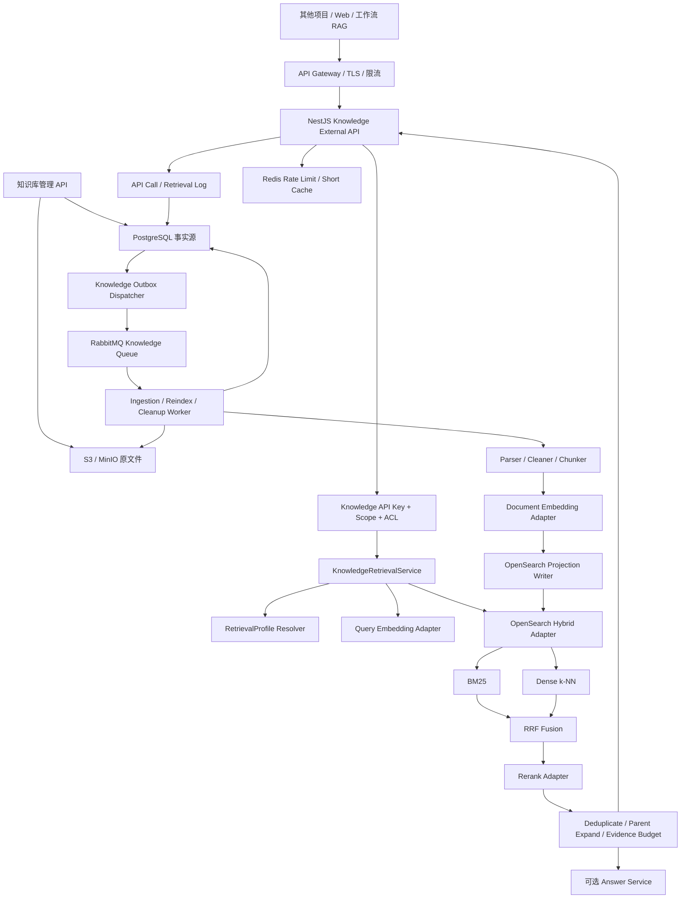
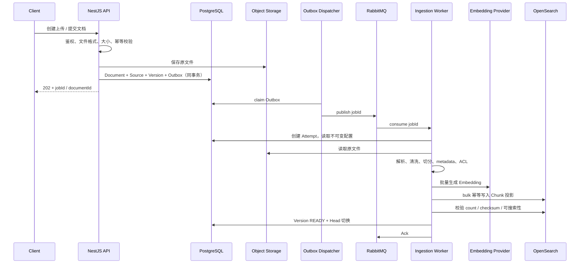

# 生产级知识库、混合检索与外部 API 方案

> 状态：生产目标设计与实施台账。知识库事实模型、可靠异步入库、对象存储、Embedding、
> OpenSearch 投影、混合召回、Web 召回测试和工作流 RAG 主链路已实现；迁移部署、环境联调、
> 检索质量评测、外部 API 安全与生产运维仍待完成。
>
> 适用范围：`apps/server` 知识库模块、文档入库 Worker、工作流 RAG 节点，以及供其他项目调用的
> `/v1/knowledge/*` Service API。
>
> 基础数据模型和索引代际设计见 [知识库设计方案](./knowledge-base-design.md)；概念和学习材料见
> [知识库与 RAG：从零基础到生产落地](./knowledge-base-rag-learning-guide.md)。本文在混合检索、
> 检索引擎、队列和外部 API 方面代表新的生产目标；与旧文档冲突时以本文为准。
>
> 调研时间：2026-08-10。OpenSearch、模型和供应商能力会变化，实施时锁定实际版本并重新验证。

## 0. 当前实现、缺口与实施台账

本节是实现进度的唯一入口。后续开发按阶段顺序推进；完成一项时必须同时更新状态和验收证据，
不能因为页面存在或接口返回 Mock 数据就标记为完成。

### 0.1 已有能力

| 能力       | 当前实现                                                               | 生产结论                                           |
| ---------- | ---------------------------------------------------------------------- | -------------------------------------------------- |
| 知识库管理 | 列表、创建、编辑、删除、设置和详情导航使用真实接口                     | 可作为管理面基线                                   |
| 文档来源   | 支持 Markdown、TXT、文本型 PDF；Source Store 支持本地、S3 与 MinIO     | 生产使用 S3；带保护期的孤儿对象 GC 已实现          |
| 分段       | 通用、Q&A、父子三种模式，支持预览、版本化 Chunk 和分页查看当前 Head    | 事实模型已实现，待部署迁移和真实环境联调           |
| 配置变更   | 创建不可变 BUILDING 代际，旧活动代际继续服务；单文档由用户手动重新索引 | 已符合“不静默改写”和成功后原子切换原则             |
| 检索设置   | 已实现 OpenSearch BM25、Dense、强制过滤和应用层 RRF                    | 主链路已实现，Rerank、父块扩展和黄金集门槛尚缺     |
| 嵌入模型   | 从模型管理选择稳定 UUID；OpenAI-compatible 与 Ollama Adapter 已接通    | 已实现批量向量化和维度校验，待供应商限流与故障联调 |
| RAG 节点   | Go Executor 调用服务端统一 Retriever；召回测试页使用同一真实检索服务   | Web 与工作流已闭环；外部 `/v1` API、安全和审计尚缺 |

### 0.2 嵌入模型配置决策

嵌入模型固定放在**知识库设置**，不作为每次上传的可编辑项：

- 一个知识库的活动索引代际只能属于一个 `embeddingSpaceKey`，不能让不同文件自行选择模型后混入
  不同维度或不同语义空间。
- 设置保存 `ModelGroup.id` 和 `ConfiguredModel.id` 两个稳定引用；凭证仍由模型模块加密管理，知识库
  不复制 Key、Base URL 或密文。
- 添加文件步骤最多展示当前模型的只读摘要和“前往设置”入口，不重复提供选择器。
- 模型或索引时配置变化后创建新 `KnowledgeBaseIndex` 代际并异步重建；旧活动代际继续服务，只有新
  代际完整 READY 后才原子切换。已有 Chunk 和活动索引不得在保存设置时被原地覆盖。
- 被知识库设置引用的模型组不能删除；被引用的模型不能删除或修改模型 ID。停用只影响新任务调度，
  历史代际仍通过快照保持可追溯。

### 0.3 尚缺能力与完成顺序

| 阶段 | 缺口                                                                | 状态               | 完成定义                                                                               |
| ---- | ------------------------------------------------------------------- | ------------------ | -------------------------------------------------------------------------------------- |
| 1A   | 知识库级嵌入模型选择和稳定引用                                      | 已完成             | 设置页只列出模型页中可用的 Embedding 模型；后端校验 owner/type/enabled；引用删除受保护 |
| 1B   | Index、Source、Version、Head、Attempt、Projection、Outbox 事实模型  | 已实现，待部署迁移 | 所有处理结果可按文档版本和索引代际追溯，失败不覆盖活动 Head                            |
| 1C   | S3/MinIO、RabbitMQ、幂等 Worker、PDF 文本解析与孤儿 Source GC       | 已实现，待环境联调 | 重复消息不产生重复版本/Chunk；失败可重试和进死信；原文件不依赖本机磁盘                 |
| 1D   | OpenSearch schema、投影写入和完整性校验                             | 已实现，待环境联调 | READY 文档的 count/checksum 与检索投影 100% 一致                                       |
| 2    | Embedding Adapter、BM25、Dense、ACL/generation filter、真实召回测试 | 已实现，待评测     | 两路召回可独立度量，权限泄漏为 0，召回测试不使用 Mock                                  |
| 3    | RRF、Rerank、父块扩展、去重、证据预算和黄金集门槛                   | 部分完成           | `hybrid-accurate-v1` 达到批准的 Recall/MRR/nDCG/拒答/引用门槛                          |
| 4    | 统一 Retriever、工作流 RAG、`/v1/knowledge/retrieve`                | 部分完成           | Web、工作流和外部 API 在相同身份/profile/query 下返回相同证据                          |
| 5    | Answer API、API Key/ACL、审计、限流、HA、备份与可观测性             | 待实现             | 请求可复现，故障降级符合 profile，容量和恢复演练通过                                   |

### 0.4 实施纪律

- 阶段 1 未通过前，不把同步写 PostgreSQL Chunk 的当前路径描述成生产入库。
- 阶段 2 未通过前，界面不得宣称“向量检索”“混合检索已生效”。
- 阶段 3 的准确率必须来自版本化黄金集和回归报告，不能用主观试问代替。
- 阶段 4 的三个入口必须共用 `KnowledgeRetriever`，禁止各自实现一套检索算法。
- 阶段 5 的安全和运维检查清单全部通过后，才可以标记为“企业生产级”。

### 0.5 当前迭代验收记录

| 日期       | 范围                      | 结果                                                                                                                                                                    |
| ---------- | ------------------------- | ----------------------------------------------------------------------------------------------------------------------------------------------------------------------- |
| 2026-08-10 | 1B 事实模型               | Prisma 已落地 Index、Source、Version、Head、Attempt、Projection、Outbox；旧文档和同步 Chunk 保留兼容读取，新版本 Chunk 以 `documentVersionId + sequence` 保证代际内唯一 |
| 2026-08-10 | 1B 索引配置不可变快照     | 嵌入模型或分段配置变化时，在事务内创建 BUILDING 代际和 Outbox；旧活动索引不变；同一知识库只允许一个 BUILDING 代际                                                       |
| 2026-08-10 | 1C RabbitMQ 与幂等 Worker | 已实现独立持久化交换机/队列、Confirm、手动 Ack、延迟重试、死信、Outbox 抢占恢复；消息只携带稳定聚合 ID；重复消费按事实状态跳过或续跑                                    |
| 2026-08-10 | 1C 对象存储 Adapter       | Source Store 已支持 `local` / `s3` 驱动；生产默认并要求 S3 Bucket；支持 AWS 默认凭证链和 MinIO endpoint/path-style；本地驱动只作为开发兼容                              |
| 2026-08-10 | 1C 解析与分段 Worker      | 已支持 Markdown、TXT、文本型 PDF（500 页上限、无 OCR）；能从不可变 Source 生成 Version 专属 Chunk 和预期投影 checksum                                                   |
| 2026-08-10 | 1C Source GC              | 已实现 local/S3 分页扫描、严格托管 key 识别、数据库双重引用核对、保护期和幂等删除；生产默认启用，默认保护期 24 小时                                                     |
| 2026-08-10 | 1D Embedding 与投影       | 已实现 OpenAI-compatible/Ollama Embedding、批量向量化、维度校验、OpenSearch mapping/bulk、count/checksum 校验；全部成功后才切 Head 与 activeIndexId                     |
| 2026-08-10 | 2 混合召回                | 已实现按 embedding space 分组的查询向量、BM25、Dense、owner/知识库/active generation/文档启用过滤，以及跨通道应用层 RRF；Web 召回测试已移除 Mock                        |
| 2026-08-10 | 2 强一致返回过滤          | OpenSearch 候选返回前再次以 PostgreSQL 当前 Head、活动 Index、Projection READY、文档启用状态和 owner 校验；禁用/删除后的残留投影不会泄漏给调用方                        |
| 2026-08-10 | 4 统一 Retriever 与 RAG   | JWT 召回测试和 Go RAG Executor 共用服务端 `KnowledgeRetrievalService`；Executor 端只提交 Command 身份、租约和 Query，知识库归属从不可变工作流版本解析                   |
| 2026-08-10 | 4 文档召回计数            | 工作流 RAG 最终命中已写入 Retrieval Log/Hit，同一次检索按文档去重；Web 召回测试不计数，文档列表从命中事实聚合召回次数                                                   |

下一批工作按以下顺序继续：

1. 部署 Prisma 迁移，并使用真实 PostgreSQL、RabbitMQ、S3/MinIO、Embedding Provider 和 OpenSearch
   完成故障、重试、幂等、部分失败及原子切换联调。
2. 实现 OpenSearch 残留投影回收、退役代际回收和删除传播。
3. 实现 Rerank、父块扩展、去重、证据预算与版本化检索画像。
4. 建立黄金集、离线评测、检索日志和发布门槛。
5. 实现外部 `/v1/knowledge/retrieve`、`kb-` API Key、grant、限流和审计，再完成 Answer API、HA、
   备份恢复、容量压测与告警。

## 1. 结论先行

当前项目的生产目标采用以下组合：

| 能力           | 选择                         | 定位                                              |
| -------------- | ---------------------------- | ------------------------------------------------- |
| API 与业务编排 | NestJS 11                    | 管理、鉴权、检索编排、外部 API、审计              |
| 业务事实源     | PostgreSQL 17 + Prisma 7     | 知识库、文档、版本、任务、索引代际、API Key、日志 |
| 原文件         | S3 兼容对象存储              | 原始文件、解析产物或大对象                        |
| 生产检索引擎   | OpenSearch 当前受支持版本    | 同一 Chunk 投影上的 BM25、向量检索、过滤与 RRF    |
| 异步队列       | PostgreSQL Outbox + RabbitMQ | 入库、重建、删除任务；复用项目现有 RabbitMQ 能力  |
| Redis          | Redis 7.4                    | 限流、短期缓存、分布式协调，不保存唯一事实        |
| 模型能力       | Provider Adapter             | Embedding、Rerank、LLM 分开配置和版本化           |
| 质量体系       | 黄金集 + 离线评测 + 线上反馈 | 用指标定义“准确”，把评测作为发布门槛              |

线上检索固定采用多阶段管线：

```text
强制租户 / ACL / active index 过滤
  -> BM25 候选 + Dense 候选
  -> RRF 融合
  -> 跨知识库候选合并
  -> Cross-encoder Rerank
  -> 去重、父块扩展、证据预算
  -> 最终 TopK / 拒答
```

“做到检索准确性”不等于承诺任何问题都能搜对，而是把它改造成可以验收的工程目标：

- 权限泄漏必须为 0。
- READY 文档的搜索投影完整率必须为 100%。
- 在真实黄金集上达到约定的 Recall、MRR、nDCG、拒答和引用门槛。
- 每次模型、切分、检索参数或 Rerank 变化都必须跑回归评测。
- 每次线上结果都能还原使用的索引代际、配置、候选和模型版本。

## 2. 目标、非目标与前提

### 2.1 目标

- 支持中文为主、中英混合的企业文档检索。
- 同时覆盖语义表达、专有名词、编号、金额、错误码和精确短语。
- 工作流 RAG、召回测试、外部检索 API 共用同一个检索服务。
- 支持一次查询多个知识库，即使它们使用不同 Embedding 模型。
- 文档、模型和索引变更不中断旧索引服务，可原子切换并回滚。
- 给其他项目提供稳定、可鉴权、可限流、可审计的检索与问答 API。
- 检索结果携带稳定引用，不让模型编造来源。
- 支持横向扩展、故障降级、指标监控和容量治理。
- 所有知识库使用统一的完整入库与检索能力。

### 2.2 非目标

第一版不包含：

- GraphRAG、知识图谱、Agentic RAG。
- 图片、音频和视频的多模态检索。
- 用户上传任意检索脚本、任意 OpenSearch DSL 或自定义 Rerank 代码。
- 让调用方在正式 API 中随意指定模型、融合权重或内部索引参数。
- 用 Prompt 替代 ACL、租户隔离或输出安全校验。

### 2.3 初始前提

- 单知识库可以从几千扩展到百万级 Chunk，但不为十亿级数据提前设计。
- 单次外部检索最多选择 10 个知识库，最终返回最多 20 条证据。
- 文档入库是异步操作；检索和纯证据返回是同步操作；生成式回答可阻塞或 SSE 流式返回。
- PostgreSQL 是唯一业务事实源，OpenSearch 是可以从 PostgreSQL 重建的检索投影。
- 第一批文件格式仍应从 Markdown、TXT 和文本型 PDF 开始，稳定后再扩展 Office 与 OCR。

这些限制最终由配置和真实压测确认，不应散落为代码魔数。

## 3. 总体架构



系统分成四个边界：

1. **管理面**：知识库、文档、索引代际、检索配置和 API Key 管理。
2. **入库面**：解析、清洗、切分、Embedding、投影、重建和资源清理。
3. **检索面**：权限解析、混合召回、融合、Rerank 和证据组装。
4. **外部 API 面**：稳定 DTO、鉴权、配额、版本、审计和错误契约。

## 4. 为什么生产主检索选择 OpenSearch

### 4.1 与 PostgreSQL + pgvector 的关系

pgvector 很适合做最小闭环、精确向量基线和中小规模向量检索，官方也提供与 PostgreSQL Full Text
Search、RRF 和 cross-encoder 组合的混合检索方案。但是本项目的生产目标明确包含：

- 中文全文检索与领域词典。
- Dense 与 BM25 的统一过滤和排名解释。
- 多租户、active generation、文档状态、时间和 ACL 过滤。
- 外部 API 的稳定延迟、检索画像和可观测性。
- 后续同义词、字段权重、查询分析和专用搜索扩缩容。

因此生产主路径选择 OpenSearch：同一条 Chunk 投影同时保存可检索正文、关键词字段、向量和过滤
字段；在同一个搜索请求和过滤范围内执行 BM25 与 k-NN，再用 search pipeline 做 rank fusion。

PostgreSQL 继续保存业务正文、状态和版本，但不承担生产查询的主向量索引，也不同时维护另一套
实时检索排名。这样避免“双搜索引擎都返回一半结果，再由应用猜一致性”的复杂度。

pgvector 可以保留为：

- 本地开发或早期最小闭环方案。
- 离线精确检索基线，用于抽样比较近似检索召回。
- OpenSearch 未采用前的短期实现。

它不作为 OpenSearch 生产主路径的同步降级库；否则每次写入、更新和删除都要同时维护两套检索
投影，故障时很难证明结果一致。

### 4.2 为什么选 OpenSearch 而不是把检索写死在业务层

- OpenSearch 原生支持 hybrid query、score normalization 和 rank-based fusion。
- BM25、向量、term/range/ACL filter 在同一个检索引擎中执行。
- 搜索索引可以独立扩容、创建副本、做快照和重建。
- 通过 `HybridSearchStore` 接口隔离后，业务服务不依赖具体 DSL，未来仍可替换为 Elasticsearch 或
  其他引擎。
- OpenSearch 使用 Apache 2.0 生态；若改用 Elasticsearch，必须提前确认 RRF、Rerank、安全等功能
  在目标部署方式下的许可和费用，不能只看文档示例。

## 5. 事实模型、索引代际和检索画像

### 5.1 两类配置必须分开

**索引时配置**改变后必须重建：

- Parser / Cleaner / Chunker 版本。
- 确定性的清洗配置；默认保留 URL、邮箱、编号、标点和结构化内容。
- 通用、Q&A 或父子分段模式及其参数。
- Embedding provider、model、task type、dimension、normalization。
- 向量相似度算法。
- OpenSearch mapping、analyzer 和字段结构版本。

这些配置保存在不可变 `KnowledgeBaseIndex` 代际中。

文档来源结构与处理方式通过版本化配置管理，Controller、Worker 和检索服务消费同一处理契约。

**查询时配置**通常不要求重建：

- BM25 和 Dense 的候选数。
- RRF rank window、rank constant 或经评测的权重。
- Rerank 模型、候选数、最终 TopK 和阈值。
- 去重、来源多样性、父块扩展和上下文预算。
- Rerank 不可用时是降级还是失败。

这些配置保存为版本化 `KnowledgeRetrievalProfile`。正式 API 只接受平台允许的 profile ID，不允许
调用方直接提交内部参数。

### 5.2 建议新增或补充的数据模型

| 模型                        | 关键字段                                            | 用途                                  |
| --------------------------- | --------------------------------------------------- | ------------------------------------- |
| `KnowledgeRetrievalProfile` | ownerId、name、version、config、status              | 不可变或版本化的查询配置              |
| `KnowledgeApiKey`           | ownerId、keyHash、prefix、suffix、scopes、expiresAt | 外部服务鉴权，明文只返回一次          |
| `KnowledgeApiKeyGrant`      | apiKeyId、knowledgeBaseId、permission               | Key 可以访问的知识库和动作            |
| `KnowledgeApiCallLog`       | apiKeyId、requestId、path、status、latency、usage   | 外部 API 审计，不保存 Authorization   |
| `KnowledgeSearchProjection` | indexId、documentVersionId、status、checksum        | PostgreSQL 中记录 OpenSearch 投影状态 |
| `KnowledgeRetrievalLog`     | profile、index、queryHash、status、latency          | 一次检索的主记录                      |
| `KnowledgeRetrievalHit`     | logId、chunkId、rank、scoreSnapshot                 | 最终证据和最小排名快照                |

`KnowledgeApiKey` 与已有应用 `app-` Key 分开。`app-` Key 绑定一个已发布工作流；知识库 Key 使用
`kb-` 前缀，绑定明确的知识库集合和 scope，不能互相调用。

### 5.3 OpenSearch 投影结构

OpenSearch 文档是 `KnowledgeChunk` 的可重建投影，建议字段：

```text
chunk_id                 keyword
parent_chunk_id          keyword?
owner_id                 keyword
knowledge_base_id        keyword
knowledge_base_index_id  keyword
scope_generation_key     keyword  # kbId:indexId
document_id              keyword
document_version_id      keyword
source_id                keyword
sequence                 integer
enabled                  boolean
title                    text + keyword
title_path               text + keyword
content                  text
content_vector           knn_vector
language                 keyword
tags                     keyword[]
acl_subjects             keyword[]
effective_from           date?
effective_to             date?
source_page              integer?
source_offset_start      integer?
source_offset_end        integer?
projection_checksum      keyword
```

安全过滤字段必须使用不可分词的 `keyword` 或数值/日期类型。不能从 `content` 中猜租户、权限或版本。

OpenSearch 文档 ID 使用稳定组合，例如：

```text
{knowledgeBaseIndexId}:{documentVersionId}:{chunkId}
```

重复投影是覆盖相同 ID 的幂等 upsert，而不是生成重复 Chunk。

### 5.4 不同 Embedding 模型怎样共存

一个 OpenSearch 向量字段的维度和映射固定，不同维度不能混在同一向量空间。定义：

```text
embeddingSpaceKey = hash(
  provider + model + taskType + dimension + normalization + distanceMetric + mappingVersion
)
```

同一 `embeddingSpaceKey` 的索引代际共享一个物理索引或索引族，例如：

```text
knowledge-chunks-{embeddingSpaceKey}-v1
```

一次请求查询多个知识库时：

1. 从 PostgreSQL 读取每个知识库的 `activeIndexId`。
2. 按 `embeddingSpaceKey` 分组。
3. 每个组只生成一次兼容的 query embedding。
4. 每个组在自己的 OpenSearch 索引中完成 BM25 + Dense + 本组 RRF。
5. 合并所有组的候选并执行统一 cross-encoder Rerank。

最终 Rerank 分数用于跨组排序，不直接比较不同向量模型的 cosine 分数或不同索引的 BM25 分数。

## 6. 生产入库链路

### 6.1 标准流程

Web 的“文本分段与清洗”步骤在正式提交前可以请求临时预览。预览与正式入库必须复用相同的
Parser、Cleaner、Chunker 版本和配置解释器，但预览不创建正式 Document、Version、Chunk，
不生成 Embedding，也不写 OpenSearch。Cleaner 只执行确定性、可版本化的保守规则：规范换行和
普通正文空白、移除非法控制字符、在高置信度下去除重复页眉页脚，同时保留 URL、邮箱、编号、
标点、代码、表格和段落结构。

Chunker 负责按照 `GENERAL/QA/PARENT_CHILD` 生成检索单元，Embedding Provider 只负责在切分完成后
将检索文本向量化：通用模式向量化普通 Chunk；Q&A 模式向量化以问题为主的问答单元；父子分段
向量化子块并保留 `parentChunkId`，召回子块后再扩展父块。三种模式都写入同一套 BM25 文本字段、
Dense 向量字段和来源元数据，不能为不同模式维护互不兼容的检索实现。



### 6.2 一致性原则

- 对象存储与 PostgreSQL不能组成一个事务。保存对象后数据库失败，要尽力删除本次孤儿对象，并由
  定时 GC 兜底。
- Document、Source、Version 与 Outbox 必须在同一个 PostgreSQL 事务创建。
- Outbox 只表示“任务需要被发布”；RabbitMQ 只表示“任务正在传递”；Version 才表示业务状态。
- RabbitMQ 使用持久化消息、Publisher Confirm、手动 Ack、重试交换机和死信队列。
- Worker 消费前按任务 ID 读取 PostgreSQL，重复消息必须安全跳过或续跑。
- OpenSearch bulk 部分成功时不能切换 Head。记录失败项并重试相同 projection ID。
- 投影完成后比较预期 Chunk 数、实际 count 与聚合 checksum，再把 Version 标记为 READY。
- 新版本失败时继续使用旧 Head；新索引代际失败时继续使用旧 `activeIndexId`。
- 删除、禁用和 ACL 变更同样走可靠投影任务；高风险权限收紧可以先在 PostgreSQL 把资源标为不可
  检索，再等待 OpenSearch 删除，避免窗口期泄漏。

### 6.3 为什么使用 RabbitMQ

项目已经为工作流命令接入 RabbitMQ，生产知识入库复用同一连接生命周期，但使用独立交换机、队列、
routing key、重试队列、死信队列和消费并发。当前可靠任务信封统一进入知识命令路由，并通过
`type + aggregateId` 分发：

```text
ai-workflow.knowledge.command.v1
  -> KNOWLEDGE_INDEX_BUILD_REQUESTED
  -> KNOWLEDGE_DOCUMENT_VERSION_PROCESS_REQUESTED
```

消息体不复制模型、切分配置、对象存储地址或正文，只携带 schema 版本、commandId、type 和稳定的
aggregateId。Worker 必须回查 PostgreSQL 中的不可变 Index/Version 快照；后续 ingest、cleanup 和
projection repair 可以拆分 routing key 或独立队列，但不得改变“数据库事实优先”的处理语义。

知识任务不能复用工作流节点 Queue，也不能让大 PDF 解析阻塞实时工作流 Command。Redis 保留给
限流、短缓存和协调，不再承担知识入库的可靠任务队列。

## 7. 混合检索完整链路

### 7.1 第 0 步：解析调用身份

在执行任何搜索前：

- 校验 `kb-` API Key 哈希、启用状态和过期时间。
- 解析 Key 允许的知识库、scope、调用配额和可选 IP / network policy。
- 生成或接收合法 `X-Request-Id`。
- `ownerId`、允许的知识库和 ACL subjects 只能从认证上下文产生，不能相信请求体。

### 7.2 第 1 步：解析 active index 与 profile

对每个请求中的知识库：

- 必须属于 Key grant。
- 必须是 ACTIVE，且有 READY `activeIndexId`。
- active index 的 OpenSearch projection 必须是 READY。
- 解析被允许的 `KnowledgeRetrievalProfile` 版本。

请求不能携带 provider、model、index name、ownerId、OpenSearch DSL 或任意 ACL。

### 7.3 第 2 步：规范化 Query

正式检索 API 默认只做确定性规范化：

- 去除首尾空白，合并异常空白。
- 统一全半角、Unicode 规范形式和大小写策略。
- 保留数字、小数、货币、版本号、错误码和标点信息。
- 应用经过评测的业务别名词典，例如“差旅酒店”与“住宿费”。

外部纯检索 API 默认不使用 LLM 改写，防止意图漂移。多轮 `answer` API 可以先把指代改成独立问题，
但必须同时保存原问题和改写问题，并通过 profile 控制。

### 7.4 第 3 步：构造强制过滤器

每个检索子查询必须携带：

```text
owner_id = authenticated owner
scope_generation_key IN active kbId:indexId pairs
enabled = true
acl_subjects intersects authenticated subjects
effective_from <= asOf
effective_to is null OR effective_to > asOf
```

调用方可以提交的 metadata filter 必须经过字段白名单和类型校验，再与强制过滤器做 `AND`。调用方
不能覆盖或删除强制过滤器。

### 7.5 第 4 步：并行召回 BM25 与 Dense

每个 embedding space group 执行：

```text
BM25：对 title、title_path、content 做 multi-field 搜索
Dense：对 content_vector 做 k-NN
Filter：两路使用相同 owner / generation / enabled / ACL / time 条件
```

字段权重的起始方向：

```text
title^3 > title_path^2 > content^1
```

这只是初始实验值。中文 analyzer、领域词典、同义词和字段权重都必须在黄金集上确定。

### 7.6 第 5 步：RRF 融合

BM25 与向量分数不在同一尺度，第一版不直接加权相加。使用 rank-based fusion：

```text
RRF(d) = Σ 1 / (rankConstant + rank_i(d))
```

OpenSearch 的 score ranker search pipeline 负责本组融合。RRF 优点是对分数尺度不敏感，缺点是无法
表达所有业务偏好。因此它是稳定基线，不是永远不变的最终算法。

### 7.7 第 6 步：跨组候选合并

当多个知识库使用不同 Embedding 模型时，每组先返回本组 RRF 候选。应用层：

- 按稳定 Chunk ID 去重。
- 对每个知识库和每个组设置候选上限，避免一个大库挤掉所有小库。
- 保留本地 rank，不跨组比较原始 BM25、cosine 或 RRF score。
- 将统一候选送入同一个 Rerank 模型。

### 7.8 第 7 步：Cross-encoder Rerank

Rerank 输入使用：

```text
query
title
title_path
child chunk content
必要的短 metadata
```

不把完整大文档交给 Rerank。候选过长时按模型 token 上限截断，但必须保留标题和命中附近内容。

Rerank 输出作为最终跨知识库可比分数。只有 Rerank 分数经过黄金集校准后才使用统一阈值；没有
Rerank 时，RRF score 不应伪装成 0～1 的“相关概率”。

### 7.9 第 8 步：父块扩展、去重与证据预算

- 搜索和 Rerank 使用较小 child chunk，最终可以返回 parent chunk。
- 相邻 child 命中同一 parent 时只返回一次。
- 限制单文档最多占最终结果的数量，避免重复内容淹没其他来源。
- 按 final TopK 和 evidence token budget 双重限制。
- 保留文档名、章节、页码、offset、版本、生效时间和稳定 citation ID。
- 冲突版本不能静默合并；正确做法是在 filter 阶段选有效版本，或保留冲突标记交给 answer 层说明。

### 7.10 第 9 步：返回、拒答和记录

- 纯检索结果为空时返回 `200` 与空 `results`，不是 `404`。
- `answer` API 证据不足时返回 `answerable=false`，不是编造答案。
- 记录 profile、active index、模型、候选排名、最终命中、耗时和降级状态。
- 正式响应默认只返回最终 score；只有 `knowledge:debug` scope 才能返回 Dense、BM25、RRF 和
  Rerank 中间排名。

## 8. 默认检索画像

建议创建 `hybrid-accurate-v1` 作为第一版实验起点：

| 参数                           | 起始值                 | 说明                            |
| ------------------------------ | ---------------------- | ------------------------------- |
| BM25 candidate K               | 100                    | 追求精确词召回                  |
| Dense K                        | 100                    | 追求语义召回                    |
| Dense numCandidates / efSearch | 通过压测确定，先高召回 | 不直接复制厂商默认              |
| RRF rank window                | 100                    | 至少覆盖两路候选窗口            |
| RRF rank constant              | 60                     | 常见起点，必须通过评测确认      |
| 每 embedding group 最大候选    | 100                    | 防止多组候选无限膨胀            |
| 全局 Rerank candidate K        | 50                     | 在准确率、token 与延迟间折中    |
| Final TopK                     | 8                      | API 可下调，正式最大值 20       |
| 单文档最大结果数               | 3                      | 控制重复来源                    |
| Evidence budget                | 4000～8000 tokens      | 按生成模型与场景配置            |
| Rerank failure                 | `FAIL_CLOSED`          | accurate profile 默认不静默降级 |

这些数字不是“行业正确答案”。上线前必须从真实数据得到新的 profile 版本，不能直接把本表变成
永不调整的常量。

同时提供 `hybrid-fast-v1`：较小候选窗口、可在 Rerank 超时后返回 RRF 结果，并明确
`degraded=true`。调用方不能临时切换失败策略，只能使用 Key 被授权的 profile。

## 9. 检索准确性体系

### 9.1 准确性分层

| 层         | 核心问题                       | 主要指标                                 |
| ---------- | ------------------------------ | ---------------------------------------- |
| 投影完整性 | READY 文档是否全部进入正确索引 | count、checksum、projection lag          |
| 权限正确性 | 是否只返回允许的数据           | ACL leakage、denied-query tests          |
| 候选召回   | 正确证据有没有进入候选         | Hit@K、Recall@K                          |
| 排序质量   | 正确证据是否靠前               | MRR、nDCG@K、Precision@K                 |
| 证据质量   | 最终内容是否完整、少噪声       | Context Precision / Recall               |
| 拒答能力   | 无答案时是否不返回伪相关结果   | false-positive rate、abstention accuracy |
| 引用正确性 | 结果能否追到正确文件位置       | citation precision、offset validation    |
| 系统质量   | 是否在延迟与成本预算内稳定完成 | P95/P99、timeout、degradation            |

### 9.2 黄金集要求

首个生产租户至少准备 200 条人工审核样本，建议构成：

- 80 条普通事实与同义改写。
- 30 条编号、金额、产品名、缩写和错误码。
- 20 条跨 Chunk 或 parent-child 问题。
- 20 条多文档或版本/时间问题。
- 20 条无答案或错误前提。
- 20 条权限隔离样本。
- 10 条恶意文档或间接 Prompt Injection 样本。

每条至少标注：query、相关文档、相关 Chunk 或可接受证据集合、答案要点、是否应该回答、权限主体、
生效时间和问题类型。

### 9.3 建议的第一版发布门槛

以下是项目启动门槛，业务高风险时应提高：

| 指标                          | 初始门槛                               |
| ----------------------------- | -------------------------------------- |
| ACL 泄漏                      | `0`                                    |
| READY 投影完整率              | `100%`                                 |
| Answerable 样本 Hit@20        | `>= 95%`                               |
| Answerable 样本 Recall@20     | `>= 90%`                               |
| nDCG@10                       | `>= 0.85`                              |
| MRR                           | `>= 0.80`                              |
| 无答案样本错误返回高置信证据  | `<= 5%`                                |
| 引用指向正确文档和位置        | `100%`                                 |
| ANN 相对离线精确基线 Recall@K | `>= 95%`                               |
| 任一关键问题分类              | 不低于约定分类下限，不能只看总体平均值 |

门槛不是对所有行业的普适承诺。上线前由产品、业务和研发共同确认，记录在 profile release 中。

### 9.4 评测流程

每个 candidate profile 与三个基线比较：

```text
BM25 only
Dense only
Hybrid RRF
Hybrid RRF + Rerank
```

发布新 profile 前：

1. 固定文档快照和黄金集。
2. 运行四套管线，保存逐题排名而非只有平均分。
3. 检查不同问题类别、不同知识库和长尾实体。
4. 检查质量、P95/P99 延迟和每请求成本。
5. 只有没有关键分类回退并通过门槛才发布新 profile 版本。
6. 灰度部分 API Key，观察空召回、点击/采用、纠错和转人工。
7. 线上失败样本去敏后回流黄金集。

### 9.5 线上定位漏斗

```text
原文正确吗
  -> 解析正确吗
  -> Chunk 是否完整
  -> Metadata / ACL / active generation 是否把它过滤掉
  -> BM25 或 Dense 是否召回
  -> RRF 是否保留
  -> Rerank 是否错误降序
  -> Parent 扩展和去重是否丢失证据
  -> Final TopK / threshold 是否裁掉
```

日志必须能回答每一层，不能只记录“最后返回了 8 条”。

## 10. 外部 API 设计

### 10.1 管理 API 与 Service API 分离

- `/knowledge-bases/*`：Studio 管理接口，继续使用用户 Bearer JWT。
- `/v1/knowledge/*`：给其他项目调用，使用 `Authorization: Bearer kb-...`。
- `/internal/*`：Worker 或受控内部服务，使用内部认证和网络隔离，不向外部项目开放。

### 10.2 API Key 与 scope

Key 示例：

```text
kb-live-xxxxxxxxxxxxxxxxxxxxxxxx
```

数据库只保存 SHA-256 哈希、前缀、末尾展示字符、状态和最后使用时间。明文只在创建响应返回一次，
并设置 `Cache-Control: no-store`。

建议 scope：

```text
knowledge:retrieve
knowledge:answer
knowledge:documents:read
knowledge:documents:write
knowledge:debug
```

每个 Key 还要通过 grant 绑定允许访问的知识库。只有 scope 没有知识库 grant 仍然不能访问数据。

### 10.3 核心检索接口

```http
POST /v1/knowledge/retrieve
Authorization: Bearer kb-live-...
Content-Type: application/json
X-Request-Id: caller-generated-id
```

请求：

```json
{
  "query": "我下周去上海出差，酒店一晚 680 元能全额报吗？",
  "knowledgeBaseIds": ["e2f7b4cc-7df1-4ef8-a7fd-d624f839047e"],
  "profileId": "hybrid-accurate-v1",
  "topK": 5,
  "asOf": "2026-08-10T00:00:00.000Z",
  "filters": {
    "tags": ["finance", "travel"]
  }
}
```

约束：

- `query` 去空白后 1～4000 字符。
- `knowledgeBaseIds` 1～10 个，必须全部属于 Key grant。
- `topK` 1～20；省略时使用 profile 默认值。
- `profileId` 只能选择 Key 允许的已发布 profile。
- `asOf` 默认当前时间；是否允许查询历史时间由 Key scope 或业务规则控制。
- `filters` 只接受平台公开的白名单字段和操作符。
- 请求不能携带 `ownerId`、ACL、model、index、weight、threshold 或 OpenSearch DSL。

成功响应：

```json
{
  "requestId": "req_01K...",
  "profile": {
    "id": "hybrid-accurate-v1",
    "version": 1
  },
  "indexGenerations": [
    {
      "knowledgeBaseId": "e2f7b4cc-7df1-4ef8-a7fd-d624f839047e",
      "indexId": "1f876390-ed7c-4d21-a089-41932a8a2599",
      "generation": 3
    }
  ],
  "degraded": false,
  "tookMs": 286,
  "results": [
    {
      "rank": 1,
      "chunkId": "a4f764e8-7c4f-4e4f-b10f-df3e53b808f6",
      "parentChunkId": null,
      "document": {
        "id": "57350118-66c0-47a9-a028-bc710f317c72",
        "name": "2026 年员工差旅与报销制度.pdf",
        "versionId": "c9e57d93-6040-42eb-b35b-ac3686883af9"
      },
      "content": "北京、上海、深圳的住宿费上限为 600 元/晚……",
      "score": 0.94,
      "scoreType": "rerank",
      "citation": {
        "sourceId": "S1",
        "titlePath": "差旅与报销制度 > 4.2 住宿费",
        "page": 8
      },
      "metadata": {
        "effectiveAt": "2026-07-01T00:00:00.000Z",
        "tags": ["finance", "travel"]
      }
    }
  ]
}
```

不把 `score` 描述成概率。它的类型由 `scoreType` 明确；正式 accurate profile 应返回 Rerank score。

`knowledge:debug` scope 可以额外请求：

```json
{
  "debug": true
}
```

调试响应可返回 BM25 rank、Dense rank、RRF rank、Rerank score、过滤和降级原因，但不能返回其他
租户候选、向量、内部索引名或敏感 ACL。

### 10.4 托管回答接口

其他项目只想获得证据时调用 `/retrieve`；希望平台完成“检索 + Prompt + LLM + 引用”时调用：

```http
POST /v1/knowledge/answer
```

请求：

```json
{
  "query": "我下周去上海出差，酒店一晚 680 元能全额报吗？",
  "knowledgeBaseIds": ["e2f7b4cc-7df1-4ef8-a7fd-d624f839047e"],
  "profileId": "hybrid-accurate-v1",
  "responseMode": "blocking"
}
```

响应：

```json
{
  "requestId": "req_01K...",
  "answerable": true,
  "answer": "不能全额报销。上海住宿费上限为 600 元/晚，超出的 80 元原则上由员工自行承担。[S1]",
  "citations": [
    {
      "sourceId": "S1",
      "documentName": "2026 年员工差旅与报销制度.pdf",
      "titlePath": "差旅与报销制度 > 4.2 住宿费",
      "page": 8,
      "chunkId": "a4f764e8-7c4f-4e4f-b10f-df3e53b808f6"
    }
  ],
  "degraded": false,
  "usage": {
    "retrievalMs": 286,
    "inputTokens": 1320,
    "outputTokens": 78
  }
}
```

`responseMode=streaming` 使用 SSE：

```text
retrieval_finished
message_delta
answer_finished
error
```

证据不足仍返回 `200`、`answerable=false`、解释缺失信息和可选 citations。它不是服务端错误。

### 10.5 外部文档入库接口

上传请求必须提交 `segmentationMode=GENERAL|QA|PARENT_CHILD`，并使用平台允许的版本化模式参数与
清洗配置；API 不接受索引档位、检索方式或查询 `TopK`。服务端将规范化后的模式与配置保存到
DocumentVersion 快照。

小文件可以提供：

```http
POST /v1/knowledge-bases/:knowledgeBaseId/documents
Content-Type: multipart/form-data
Idempotency-Key: caller-stable-key
```

响应 `202 Accepted`：

```json
{
  "requestId": "req_01K...",
  "documentId": "57350118-66c0-47a9-a028-bc710f317c72",
  "jobId": "7eedad77-7b34-43f6-ae58-321eaa8dc3c5",
  "status": "QUEUED"
}
```

查询任务：

```http
GET /v1/knowledge/ingestion-jobs/:jobId
```

大文件后续改用上传会话：

```text
POST /v1/knowledge-bases/:id/upload-sessions
  -> 返回预签名 URL
客户端直传对象存储
POST /v1/knowledge-bases/:id/upload-sessions/:sessionId/complete
  -> 创建 Document / Version / Job
```

是否使用 multipart 或预签名不改变 Document、Source、Version 和 Job 契约。

### 10.6 其他接口

```text
GET    /v1/knowledge-bases
GET    /v1/knowledge-bases/:id
GET    /v1/knowledge-bases/:id/documents
GET    /v1/knowledge-bases/:id/documents/:documentId
PATCH  /v1/knowledge-bases/:id/documents/:documentId
DELETE /v1/knowledge-bases/:id/documents/:documentId
GET    /v1/knowledge/retrievals/:requestId        # 仅有审计权限时
```

外部列表使用 opaque cursor，不允许客户端构造数据库 offset 或解析 cursor。

### 10.7 错误契约

统一形状：

```json
{
  "code": "KNOWLEDGE_INDEX_NOT_READY",
  "message": "知识库索引尚未就绪",
  "requestId": "req_01K...",
  "details": {
    "knowledgeBaseId": "e2f7b4cc-7df1-4ef8-a7fd-d624f839047e"
  }
}
```

| HTTP | 典型 code                   | 说明                                       |
| ---- | --------------------------- | ------------------------------------------ |
| 400  | `INVALID_REQUEST`           | DTO、字段、数量或 filter 不合法            |
| 401  | `INVALID_API_KEY`           | Key 缺失、无效或过期                       |
| 403  | `KNOWLEDGE_SCOPE_DENIED`    | scope 或 grant 不允许                      |
| 404  | `KNOWLEDGE_BASE_NOT_FOUND`  | 不存在或不属于 Key，避免枚举               |
| 409  | `IDEMPOTENCY_CONFLICT`      | 同一幂等键对应不同请求                     |
| 409  | `KNOWLEDGE_INDEX_NOT_READY` | active projection 尚不可服务               |
| 413  | `PAYLOAD_TOO_LARGE`         | 文件或请求超过配置上限                     |
| 429  | `RATE_LIMITED`              | 返回 `Retry-After` 和限流响应头            |
| 503  | `RETRIEVAL_UNAVAILABLE`     | OpenSearch、Embedding 或强制 Rerank 不可用 |
| 504  | `RETRIEVAL_TIMEOUT`         | 超过服务端 deadline                        |

日志不得记录 Authorization、完整 API Key、完整文档或默认记录完整 query。

### 10.8 API 版本与兼容性

- URL 主版本固定 `/v1`。
- 只新增可选响应字段不升主版本；删除字段、改语义或收紧已承诺范围需要新主版本。
- `profile.id + profile.version` 与 `indexId` 出现在响应中，保证结果可复现。
- API 不暴露 OpenSearch index name、DSL 或供应商模型凭证。
- 所有时间使用 ISO 8601 UTC；所有 ID 使用服务端生成 UUID。
- 生成式 SSE 客户端断开后是否取消请求必须有明确语义；第一版建议客户端断开即取消尚未完成的
  answer，纯检索请求不提供后台继续运行语义。

## 11. NestJS 模块边界

建议在 `apps/server` 内拆分职责，不创建新的 workspace package：

```text
KnowledgeBaseModule
  管理知识库身份和基础信息

KnowledgeDocumentModule
  文档、Source、Version、上传和状态查询

KnowledgeIngestionModule
  Outbox、RabbitMQ publisher/consumer、Attempt、Parser、Chunker

KnowledgeIndexModule
  Index generation、embedding space、OpenSearch projection、切换与重建

KnowledgeRetrievalModule
  Profile、Query normalization、HybridSearchStore、Reranker、Context builder、日志

KnowledgeExternalApiModule
  kb- API Key Guard、scope/grant、DTO、限流、审计、/v1 路由

KnowledgeAnswerModule
  基于 Retrieval Service 的 Prompt、LLM、引用校验和 SSE
```

关键接口：

```ts
interface KnowledgeParser {
  parse(source: KnowledgeSourceRef): Promise<ParsedKnowledgeDocument>
}

interface KnowledgeEmbeddingProvider {
  embedDocuments(input: EmbedDocumentBatch): Promise<EmbeddingBatchResult>
  embedQuery(input: EmbedQueryInput): Promise<number[]>
}

interface HybridSearchStore {
  project(input: SearchProjectionBatch): Promise<SearchProjectionResult>
  remove(input: SearchProjectionDelete): Promise<void>
  search(input: HybridSearchInput): Promise<HybridSearchCandidate[]>
}

interface KnowledgeReranker {
  rerank(input: RerankInput): Promise<RerankedCandidate[]>
}

interface KnowledgeRetriever {
  retrieve(input: KnowledgeRetrieveInput): Promise<KnowledgeRetrieveResult>
}
```

Controller 只做 DTO、认证上下文、状态码和 SSE 转换。检索算法不写在 Controller，也不让 Prisma
model 或 OpenSearch response 直接成为公开 DTO。

工作流 RAG 节点、Web 召回测试和外部 `/v1/knowledge/retrieve` 都调用同一个
`KnowledgeRetriever`。三者只在认证上下文、是否允许 debug、是否计入正式调用统计上不同。

## 12. 安全设计

### 12.1 API 安全

- 所有外部接口必须经过 TLS；高价值内网调用可叠加 mTLS 或网关签名。
- Key 只放 `Authorization` Header，不放 URL、query string、日志或错误详情。
- Key 可撤销、可过期、可绑定 scope、知识库、配额和可选网络策略。
- 每个资源 ID 访问都重新检查 grant，防止 Broken Object Level Authorization。
- Redis 按 API Key + route 做令牌桶限流；数据库保留配额事实与计费审计。
- 限制 query 长度、知识库数量、TopK、filter 数、上传大小、页数、并发和每日 token。
- 正式 API 不接受任意模型 ID、URL、DSL、Prompt 或内部配置，防止资源消耗和 SSRF。
- CORS 不是服务间鉴权；服务端调用场景不配置无意义的 `*` 作为安全措施。

### 12.2 数据与 RAG 安全

- 上传文件视为不可信输入；解析器进程限制 CPU、内存、时间、文件数和网络访问。
- 检索内容视为数据，不是系统指令；answer Prompt 明确 source boundary。
- ACL 必须在检索前强制过滤，不能先取越权内容再依赖 LLM 忽略。
- OpenSearch、对象存储、PostgreSQL 和备份都配置加密、独立服务账号和最小权限。
- Rerank / LLM 上游只接收当前请求允许的候选，不发送整库或越权 metadata。
- 引用由服务端稳定 ID 映射，模型不能自由生成 URL 或文档标识。
- LLM 输出进入工作流工具、HTML 或其他项目业务逻辑前仍需结构校验和转义。

## 13. SLO、超时与容量

### 13.1 建议的初始 SLO

| 能力                   | 初始目标                                 |
| ---------------------- | ---------------------------------------- |
| `/retrieve` 可用性     | 月度 `>= 99.9%`                          |
| `hybrid-fast` P95      | `<= 500 ms`                              |
| `hybrid-accurate` P95  | `<= 1000 ms`                             |
| `/answer` 首 token P95 | `<= 2500 ms`，与模型供应商相关           |
| 索引新鲜度             | 文档处理完成后 60 秒内可搜索             |
| 权限收紧传播           | 目标 30 秒内，超时则资源保持 fail-closed |
| 删除完成               | 按文件量制定，例如 24 小时内清理外部资源 |

这是启动目标，不是当前系统已经达到的承诺。正式 SLA 要在容量压测和供应商 SLA 基础上确定。

### 13.2 分阶段 deadline 示例

```text
认证与 active index 解析   50 ms
query embedding           250 ms
OpenSearch hybrid         300 ms
Rerank                    400 ms
context build              50 ms
审计写入                   50 ms
总 deadline              1200 ms
```

所有下游 timeout 必须小于总 deadline，并传递取消信号。不能让请求已经超时后，Rerank 或模型仍在
后台无限消耗资源。

### 13.3 容量需要持续测量

- Chunk 总数、每天新增/更新/删除量、平均和 P99 token。
- Embedding dimension、OpenSearch index size、segment、shard 和 replica。
- BM25 / Dense 候选数、Rerank pair 数和每请求 token。
- RabbitMQ backlog、处理吞吐、失败率和死信数量。
- 各上游供应商限流、成本、P95/P99 和错误类型。
- 不同租户的 QPS、热点知识库和过滤选择性。

不要按“每个知识库一个 shard”设计；大量小知识库会造成 shard 爆炸。优先按 embedding space 和
索引 schema 组织共享索引，用字段隔离知识库和 generation。

## 14. 缓存策略

第一版不缓存完整检索响应，先避免 ACL、active generation 和文档更新导致的数据泄漏或陈旧结果。

可以安全评估：

- Query embedding 缓存：key 包含规范化 query、embedding space、模型和 preprocessing 版本。
- Profile 和 active index 短缓存：key 包含 owner，变更时主动失效，TTL 很短。
- 不缓存 API Key 明文和模型凭证。

如果以后缓存最终结果，cache key 至少包含：

```text
owner + API key grant version + ACL subjects hash + kb active index IDs
+ profile version + normalized query + filters + asOf bucket + topK
```

任一权限、active index、文档启停或 profile 发布变化都必须使旧 key 不再命中。

## 15. 故障与降级

| 故障                         | Accurate profile                     | Fast profile                      |
| ---------------------------- | ------------------------------------ | --------------------------------- |
| Query Embedding 超时         | `503`，不假装完整混合检索            | 可降级 BM25，`degraded=true`      |
| OpenSearch 不可用            | `503`                                | `503`，不查询 PostgreSQL 全表兜底 |
| Rerank 超时                  | `503`                                | 返回 RRF，`degraded=true`         |
| 审计数据库不可用             | 默认 fail-closed                     | 是否缓冲后返回由合规策略决定      |
| RetrievalLog 写入失败        | API 审计仍保留；质量日志进入可靠补偿 | 同左                              |
| 某知识库 projection 非 READY | 整个请求失败或显式 partial profile   | partial 必须明确列出 skipped KB   |
| OpenSearch bulk 部分失败     | Version 不 READY，重试失败项         | 不影响旧 Head                     |
| RabbitMQ 重复消息            | 幂等续跑 / 跳过                      | 不产生重复投影                    |

降级不是在 catch 中悄悄换算法。响应、日志、指标都必须带 `degraded`、`degradationReason` 和实际
使用的 profile path。

## 16. 可观测性

一次检索 Trace 至少包含：

```text
requestId / traceId
apiKeyId（不含明文）
ownerId / granted KB IDs（安全标识）
profileId + version
active index IDs + embedding space keys
query normalization / rewrite version
embedding provider + model + latency
OpenSearch total / BM25 / Dense latency and candidate counts
RRF local ranks
Rerank model + latency + candidate count
final chunk IDs + citation IDs
total latency / degraded / error code
```

建议指标：

- `knowledge_retrieval_requests_total{status,profile}`
- `knowledge_retrieval_duration_ms{stage,profile}`
- `knowledge_retrieval_candidates{stage}`
- `knowledge_retrieval_empty_rate{profile}`
- `knowledge_retrieval_degraded_total{reason}`
- `knowledge_projection_lag_seconds`
- `knowledge_projection_mismatch_total`
- `knowledge_ingestion_jobs{status,stage}`
- `knowledge_api_rate_limited_total`
- `knowledge_acl_denied_total`

默认日志只保存 query hash 或脱敏摘要；需要保存正文进行质量分析时，必须配置用途、访问权限、保留
时间和删除机制。

## 17. 部署与高可用

### PostgreSQL

- 生产使用高可用实例、PITR、自动备份和 migration 单次发布任务。
- Search projection 状态和 Outbox 必须可从备份恢复。

### OpenSearch

- 使用受支持版本，生产多节点、多可用区和 replica，避免单节点作为生产 SLA 基础。
- 配置 snapshot repository、恢复演练、磁盘水位、JVM/内存、shard 和 segment 监控。
- 索引模板、analyzer、search pipeline 作为版本化部署配置，不在运行期人工修改生产索引。
- OpenSearch 不直接暴露公网，只有 NestJS 和受控 Worker 服务账号可访问。

### RabbitMQ

- 生产使用 quorum queue 或等价高可用策略、Publisher Confirm、consumer prefetch 和死信队列。
- 知识入库与工作流执行使用独立 vhost 或至少独立交换机、queue、routing key 和资源配额。

### 对象存储

- 启用服务端加密、生命周期、版本/软删除策略和访问日志。
- 客户端预签名上传限制 object key、大小、MIME、有效期和单次使用语义。

## 18. 实施顺序

### 阶段 1：事实模型和入库闭环

- 已完成知识库级嵌入模型选择：复用模型管理的 Embedding 目录，保存稳定 UUID 引用并保护被引用模型。
- 已落地 Index、Document、Source、Version、Chunk、Head、Attempt、Projection、Outbox。
- 已实现 S3/MinIO、本地开发存储、RabbitMQ 知识队列和幂等 Worker；孤儿对象 GC 待补齐。
- 已支持 Markdown / TXT / 文本型 PDF，统一的结构化解析、保守清洗、三种分段模式与临时预览。
- 已建立 OpenSearch schema、projection writer 和 count/checksum 完整性校验；待生产环境联调。

验收：重复消息不重复写；失败不切 Head；READY 投影完整率 100%。

### 阶段 2：Dense、BM25 与召回测试

- 已实现 Embedding Adapter 和 embedding space 分组。
- 已实现 OpenSearch BM25、k-NN、强制 owner / knowledge base / generation / document filter。
- 召回测试页已使用真实 Retriever 展示融合结果与来源；两路候选诊断视图待补齐。
- 建立第一批 200 条黄金集和三个基线。

验收：BM25 only、Dense only 可分别测量；权限泄漏为 0。

### 阶段 3：RRF、Rerank 和准确性门槛

- 已实现 BM25、Dense 和跨 embedding space 的应用层 RRF；是否切换 OpenSearch score ranker 由压测决定。
- 跨组候选合并和 cross-encoder Rerank。
- parent-child、去重、证据预算和引用。
- profile 版本、离线评测报告和发布门槛。

验收：`hybrid-accurate-v1` 通过第 9.3 节门槛，逐类无关键回退。

### 阶段 4：工作流 RAG 与外部 Retrieve API

- 工作流和召回测试已共用服务端 `KnowledgeRetrievalService`；外部 API 接入后必须继续复用该边界。
- `kb-` API Key、scope、grant、限流、审计、错误契约。
- `/v1/knowledge/retrieve` 和异步文档 API。

验收：同一身份、profile 和问题在三个入口返回相同证据；跨 Key 越权用例全部失败。

### 阶段 5：Answer API 和生产加固

- `/v1/knowledge/answer`、引用校验、拒答和 SSE。
- HA、备份恢复、容量压测、故障注入和降级策略。
- 线上反馈回流、灰度 profile、SLO 仪表盘和告警。

验收：可按 requestId 完整复现；模型和 Rerank 故障符合 profile 策略；恢复演练通过。

## 19. 上线检查清单

### 正确性

- [ ] 黄金集经过领域人员审核，覆盖精确词、语义、无答案、版本和权限。
- [ ] BM25、Dense、Hybrid、Hybrid + Rerank 有逐题对比报告。
- [ ] 达到已批准的 Recall、MRR、nDCG、拒答和引用门槛。
- [ ] ANN 抽样与精确基线比较，召回损失在门槛内。
- [ ] 所有 READY 文档 count 和 checksum 与 OpenSearch 一致。

### 安全与 API

- [ ] `kb-` Key 只存哈希，明文只显示一次，可撤销、过期、限流。
- [ ] scope 与知识库 grant 双重校验。
- [ ] owner、active generation 和 ACL filter 不能被请求体覆盖。
- [ ] API 不暴露内部索引、向量、模型凭证、其他租户候选和任意 DSL。
- [ ] 文件、query、TopK、知识库数量、filters、并发和 token 都有限制。
- [ ] Error、429、Retry-After、requestId 和幂等语义已经写入调用文档。

### 一致性与运维

- [ ] Outbox、RabbitMQ confirm、手动 Ack、重试、死信和幂等全部闭环。
- [ ] 新文档/新代际只有完整投影后才能 READY 和 active。
- [ ] 更新、禁用、权限收紧和删除能传播并可审计。
- [ ] OpenSearch、PostgreSQL、RabbitMQ 和对象存储有备份与恢复演练。
- [ ] P95/P99、积压、projection lag、空召回、降级和成本有监控告警。
- [ ] Rerank、Embedding、OpenSearch、数据库分别做过超时和故障演练。

## 20. 参考资料

1. [OpenSearch Hybrid Search](https://docs.opensearch.org/latest/vector-search/ai-search/hybrid-search/index/)：
   hybrid query、normalization 和 rank-based score ranker pipeline。
2. [OpenSearch Score Ranker Processor](https://docs.opensearch.org/latest/search-plugins/search-pipelines/score-ranker-processor/)：
   基于排名融合多个检索子句。
3. [pgvector 官方文档](https://github.com/pgvector/pgvector)：精确/近似检索、HNSW、过滤、混合检索
   以及与 RRF / cross-encoder 的组合。
4. [Elasticsearch Hybrid Search](https://www.elastic.co/docs/solutions/search/hybrid-search)：
   BM25 + vector + RRF 的另一份生产实现参考；采用前需确认许可和部署成本。
5. [Ragas Metrics](https://docs.ragas.io/en/stable/concepts/metrics/available_metrics/)：
   Context Precision、Context Recall、Faithfulness 等评测概念。
6. [OWASP API Security Top 10](https://owasp.org/www-project-api-security/)：对象级授权、资源消耗、
   API 资产和第三方 API 风险。
7. [OWASP REST Security Cheat Sheet](https://cheatsheetseries.owasp.org/cheatsheets/REST_Security_Cheat_Sheet.html)：
   API Key、HTTP 状态、限流和传输安全。
8. [OWASP Top 10 for LLM Applications](https://owasp.org/www-project-top-10-for-large-language-model-applications/)：
   Prompt Injection、不安全输出处理和敏感信息风险。

## 21. 最终原则

本方案把知识库当成一个独立的检索服务，而不是工作流里的一个辅助函数：

```text
PostgreSQL 管事实
OpenSearch 管可重建检索投影
RabbitMQ 管可靠异步传递
Retrieval Profile 管算法版本
黄金集和指标管准确性
kb- API Key 管外部访问边界
requestId 和日志管可复现与审计
```

生产级检索的核心不是“用了混合检索”这一个功能，而是能证明：正确资料已经入库、调用方有权
访问、正确证据进入候选并排到前面、证据不足时不会伪装成正确答案，而且每一次结果都可以解释和
回滚。
