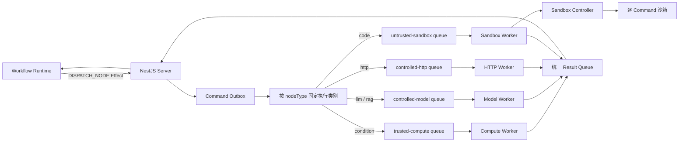

# 节点分级隔离实现方案

## 1. 文档状态

- 状态：分阶段实施中
- 适用范围：Workflow Runtime、NestJS Server、RabbitMQ、Go Executor、Code Node.js Runtime 与生产部署
- 基线日期：2026-08-06
- 目标：按照节点风险拆分执行边界，而不是让所有节点无差别地进入逐任务沙箱

当前落地状态：

- 已实现分类 Command Queue/DLQ、Outbox 固定执行类别与 Routing Key；默认 `legacy`，显式切换
  `classified` 后启用分类路由；
- 节点到执行类别的登记已移入不可变 `WorkflowServerCatalog.executionRegistry`；Routing Service
  只应用部署模式与启用类别策略，不再导入内置节点类型或维护静态路由表；
- 已实现 Go `legacy/compute/model/http/sandbox` Profile 和 Profile Registry 白名单；
- 已实现 Code `process/remote` Runner、远程 Controller 请求/结果边界和生产拒绝降级开关，具体边界见
  [远程沙箱调用实现状态](./remote-sandbox-call-implementation-status.md)；
- 已实现可选 Executor 内部 Bearer Token；HTTP 应用层不再限制目标 URL，目标网络限制由部署层承担；
- 尚未在仓库中提供具体 Sandbox Controller、gVisor/microVM、Egress Proxy、Network Policy 和生产部署
  模板；未部署这些基础设施前，不能宣称已经具备强沙箱或完整网络安全边界。

本文是现有执行架构之上的增量方案。实施期间继续保持以下边界：

- `@ai-workflow/runtime` 只负责状态机、DAG/Loop 调度和 Effect，不访问 RabbitMQ 或执行外部副作用；
- Server 负责 WorkflowRun、NodeRun、Outbox、Inbox、租约、幂等和 RuntimeState 持久化；
- Executor 只接收单节点 Protocol Command，不读取完整 Workflow，也不承担 DAG 调度；
- Start、End、Loop、Loop Start、Loop Exit 继续由 Runtime 本地推进；
- Sub Workflow 继续由 Server 宿主执行，不投递到 Go Executor；
- Result 只有在 Publisher Confirm 后才 Ack Command，Server 只有在结果事务提交后才 Ack Result。

## 2. 背景与当前差距

当前所有 Go 业务 Executor 共用一个进程、一个 Registry 和一个 RabbitMQ Command Queue：

| 节点                        | 当前执行位置                    | 当前隔离                                           |
| --------------------------- | ------------------------------- | -------------------------------------------------- |
| Start / End / Loop 系统节点 | TypeScript Runtime              | 可信进程内执行                                     |
| Condition                   | Go Executor                     | 与其他 Go 节点共享进程和网络边界                   |
| LLM / RAG                   | Go Executor                     | 与其他 Go 节点共享进程、模型解析接口和网络边界     |
| HTTP                        | Go Executor                     | 与其他 Go 节点共享进程和网络边界                   |
| Code                        | Go Executor 启动 Node.js 子进程 | 独立临时目录、进程、Heap/Stack、超时和环境变量过滤 |

Code 当前使用的 `nodeJSSandbox` 是进程级轻量隔离，不是不可信多租户安全沙箱。用户代码仍可以使用
文件系统、网络、`worker_threads` 和 `child_process`，因此能触达 Executor 容器当前用户可访问的资源。
如果 Code 与 LLM、HTTP 等节点共享容器，Code 的影响面会扩展到同一容器、同一内部网络以及该
Executor 可访问的 Server 内部接口。

当前开发 Compose 只运行 PostgreSQL、Redis 和 RabbitMQ，没有定义 Executor 容器。开发者在宿主机
直接启动 Executor 时，Code 子进程也运行在宿主机权限边界内。

## 3. 目标与非目标

### 3.1 目标

1. Code 和未来第三方扩展按不可信代码处理，每次执行进入独立强沙箱。
2. Code 执行边界不能访问模型凭证、数据库、Redis、RabbitMQ、Server 内部接口或其他任务文件。
3. HTTP、LLM、RAG 使用与 Code 分离的 Worker、凭证和网络策略。
4. HTTP 任意 URL 请求的目标网络限制由部署层出站边界承担，不依赖应用层 URL 白名单。
5. Condition 等可信纯计算不承担逐任务沙箱启动成本。
6. 复用现有 Protocol、租约、Outbox/Inbox 和 Result 链路，支持分阶段发布与快速回滚。
7. 将安全策略转化为可部署、可观测、可验收的明确配置。

### 3.2 非目标

- 不在本方案中重写 Workflow Runtime 或改变 DAG/Loop 语义；
- 不把完整 Workflow、数据库连接或长期 Secret 放入 Protocol Command；
- 不让沙箱直接消费 RabbitMQ 或直接发布 Protocol Result；
- 不通过把 Docker Socket 挂进普通 Executor 来实现逐任务容器；
- 不允许不同用户或不同 Command 复用同一个正在运行的代码容器；
- 不在第一阶段更改 Protocol v1 消息结构。

## 4. 架构决策

### 4.1 风险分级

| 执行类别            | 节点                                                           | 执行边界            | 核心策略                                                  |
| ------------------- | -------------------------------------------------------------- | ------------------- | --------------------------------------------------------- |
| `runtime-control`   | Start、End、Loop、Loop Start、Loop Exit、Sub Workflow 宿主逻辑 | Runtime / Server    | 不进入 MQ；只执行可信控制逻辑                             |
| `trusted-compute`   | Condition                                                      | 低权限 Go Worker    | 无 Secret；默认无外网；容器级资源限制                     |
| `controlled-model`  | LLM、RAG                                                       | 模型 Worker         | 只访问模型解析/检索网关和允许的供应商端点；短生命周期凭证 |
| `controlled-http`   | HTTP                                                           | HTTP Worker         | 强制经过出站策略；阻止私网、元数据和内部服务访问          |
| `untrusted-sandbox` | Code、未来脚本/插件/第三方可执行节点                           | 每 Command 独立沙箱 | 非 root、只读根文件系统、资源限制、默认无内部网络         |

Condition 第一阶段继续使用 Go 实现并进入 `trusted-compute` Worker，避免为了安全隔离同时修改
Runtime 状态机语义。未来若决定将 Condition 内建到 Runtime，应作为单独的架构变更处理，不是本方案
落地的前置条件。

### 4.2 目标拓扑



所有 Worker 继续产生相同的 `ExecuteNodeResult`。Server 不根据 Worker 类型走不同的结果状态机。

## 5. RabbitMQ 路由设计

### 5.1 Command 路由

保留 `ai-workflow.command.v1` direct exchange，新增下列 Routing Key 和持久队列：

| 执行类别            | Routing Key            | Queue                                 |
| ------------------- | ---------------------- | ------------------------------------- |
| `trusted-compute`   | `node.execute.compute` | `ai-workflow.node.execute.compute.v1` |
| `controlled-model`  | `node.execute.model`   | `ai-workflow.node.execute.model.v1`   |
| `controlled-http`   | `node.execute.http`    | `ai-workflow.node.execute.http.v1`    |
| `untrusted-sandbox` | `node.execute.sandbox` | `ai-workflow.node.execute.sandbox.v1` |

每个 Command Queue 使用独立 DLQ：

- `ai-workflow.node.execute.compute.dlq.v1`
- `ai-workflow.node.execute.model.dlq.v1`
- `ai-workflow.node.execute.http.dlq.v1`
- `ai-workflow.node.execute.sandbox.dlq.v1`

独立 DLQ 用于保留失败命令的来源和安全等级，避免排查时重新解析正文判断来源。

### 5.2 Result 路由

继续使用：

- Exchange：`ai-workflow.result.v1`
- Routing Key：`node.result`
- Queue：`ai-workflow.node.result.v1`

结果链路不按执行类别拆分。这样 Runtime、Result Inbox、NodeRun 和 SSE 不需要感知 Worker 拆分。

### 5.3 路由归属

Server 在创建 Command Outbox 时根据 `nodeType` 解析执行类别和 Routing Key。映射必须是显式白名单：

```text
condition -> trusted-compute
llm       -> controlled-model
rag       -> controlled-model
http      -> controlled-http
code      -> untrusted-sandbox
```

未知节点不得回退到通用队列，应在创建 Run 或 Command 前返回稳定的“不支持执行”错误。

Outbox 需要把最终 `executionClass` 和 `routingKey` 与 Command 一起持久化，Publisher 重试时只使用已保存
的值。不能在每次发布重试时重新读取可变映射，否则发布过程中的配置变更可能让同一 Command 进入不同
Worker 池。

`executionClass` 和 `routingKey` 是 Server/MQ 基础设施元数据，不加入 Protocol v1。Protocol Command
已有 `nodeType`，执行类别不属于跨语言节点业务契约。

## 6. Go Worker 拆分

### 6.1 单一代码库、多个 Profile

第一版保留一个 Go module 和一个可执行程序，通过稳定的 `EXECUTOR_PROFILE` 选择 Registry 与 Command
Queue。为保证滚动升级，当前未配置时使用 `legacy`；分类部署必须显式设置 Profile：

| `EXECUTOR_PROFILE` | 注册节点                        | 消费队列                              |
| ------------------ | ------------------------------- | ------------------------------------- |
| `legacy`           | LLM、RAG、Code、HTTP、Condition | `ai-workflow.node.execute.v1`         |
| `compute`          | Condition                       | `ai-workflow.node.execute.compute.v1` |
| `model`            | LLM、RAG                        | `ai-workflow.node.execute.model.v1`   |
| `http`             | HTTP                            | `ai-workflow.node.execute.http.v1`    |
| `sandbox`          | Code                            | `ai-workflow.node.execute.sandbox.v1` |

实现约束：

- Profile 未配置时兼容使用 `legacy`，未知值仍启动失败；完成分类迁移后再单独移除兼容默认值；
- Registry 只注册当前 Profile 允许的节点；
- Worker 只消费当前 Profile 对应队列；
- Worker 收到不属于 Profile 的 `nodeType` 时返回稳定错误并触发高优先级告警；
- 日志只记录 `profile`、Command/Run/NodeRun 身份、耗时和错误码，不记录 Inputs、Config、用户代码或凭证；
- 每个 Profile 使用独立 RabbitMQ 用户，权限只覆盖自己的 Command Queue、统一 Result Exchange 以及
  必需的拓扑声明；
- 每个 Profile 单独配置并发、CPU、内存、PID、网络和扩缩容策略。

### 6.2 进程并发

当前 Go Worker `Qos(1)` 且同步处理 delivery，一个实例同时执行一个 Command。第一阶段保持这一语义，
通过增加 Worker 副本扩容，先避免并发改造与安全拆分相互影响。

后续如增加单进程并发，必须同时提供：

- Profile 级最大并发；
- 单租户并发配额；
- Command deadline 与取消传播；
- 优雅退出时停止拉取新消息并等待或取消进行中的任务；
- 内存、连接池和上游限流容量验证。

## 7. Code 强沙箱

### 7.1 组件边界

Sandbox Worker 不再直接把 `node` 子进程作为生产安全边界，而是通过内部 `SandboxRunner` 接口调用
Sandbox Controller：

```go
type SandboxRunner interface {
    Run(ctx context.Context, request SandboxRequest) (SandboxResult, error)
}
```

建议保留两个实现：

- `process`：复用当前 Node 子进程，仅允许本地开发显式启用，并在启动日志中标记 `unsafe`；
- `remote`：生产默认实现，调用受工作负载身份保护的 Sandbox Controller。

生产环境没有配置 `remote` 时 Sandbox Worker 必须启动失败，不能静默回退到 `process`。

Sandbox Controller 是唯一有权限创建和销毁任务容器的组件。普通 Worker 不挂载 Docker Socket，
任务容器也不持有 Kubernetes、containerd、Docker、RabbitMQ 或 Server 凭证。

### 7.2 单次执行流程

1. Sandbox Worker 消费并校验 Protocol Command；
2. 校验 deadline 与 Server Command 租约；
3. 使用 `commandId` 向 Controller 创建任务，Controller 保证同一 `commandId` 幂等；
4. Controller 创建独立容器或微虚拟机，并注入源码、Inputs 和输出上限；
5. 沙箱内运行固定版本的 `runner.mjs`，执行 `await main(inputs)`；
6. Controller 收集受限的结构化结果、退出原因和资源统计；
7. Worker 将结果映射为现有 `ExecuteNodeResult` 并发布；
8. Result 获得 Publisher Confirm 后 Worker Ack Command；
9. Controller 销毁任务并由后台清理器回收超时残留资源。

如果 Worker 与 Controller 的连接在任务执行中断开，重试必须使用相同 `commandId` 查询任务状态，
不能无条件创建第二个任务。Controller 至少在 Command deadline 后保留一段结果 TTL，使 Worker 能恢复
已完成结果。

### 7.3 沙箱策略

| 项目       | 生产要求                                                                     |
| ---------- | ---------------------------------------------------------------------------- |
| 任务身份   | 每 Command 独立任务；不得跨用户、Run 或 Command 复用                         |
| 用户       | 固定非 root UID/GID；禁止提权                                                |
| 根文件系统 | 只读；不包含 Worker、Server 源码或凭证                                       |
| 工作目录   | 独立 tmpfs/临时卷；只包含 runner、用户代码、输入和结果                       |
| Host 挂载  | 禁止宿主目录、Docker Socket、ServiceAccount Token 和共享 `node_modules` 挂载 |
| Linux 权限 | Drop all capabilities；`no-new-privileges`；默认 seccomp/AppArmor 或等价策略 |
| 进程       | 独立 PID namespace；限制 PID 数；取消时终止整个任务而非只杀主进程            |
| CPU        | 每任务硬限制和累计 CPU 时间限制                                              |
| 内存       | 容器硬限制；V8 Heap 限制只作为第二层保护                                     |
| 磁盘       | 限制临时目录和输出大小；任务结束后销毁                                       |
| 时间       | 取 Command deadline 与平台上限的较早值                                       |
| 网络       | 禁止访问平台内部网络；公网访问只能经过受控出站代理                           |
| 输出       | 继续限制 JSON、stderr 和错误堆栈大小；不回传任意文件                         |
| 镜像       | 固定 digest、Node.js 22+、最小依赖、持续漏洞扫描                             |

推荐的生产实现优先使用支持额外隔离层的 OCI Runtime，例如 gVisor RuntimeClass；高敏感或公网多租户
环境可进一步使用 microVM。只使用普通共享宿主 Docker 容器可以作为过渡阶段，但不能挂载高权限
资源，也不能把容器内 root 当作安全边界。

### 7.4 网络兼容策略

当前 Code 支持原生 `fetch`，直接切换为完全断网会破坏已有工作流。因此分两步迁移：

1. 强沙箱首次上线时，允许通过专用 Egress Proxy 访问公网 HTTP/HTTPS，但阻止回环、私网、链路本地、
   云元数据、集群网段和平台域名；沙箱不能直连任何目标；
2. Code Config 增加明确的网络策略后，新建节点默认 `none`，需要联网时由用户显式选择 `public`。

历史版本缺少网络策略时暂按 `public` 兼容，但仍必须经过 Egress Proxy。新节点初始配置应显式写入
`none`，避免依赖 Schema 缺省值区分新旧节点。任何模式都不提供 `internal` 网络能力。

出站代理必须在每次请求和每次重定向时重新校验目标，阻止 DNS Rebinding；只按第一次 DNS 解析结果
判断是不够的。

### 7.5 第三方包

- Node 内置模块由沙箱镜像提供；
- 允许的 npm 包随镜像固定版本安装，不从宿主 Workspace 挂载 `node_modules`；
- 运行时禁止 `npm install` 和任意包下载；
- 镜像版本与 Command 执行记录关联，便于复现和安全回滚；
- 新增包需要经过许可证、供应链和漏洞检查，不允许用户通过路径导入宿主文件。

## 8. 受控 I/O Worker

### 8.1 Model Worker

LLM/RAG Worker 与 Code、HTTP 分开部署，并遵守：

- 只能访问 Server 的 Command Lease、模型解析/检索网关以及明确允许的模型供应商端点；
- 不能直接访问 PostgreSQL、Redis、RabbitMQ Management 或其他应用内部接口；
- 模型凭证继续不进入 RabbitMQ Command，只在当前 NodeRun 租约有效时按需解析；
- 内部解析接口增加工作负载身份校验，不能只依赖“地址在内网”；
- 凭证只保存在当前请求内存中，不写日志、错误 details、指标标签或持久缓存；
- RAG 后续需要向量检索时优先调用受控检索网关，不把数据库凭证下发给 Worker。

### 8.2 HTTP Worker

HTTP 节点允许用户配置目标 URL，必须拥有独立于 Model Worker 的网络策略：

- 应用层只校验完整的 HTTP/HTTPS 地址，不应用 URL 白名单或内网地址过滤；
- 由部署层 Network Policy、Egress Proxy 或等价网络边界限制可访问的目标网络；
- 部署层限制必须覆盖 DNS、重定向以及直连场景，不能依赖用户正确填写地址；
- 限制连接、TLS、首字节和总执行时间；
- 限制请求体、响应头和响应体大小；
- 不自动注入 Server、模型或数据库凭证；
- 日志不记录 Authorization、Cookie、请求/响应正文或完整 URL Query。

HTTP Worker 即使实现本身可信，也不能与 Model Worker 共用任意出站网络，因为两者的目标范围和凭证
等级不同。

## 9. Server 实现

### 9.1 执行类别解析

在 Server 的 Workflow MQ 基础设施边界增加显式 `nodeType -> executionClass -> routingKey` 解析器。
创建完整运行、单节点运行和后续重试 Command 时必须复用同一个解析器。

执行前能力校验需要同时确认：

- Core Registry 存在该 `nodeType`；
- 当前部署存在该节点对应的执行类别；
- 对应 Worker Profile 已启用；
- 节点需要的功能策略已启用，例如 Code 公网访问或允许的模型供应商。

暂时无法从部署系统动态获取 Worker 状态时，Server 使用显式配置的启用类别白名单，不能把“消息能
发布到 Exchange”当作 Worker 一定存在。

### 9.2 Outbox 持久化

Command Outbox 增加：

- `executionClass`：稳定枚举；
- `routingKey`：创建 Command 时确定；
- 可选 `sandboxImageVersion`：仅 Code，用于审计和复现。

数据库迁移需要为历史未完成 Outbox 按 `payload.nodeType` 回填执行类别和 Routing Key。无法识别的历史
数据必须标记失败并进入人工处理，不能回填到通用队列。

Publisher 发布成功、重试、最大次数失败和 Result 归一化语义保持不变，只把固定常量 Routing Key
替换为 Outbox 保存的 Routing Key。

### 9.3 租约与取消

所有 Worker 继续在执行前和执行期间校验 Command 租约。Sandbox Worker 的取消必须继续传递到
Controller，并最终删除任务容器。

Controller 不拥有 Workflow 状态机，只接受短生命周期任务请求。它不能把“容器仍在运行”视为租约
有效，也不能在 Worker 已确认租约失效后继续保留可联网任务。

## 10. Protocol 与错误契约

### 10.1 Protocol v1 保持不变

第一阶段不增加 `executionClass`、Queue 或沙箱参数：

- Server 已能从 `nodeType` 决定路由；
- Worker Profile 已限定允许的 Registry；
- 沙箱镜像、CPU、内存、网络和 PID 属于平台部署策略，不应由用户 Command 任意指定；
- Result 仍能使用自由字符串错误码表达隔离错误。

只有未来需要让不同 WorkflowVersion 显式选择版本化执行环境，并且该选择必须跨 Server/Executor 传递
时，才升级 Protocol，而不是向 v1 添加可选字段改变旧消息含义。

### 10.2 稳定错误码

| 错误码                            | 场景                                      | Retryable             |
| --------------------------------- | ----------------------------------------- | --------------------- |
| `EXECUTOR_PROFILE_MISMATCH`       | Command 进入了不允许该 nodeType 的 Worker | `false`，同时告警     |
| `SANDBOX_SERVICE_UNAVAILABLE`     | Controller 暂时不可用                     | `true`                |
| `SANDBOX_CREATE_FAILED`           | 基础设施暂时无法创建任务                  | 依据原因，默认 `true` |
| `SANDBOX_POLICY_VIOLATION`        | 违反文件、进程或网络策略                  | `false`               |
| `SANDBOX_RESOURCE_LIMIT_EXCEEDED` | 超过 CPU、内存、PID 或临时磁盘限制        | `false`               |
| `SANDBOX_EXECUTION_TIMEOUT`       | 达到 Command 或平台执行期限               | `false`               |
| `SANDBOX_RESULT_INVALID`          | 沙箱没有返回合法结构化结果                | `false`               |

现有 `CODE_SYNTAX_ERROR`、`CODE_RUNTIME_ERROR`、`CODE_OUTPUT_INVALID`、`CODE_OUTPUT_TOO_LARGE` 等用户代码
错误继续保留。不要把基础设施错误统一伪装为 `CODE_RUNTIME_ERROR`。

## 11. 部署策略

### 11.1 容器和身份

每个 Worker Profile 使用独立 Deployment/Service Account、RabbitMQ 用户和 Network Policy：

| Profile        | 允许访问                                                   | 明确禁止                                              |
| -------------- | ---------------------------------------------------------- | ----------------------------------------------------- |
| Compute        | RabbitMQ、Command Lease                                    | 公网、数据库、模型解析、Sandbox Controller            |
| Model          | RabbitMQ、Command Lease、模型解析/检索网关、允许的模型端点 | 数据库、Redis、任意内网、Sandbox Controller           |
| HTTP           | RabbitMQ、Command Lease、Egress Proxy                      | 数据库、Redis、模型解析、平台内网直连                 |
| Sandbox Worker | RabbitMQ、Command Lease、Sandbox Controller                | 模型解析、数据库、Redis、任意业务内部服务             |
| Sandbox Task   | Controller 返回通道、可选公网 Egress Proxy                 | RabbitMQ、Server、数据库、Redis、集群控制面和宿主网络 |

Worker 和 Controller 均使用非 root 用户、只读根文件系统、最小 Linux capability、资源
requests/limits 和明确的临时目录挂载。

### 11.2 配置项

建议新增稳定配置：

| 配置                             | 用途                                                |
| -------------------------------- | --------------------------------------------------- |
| `EXECUTOR_PROFILE`               | `legacy` / `compute` / `model` / `http` / `sandbox` |
| `EXECUTOR_COMMAND_QUEUE`         | 当前 Profile 消费队列；生产由部署模板固定           |
| `EXECUTOR_CONCURRENCY`           | Profile 级并发，第一阶段固定为 `1`                  |
| `CODE_SANDBOX_BACKEND`           | `process` / `remote`；生产只允许 `remote`           |
| `CODE_SANDBOX_CONTROLLER_URL`    | Sandbox Controller 内部地址                         |
| `CODE_SANDBOX_CONTROLLER_TOKEN`  | 兼容阶段的 Controller Bearer Token                  |
| `CODE_SANDBOX_REQUIRE_REMOTE`    | 生产禁止回退到进程后端                              |
| `CODE_SANDBOX_REQUIRE_TLS`       | 生产要求 Controller 使用 HTTPS                      |
| `CODE_SANDBOX_REQUIRE_AUTH`      | 生产要求 Controller 配置认证信息                    |
| `CODE_SANDBOX_IMAGE`             | 固定 digest 的执行镜像                              |
| `CODE_SANDBOX_RESULT_TTL`        | Controller 幂等结果保留时间                         |
| `CODE_EGRESS_PROXY_URL`          | Code 公网访问代理                                   |
| `EXECUTOR_ENABLED_CLASSES`       | Server 执行前能力白名单                             |
| `WORKFLOW_EXECUTOR_ROUTING_MODE` | Server 使用 `legacy` 或 `classified` Command 路由   |
| `EXECUTOR_INTERNAL_AUTH_TOKEN`   | Server/Executor 内部 Lease 与模型解析 Bearer Token  |
| `EXECUTOR_REQUIRE_INTERNAL_AUTH` | 生产要求内部接口启用认证                            |

敏感认证信息通过工作负载身份或 Secret 挂载提供，不放入普通环境变量清单、日志或 Protocol Command。

## 12. 可观测性与审计

指标至少包含：

- 各执行类别 Queue 深度、最老消息等待时间和消费速率；
- Worker Profile 在线副本、执行中数量、成功/失败/取消/超时数量；
- 按 `executionClass`、`nodeType`、稳定错误码聚合的耗时和结果；
- 沙箱创建耗时、运行耗时、销毁耗时、残留任务数；
- 沙箱 CPU、峰值内存、PID、临时磁盘和出站流量；
- HTTP/Code 被阻止的网络目标类别，不记录敏感完整 URL；
- 租约失效到任务终止之间的延迟；
- Profile mismatch、未知路由和 DLQ 增长告警。

日志和 Trace 允许携带：`commandId`、`runId`、`nodeRunId`、`executionKey`、`nodeType`、
`executionClass`、`profile`、沙箱任务 ID、镜像版本、耗时、退出原因和稳定错误码。

不得携带：用户源码、Inputs、Config 正文、Outputs 正文、模型 Prompt、API Key、Authorization、Cookie
或完整 URL Query。

## 13. 分阶段实施

### 阶段一：队列与 Worker 安全域拆分

1. 已增加执行类别解析器和四类 Command Queue/DLQ；
2. 已由 Outbox 持久化 `executionClass` 与 `routingKey`；
3. 已为 Go 增加 Profile，并按 Profile 注册 Registry 和消费 Queue；
4. 待部署四类 Worker；默认 `legacy` 不改变现有消费链路；
5. 先让新 Worker 就绪，再切换 Publisher 路由；
6. 旧 `node.execute` Queue 由旧 Worker 继续排空，禁止新旧 Routing Key 双重发布。

完成标志：不同风险节点不再进入同一 Worker 进程和容器，即使 Code 强沙箱尚未上线，也已缩小影响面。

### 阶段二：Code 强沙箱

1. 已抽象 Code Runner，保留兼容 `process` 后端并增加 `remote` 后端；
2. 待实现和部署带工作负载认证的 Sandbox Controller；
3. 构建固定 digest 的 Node.js 22+ 沙箱镜像；
4. 落地逐任务文件、用户、PID、CPU、内存、磁盘、时间和网络策略；
5. 实现 `commandId` 幂等、断线恢复、取消和残留任务清理；
6. 生产 Sandbox Worker 切换为 `remote`，禁止回退；
7. 保留现有 Code 用户错误码，并增加沙箱基础设施错误映射。

完成标志：用户代码无法读取 Worker 文件/环境、无法连接平台内网、无法影响其他 Command，资源超限和
租约取消能可靠终止整个任务。

### 阶段三：I/O 网络和凭证收口

1. 已具备 Model、HTTP 独立 Profile；待部署独立网络策略和 RabbitMQ 身份；
2. 模型解析与 Lease 接口已支持可选内部 Bearer Token；后续替换为部署级工作负载身份；
3. HTTP 与 Code 分别接入专用 Egress Proxy；
4. HTTP 应用层不限制目标 URL；生产环境的目标网络限制和 Egress 防护待部署；
5. 验证日志、错误、指标和 Trace 不泄露请求正文与凭证。

### 阶段四：默认最小权限和扩展治理

1. Code 新节点默认 `networkPolicy: none`，历史版本保持受控公网兼容；
2. 第三方脚本、插件和可执行扩展默认路由到 `untrusted-sandbox`；
3. 建立沙箱镜像依赖审批、漏洞扫描、升级和回滚流程；
4. 根据真实指标决定是否增加 Worker 并发或更强的 microVM 隔离。

## 14. 发布、兼容与回滚

### 14.1 发布顺序

1. 部署能声明新拓扑但仍发布旧 Routing Key 的 Server；
2. 部署各 Profile Worker 并验证新 Queue 消费能力；
3. 数据库迁移并回填未完成 Outbox 路由；
4. Server 按 nodeType 切换新 Routing Key；
5. 等待旧 Queue 排空后停止旧的全量 Registry Worker；
6. Code 强沙箱独立灰度，不与队列拆分同一次强制切换。

### 14.2 回滚原则

- 禁止把同一 Command 同时发布到旧 Queue 和新 Queue；
- 阶段一回滚通过停止新路由发布，并让旧 Worker 消费旧 Routing Key 完成；
- 已发布到新 Queue 的消息必须由对应 Profile Worker 排空或显式迁移，不能通过重新发布制造副本；
- Code 强沙箱故障时生产环境暂停 Sandbox Queue 消费并恢复服务，不自动降级为宿主进程执行；
- Result Queue 与 Protocol v1 未变化，Server 结果处理可以独立回滚；
- 回滚期间继续依赖 commandId、idempotencyKey、leaseToken 和 Inbox 去重，不能用它们代替正确的单路发布。

## 15. 验收标准

### 15.1 路由和协议

- 每个已支持业务 nodeType 只映射到一个执行类别；
- 未知 nodeType 在发布前被拒绝，没有 fallback Queue；
- Outbox 重试始终使用首次持久化的 Routing Key；
- 所有 Profile 返回的 Result 都通过现有 Protocol v1 校验；
- 重复 Command、重复 Result、迟到租约和并行结果不会重复推进 RuntimeState。

### 15.2 Code 隔离

- Code 无法读取 Worker/Server 文件、环境变量、Service Account Token 或其他任务目录；
- Code 无法连接 Server、PostgreSQL、Redis、RabbitMQ、模型解析接口、云元数据和集群控制面；
- `child_process`、Worker Thread 或后台进程不能在 Command 结束后存活；
- CPU、内存、PID、临时磁盘、输出和执行时间超限都能得到稳定错误且任务被清理；
- Worker 或 Controller 重启后，不会为同一 `commandId` 并发创建多个任务；
- 生产缺少远程沙箱配置时 Sandbox Worker 拒绝启动，不回退到进程模式。

### 15.3 I/O 安全

- HTTP 的直接请求和重定向都不能访问私网、回环、链路本地、元数据或平台内部域名；
- Model Worker 只能访问租约、模型/检索网关和允许的供应商目标；
- Code/HTTP Worker 无法调用模型解析接口获取凭证；
- 日志、指标、Trace、DLQ 运维界面和错误 details 不出现用户正文或凭证。

### 15.4 运维

- 每类 Queue、Worker 和沙箱任务都有容量、延迟、错误率和残留资源告警；
- 可以只停止某一个执行类别而不影响 Runtime 控制节点和其他 Worker；
- 旧 Queue 排空、新 Queue 灰度和单类别回滚都有明确操作路径；
- 沙箱镜像可以按 digest 审计并回滚到上一安全版本。

## 16. 预计代码影响范围

| 范围                                                      | 预计变更                                                        |
| --------------------------------------------------------- | --------------------------------------------------------------- |
| `apps/server/src/infra/workflow-mq`                       | 多 Queue 拓扑、路由解析、按 Outbox Routing Key 发布             |
| `apps/server/src/services/workflow-run.service.ts`        | 创建 Command 时解析执行类别，执行前能力校验                     |
| `apps/server/src/repositories/workflow-run.repository.ts` | Outbox 执行类别与 Routing Key 持久化/回填                       |
| `apps/server/prisma`                                      | Outbox 新字段和迁移                                             |
| `apps/executor-go/cmd/executor`                           | Profile 配置、启动校验、选择 Registry 与 Queue                  |
| `apps/executor-go/internal/executors`                     | 按 Profile 注册节点，禁止全量默认注册                           |
| `apps/executor-go/internal/mq`                            | Profile Queue/DLQ、日志维度和 mismatch 处理                     |
| `apps/executor-go/internal/executors/code`                | `SandboxRunner`、远程 Controller 适配和错误映射                 |
| 部署配置                                                  | 四类 Worker、Sandbox Controller、沙箱镜像、身份、资源和网络策略 |
| `packages/workflow-core` 与 Web                           | 阶段四增加 Code 网络策略时更新 Schema、初始配置和表单           |
| `packages/workflow-protocol`                              | 阶段一至三不变；仅未来需要跨语言传递版本化执行环境时再升级      |

实施时应按阶段更新相关项目技能和运行文档；在代码尚未落地前，本文描述的是目标实现，不应把未来
能力误标记为当前已经具备。
