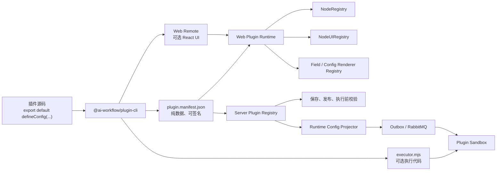

# 第三方插件开发与运行架构

## 1. 文档状态

- 状态：阶段一 SDK 与构建工具已实现，Web/Server/执行阶段待实施
- 基线日期：2026-08-08
- 适用范围：插件 SDK、插件构建工具、Workflow Core、Web 编辑器、Server、Runtime、Protocol 与 Executor
- 目标：让第三方按照稳定公开规范开发工作流节点插件，并支持声明式节点、可选自定义节点 UI、可选完整自定义配置表单，以及后续的隔离执行能力

本文描述目标架构，不表示仓库已经具备全部对应能力。当前 `packages/workflow-plugin` 已完成声明
DSL、Schema AST 与编译器、源码配置和 manifest 契约，以及 `./ui`、`./executor` 公共入口；
`packages/workflow-plugin-cli` 已实现 init、check、build、pack、dev、三套项目模板、ESM Web Remote
与 Executor ESM 构建。插件市场页面仍主要使用模拟数据，Web 与 Server 尚未消费插件 Manifest 和
Artifact。

## 2. 结论

插件不应只构建成一个被 Web、Server 和 Executor 共同 `import()` 的 JavaScript 文件。推荐采用
“一个源码入口、三类构建产物”的模型：

1. 插件源码通过 `package.json#exports["."]` 声明根入口，入口必须
   `export default defineConfig(...)`。
2. 构建工具读取默认导出并生成可序列化、可校验、可签名的 `plugin.manifest.json`。
3. 只有声明自定义节点 UI 或自定义配置表单时，才生成 Web Remote。
4. 只有声明第三方执行代码时，才生成 Executor ESM；该产物只能由独立强沙箱执行，不能被
   NestJS、Go Worker 主进程或 Web 页面直接执行。
5. Workflow 草稿和不可变版本固定插件版本与产物摘要，保证历史版本可验证、可重放和可回滚。

该设计直接复用现有的 `NodeRegistry`、`NodeUIRegistry`、`NodeConfigFields`、
`NodeConfigSection` 和 Runtime Config Projector，而不是在插件系统内维护第二套工作流模型。

## 3. 目标与非目标

### 3.1 目标

1. 提供小型、类型安全的 npm SDK，让开发者通过 `defineConfig` 和 `defineNode` 声明插件。
2. 构建工具自动解析根 `exports`，不要求固定使用 `src/index.ts`，但默认导出是唯一配置入口。
3. 插件节点复用 Core 的节点、端口、变量、输出和校验语义。
4. 节点 UI 默认复用 `BaseNode`；只有 `custom: true` 时完整接管节点外壳。
5. 配置表单默认复用 schema 驱动表单；只有 `custom: true` 时完整接管配置区域。
6. 插件可以按稳定能力名称复用 Web 已有的 LLM 模型、知识库、子工作流等宿主字段 renderer，
   不能引用 `apps/web/src` 内部文件。
7. Web、Server、Runtime 和 Executor 对同一插件版本使用一致、不可变的 manifest。
8. 未知插件、缺失版本、能力不兼容和 renderer 冲突都能在明确边界快速失败。
9. 第三方执行代码默认按照 `untrusted-sandbox` 风险等级处理。

### 3.2 非目标

- 第一阶段不开放任意 Go Executor、NestJS Provider 或数据库访问。
- 第一阶段不支持插件修改路由、页面布局、认证、Prisma Client 或平台全局状态。
- 第一阶段不允许插件覆盖 `start`、`end`、`llm`、`http` 等内置节点类型。
- 第一阶段不支持任意 JavaScript schema refinement、transform 或服务端迁移函数。
- 第一阶段不支持同一 Workflow 同时使用同一插件的多个版本。
- 在强沙箱、产物签名和权限治理落地前，不宣称第三方 Executor 已具备生产安全边界。

## 4. 当前可复用能力与主要差距

### 4.1 已有能力

- `@ai-workflow/core` 的 `NodeType` 已声明 schema、definition、form、configRenderer、
  variableForm、固定输出、初始配置和动态端口。
- `NodeRegistry` 已支持重复注册检查、批量注册和按 type 查询。
- `@ai-workflow/nodes-ui` 已有两种 UI 注册模式：
  - `defineNodeUI`：只提供内容区并复用 `BaseNode`；
  - `defineNodeRendererUI`：完整接管节点 renderer。
- `NodeUIRegistry.assertCompatible()` 已能检查 UI 注册是否存在对应 Core 节点。
- `@ai-workflow/form` 的 `NodeConfigFields` 已支持按 `field.ui` 注入字段 renderer。
- `NodeConfigSection` 已为完整自定义配置表单保留 renderer map。
- Web 已通过 `builtinWorkflowNodeConfigFieldRenderers` 注入 `llm_model`、
  `knowledge_base` 和 `sub_workflow` 字段。
- Runtime 已要求包含变量位置的 Config 注册显式 projector，纯 JSON Config 可以使用
  `projectStaticJsonNodeConfig`。
- Server/Executor 已有按风险拆分的执行类别、Queue、Profile 和 Registry 白名单基础。

### 4.2 主要差距

1. Web 多处直接导入 Core 全局 `nodeRegistry`，并在模块初始化时静态生成 React Flow
   `nodeTypes`，无法按当前 Workflow 合并插件。
2. Server 的保存、发布、运行和执行路由同样依赖内置 Registry 或内置 node type 映射。
3. 当前 Workflow 快照没有插件版本锁，无法保证发布版本在插件升级后仍可复现。
4. Core 的 Zod schema、`createInitialConfig()` 和 `resolvePorts()` 包含运行时对象或函数，不能直接
   放入 JSON manifest。
5. 任意远程 React 代码与宿主运行在同一个页面上下文，不能被当作安全沙箱。
6. 当前 Protocol v1 只使用 `nodeType` 选择 Go Executor；插件逻辑节点类型与执行适配器类型尚未拆分。

## 5. 总体架构



### 5.1 三种产物的信任边界

| 产物                   | 内容                                                           | 消费方      | 信任边界                                   |
| ---------------------- | -------------------------------------------------------------- | ----------- | ------------------------------------------ |
| `plugin.manifest.json` | 元数据、节点定义、schema AST、form、端口、权限和 artifact 描述 | Web、Server | 纯数据，必须经过 schema 校验和摘要校验     |
| Web Remote             | 自定义节点内容、完整节点 renderer、完整配置 renderer           | Web         | 与宿主同页面执行，属于特权代码             |
| Executor ESM           | 第三方节点执行逻辑                                             | 强沙箱      | 不可信代码，不进入 Server 或 Worker 主进程 |

声明式插件可以只有 manifest，不生成或加载任何第三方 JavaScript。

## 6. Workspace package 规划

### 6.1 `@ai-workflow/plugin`

沿用并重做现有 `packages/workflow-plugin`，将其作为第三方开发者使用的公共 SDK 门面。

建议公开入口：

```ts
import {
  defineConfig,
  defineNode,
  field,
  pluginSchema,
  type DataType,
  type NodeInputBindings,
  type NodeOutputDefinition,
  type VariableValue,
} from '@ai-workflow/plugin'

import {
  BaseNode,
  HostField,
  HostVariablePicker,
  NodeContentItem,
  NodeContentList,
  type PluginConfigRendererProps,
  type PluginNodeContentProps,
  type PluginNodeRendererProps,
} from '@ai-workflow/plugin/ui'

import {
  defineExecutor,
  type PluginExecutorContext,
  type PluginExecutorResult,
} from '@ai-workflow/plugin/executor'
```

约束：

- 根入口只提供环境无关的声明 DSL、schema、manifest 契约和稳定类型。
- `./ui` 才允许依赖 React，并作为 Core、Form、Nodes UI 与 UI primitives 的稳定公共门面。
- `./executor` 不依赖 React、DOM、NestJS、RabbitMQ 或 Go 实现细节。
- 第三方不得从内部 package 的 `src` 路径导入，也不得从 `apps/*` 导入。
- SDK 发布产物应捆绑公共类型声明，避免 `.d.ts` 暴露仓库私有物理路径。
- React、React DOM 和宿主 UI SDK 在 Web Remote 中作为共享单例，不随每个插件重复打包。

### 6.2 `@ai-workflow/plugin-cli`

新增独立的 dev-only 构建工具 package，避免把构建器及其 bundler 依赖放进浏览器 SDK。

建议命令：

```text
ai-workflow-plugin init
ai-workflow-plugin check
ai-workflow-plugin dev
ai-workflow-plugin build
ai-workflow-plugin pack
ai-workflow-plugin publish
```

第一阶段已实现 `init`、`check`、`dev`、`build` 和 `pack`；`publish` 在 Server 插件上传与版本模型
完成后接入。

新增 workspace package 时，需要同步为 `$ai-workflow-packages` 增加独立技能引用文件并登记加载条件。

## 7. 插件源码入口

第三方 package 示例：

```json
{
  "name": "@acme/ai-workflow-github",
  "version": "1.0.0",
  "type": "module",
  "exports": {
    ".": "./src/index.ts"
  },
  "scripts": {
    "check": "ai-workflow-plugin check",
    "build": "ai-workflow-plugin build",
    "pack": "ai-workflow-plugin pack"
  },
  "devDependencies": {
    "@ai-workflow/plugin": "^1.0.0",
    "@ai-workflow/plugin-cli": "^1.0.0"
  }
}
```

根入口必须使用默认导出：

```ts
import { defineConfig, defineNode, field, pluginSchema as s } from '@ai-workflow/plugin'

export default defineConfig({
  displayName: 'GitHub',
  description: 'GitHub 工作流节点',
  hostVersionRange: '^1.0.0',
  permissions: ['network:public'],

  nodes: [
    defineNode({
      key: 'create-issue',
      label: '创建 Issue',
      description: '在指定仓库创建 Issue',
      icon: './assets/github.svg',

      config: {
        schemaVersion: 1,
        schema: s.object({
          owner: s.string({ minLength: 1 }),
          repository: s.string({ minLength: 1 }),
          title: s.string({ minLength: 1 }),
          body: s.string(),
        }),
        initial: {
          owner: '',
          repository: '',
          title: '',
          body: '',
        },
        form: {
          owner: field.text({ label: 'Owner', required: true }),
          repository: field.text({ label: 'Repository', required: true }),
          title: field.text({ label: '标题', required: true }),
          body: field.textarea({ label: '正文' }),
        },
      },

      ports: {
        inputs: {
          input: { label: '输入', required: false },
        },
        outputs: {
          output: { label: '输出', multiple: true },
        },
      },

      ui: {
        node: {
          custom: false,
          content: {
            entry: './src/ui/create-issue-node.tsx',
            export: 'default',
          },
        },
        form: {
          custom: false,
        },
      },

      execution: {
        kind: 'sandbox-js',
        entry: './src/executor.ts',
      },
    }),
  ],
})
```

插件 version 只以 `package.json#version` 为事实来源，配置中不重复声明。CLI 只使用 npm package 名称
标识第三方来源；平台插件 UUID 和上传作者由服务端发布流程绑定，不能由插件源码声明。

## 8. `defineConfig` 与 `defineNode`

### 8.1 `defineConfig`

`defineConfig` 应是无副作用的类型辅助函数：

```ts
export function defineConfig<const TConfig extends PluginConfig>(config: TConfig): TConfig {
  return config
}
```

它不能输出日志、读取环境变量、访问文件系统或执行发布逻辑。CLI 仍必须使用正式 Zod schema 校验
默认导出，不能把 TypeScript 类型检查当作运行时边界。

### 8.2 `defineNode`

`defineNode` 负责保持以下关联：

- schema 与 `initial` 的输入、输出类型；
- schema 与 form 字段 key；
- schema 与节点内容、完整节点 renderer、完整配置 renderer 的泛型 props；
- 节点 key、固定输出和执行结果定义；
- `custom` 判别联合中的必填和禁止字段。

构建工具必须再次检查 `initial` 能通过 schema，并确保每次创建节点时对初始对象做深拷贝，避免
多个节点实例共享数组或对象引用。

## 9. Schema 设计

### 9.1 不直接发布 Zod 对象

Core 当前以 Zod 为节点配置唯一事实来源，但 Zod schema 包含对象和函数，不能安全写入 manifest。
如果 Server 为获得 schema 而 `import()` 插件 JavaScript，就等于授予插件 Server 进程权限。

因此公共 SDK 应提供可序列化、可推导类型的 `pluginSchema` DSL。构建后保存 Schema AST，Web 与
Server 使用平台实现将同一 AST 编译为 Zod。

### 9.2 第一版支持范围

- object、array、string、number、boolean；
- literal、enum、union；
- optional、nullable、default；
- min/max、minLength/maxLength、pattern；
- JSON value；
- 平台预定义的 `VariableValue`、数据类型和资源引用；
- 对象严格模式和明确的额外字段策略。

第一版禁止：

- 任意 `refine()`、`superRefine()`、`transform()`；
- 捕获本地变量的验证函数；
- 依赖网络、文件、时间、随机数或数据库的验证；
- 无法由 Server 和 Web 确定性重建的 schema 扩展。

### 9.3 Schema 编译

SDK 内部提供单一编译入口：

```ts
compilePluginSchemaToZod(schemaAst)
```

Web、Server 和 CLI 都复用该入口。CLI 额外生成 JSON Schema 仅用于 manifest 审查、编辑器提示和
跨语言工具，不把 JSON Schema 作为另一套业务校验规则。

## 10. 节点和表单的 `custom` 契约

不要使用节点级的单个模糊布尔值，应分别声明节点外壳和配置表单：

```ts
type PluginNodeUI =
  | {
      custom: false
      content?: ModuleReference
    }
  | {
      custom: true
      renderer: ModuleReference
    }

type PluginFormUI =
  | {
      custom: false
    }
  | {
      custom: true
      renderer: ModuleReference
    }
```

| 配置                                | 宿主行为                                             |
| ----------------------------------- | ---------------------------------------------------- |
| `node.custom: false` 且没有 content | 使用 `BaseNode` 和默认摘要                           |
| `node.custom: false` 且有 content   | 使用 `BaseNode`，插件只提供内容区                    |
| `node.custom: true`                 | 使用完整节点 renderer，映射到 `defineNodeRendererUI` |
| `form.custom: false`                | 使用 Core form 和 `NodeConfigFields`                 |
| `form.custom: true`                 | 使用 `NodeConfigSection`，插件接管完整配置区域       |

完整自定义表单仍必须：

- 使用受控 `config` 和 `onConfigChange`；
- 通过宿主提供的 Zod schema 实时校验和提交校验；
- 使用 `useFormData` 管理内部多字段草稿；
- 透传 disabled、errors 和 availableVariables；
- 不直接修改 Workflow、Edge、端口或持久化状态；
- 不通过自定义 UI 绕过 Core schema。

第一版插件只使用静态端口和静态初始配置。动态端口需要先设计可序列化的安全规则 DSL，不能把
第三方 `resolvePorts()` 函数加载进 Server。确有需要时可先作为受信任平台插件能力，不直接开放给
Marketplace 第三方。

## 11. 宿主字段能力

Web 当前的 LLM 模型、知识库和子工作流字段依赖应用 API 与 Catalog Provider，不能移动到 Form
package，也不能让插件导入 `apps/web/src/features/workflow/node-config-renderers/builtin.ts`。

应在 Web 引入宿主字段注册表：

```ts
interface WorkflowHostFieldRegistry {
  has(type: string): boolean
  get(type: string): AnyFieldRenderer | undefined
}
```

Web 初始化时注册：

```ts
hostFieldRegistry.register(FIELD_UI_TYPES.LLM_MODEL, LlmModelField)
hostFieldRegistry.register(FIELD_UI_TYPES.KNOWLEDGE_BASE, KnowledgeBaseField)
hostFieldRegistry.register(FIELD_UI_TYPES.SUB_WORKFLOW, SubWorkflowField)
```

普通插件表单可以直接声明宿主字段：

```ts
form: {
  model: field.host({
    type: 'llm_model',
    label: '模型',
  }),
}
```

完整自定义表单使用 SDK 提供的桥接组件，而不是拿到 Web 内部组件：

```tsx
import { HostField } from '@ai-workflow/plugin/ui'

export default function CustomForm(props: PluginConfigRendererProps<MyConfig>) {
  return (
    <HostField
      type="llm_model"
      name="model"
      value={props.config.model}
      onChange={(model) =>
        props.onConfigChange({
          ...props.config,
          model,
        })
      }
    />
  )
}
```

manifest 同时声明宿主能力依赖：

```json
{
  "requires": {
    "hostFields": ["llm_model"]
  }
}
```

激活插件时必须一次性检查能力；缺少能力时禁用插件并返回诊断信息，不能等用户打开表单后才报错。
模型和知识库目录继续由现有 Provider 懒加载，插件不得自行复制目录缓存和请求逻辑。

## 12. 构建工具

### 12.1 根入口解析

CLI 从当前工作目录向上查找最近的 `package.json`，然后：

1. 必须存在 `exports["."]`；
2. 字符串值直接作为源码入口；
3. 条件对象第一版按 `source`、`import`、`default` 顺序选择；
4. 不接受数组、通配 root export 或无法唯一确定的条件；
5. 入口必须位于插件 package 根目录内，拒绝通过 `..` 指向包外文件；
6. 使用 bundler 把 TypeScript/TSX 临时编译为 Node ESM；
7. `await import()` 临时模块并读取 `module.default`；
8. 缺少默认导出时返回明确错误；
9. 默认导出必须通过插件配置 Zod schema；
10. 临时文件放在独立临时目录并在构建结束后清理。

默认导出是唯一配置入口。命名导出可以用于开发者自己的源码组织，但 CLI 不从命名导出推断节点、
renderer 或 executor。

### 12.2 构建检查

`check` 和 `build` 至少验证：

- package 名称和 version 合法；
- node key 在插件内唯一；
- 生成后的完整 node type 不与内置或其他插件冲突；
- `initial` 能通过 schema；
- form 字段只引用 schema 顶层字段；
- 端口 ID、固定输出 key 和变量 key 合法且唯一；
- `custom: true` 对应模块和导出真实存在；
- `custom: false` 不携带完整 renderer；
- manifest 中没有函数、class、React element 或不可序列化值；
- 使用的宿主字段能力已经在 `requires` 中声明；
- permissions 覆盖 Web Remote、网络、Secret 和 Executor 需求；
- SDK/宿主版本范围与构建器兼容；
- 单文件、单 chunk 和总 artifact 大小不超过平台限制；
- 输出目录不包含源码、source map、环境文件、密钥或无关 package 文件，除非发布策略明确允许。

### 12.3 构建输出

```text
dist/
├── plugin.manifest.json
├── assets/
│   └── github.svg
├── web/
│   ├── mf-manifest.json
│   ├── remoteEntry.js
│   └── chunks/*
├── executor/
│   └── index.mjs
└── integrity.json
```

- 没有自定义 UI 时不生成 `web/`。
- 没有第三方执行代码时不生成 `executor/`。
- `integrity.json` 保存每个文件的相对路径、字节数和 SHA-256。
- `pack` 生成不可变压缩包，压缩包自身也计算摘要。
- `publish` 后平台重新托管 Web 与 Executor 产物，不直接使用作者域名 URL。

### 12.4 Web Remote

自定义 React UI 推荐生成 Module Federation Remote，由 Web 使用运行时 API按已安装插件清单动态加载。
构建器负责生成虚拟远程入口，插件作者只声明组件文件和 export，不手写注册代码。

远程模块建议只暴露一个稳定模块：

```ts
interface PluginWebModule {
  nodes: Readonly<
    Record<
      string,
      {
        content?: PluginNodeContentComponent
        renderer?: PluginNodeRendererComponent
        configRenderer?: PluginConfigRendererComponent
      }
    >
  >
}
```

React、React DOM 和 `@ai-workflow/plugin/ui` 必须使用宿主共享实例，避免重复 React 导致 Hook
错误。插件 CSS 使用语义 token，并通过构建器限定作用域；禁止覆盖 `html`、`body` 或宿主全局类。

## 13. Manifest 契约

示意结构：

```json
{
  "manifestVersion": 1,
  "plugin": {
    "packageName": "@acme/github",
    "displayName": "GitHub",
    "description": "读取 GitHub 仓库内容",
    "version": "1.0.0"
  },
  "hostVersionRange": "^1.0.0",
  "permissions": ["network:public"],
  "requires": {
    "hostFields": []
  },
  "nodes": [
    {
      "key": "create-issue",
      "type": "plugin:@acme/github/create-issue",
      "configSchemaVersion": 1,
      "configSchema": {},
      "initialConfig": {},
      "form": {},
      "ports": {},
      "fixedOutputs": [],
      "ui": {
        "node": {
          "custom": false,
          "remoteExport": "CreateIssueNodeContent"
        },
        "form": {
          "custom": false
        }
      },
      "execution": {
        "kind": "sandbox-js",
        "artifact": "executor/index.mjs"
      }
    }
  ],
  "integrity": {
    "algorithm": "sha256",
    "digest": "..."
  }
}
```

### 13.1 Node type 命名

完整 node type 由平台生成：

```text
plugin:<package-name>/<node-key>
```

开发者只声明 package 名和 `node.key`，不能直接声明完整 type。package 名用于第三方产物定位，不是
平台插件 UUID；作者来自上传请求中的认证用户。内置 node type 不使用 `plugin:` 前缀。

### 13.2 版本字段

- `manifestVersion`：manifest 文件格式版本；
- `hostVersionRange`：兼容的平台插件宿主版本范围；
- npm package version：插件版本；
- `configSchemaVersion`：单个节点配置结构版本；
- artifact digest：具体构建内容身份。

这些字段语义不能互相替代。

## 14. Web 插件运行时

### 14.1 统一 Runtime Catalog

Web 新增统一对象：

```ts
interface WorkflowPluginRuntime {
  nodeRegistry: NodeRegistry
  nodeUIRegistry: NodeUIRegistry
  fieldRenderers: NodeConfigFieldRendererMap
  configRenderers: NodeConfigRendererMap
  reactFlowNodeTypes: NodeTypes
  pluginLock: WorkflowPluginLock
}
```

创建入口：

```ts
createWorkflowPluginRuntime({
  builtinNodes,
  builtinNodeUIs,
  builtinFieldRenderers,
  installedPluginManifests,
  loadedWebModules,
})
```

创建过程必须：

1. 从内置定义创建新的 Core Registry，不修改全局 singleton；
2. 将 manifest 节点适配为 Core `NodeType`；
3. 合并插件 UI 注册；
4. 合并 Form 内置字段、Web 宿主字段和插件 renderer；
5. 检查所有命名冲突；
6. 调用 `NodeUIRegistry.assertCompatible(coreRegistry)`；
7. 根据最终 Core Registry 创建 React Flow `nodeTypes`；
8. 成功后冻结当前 Runtime，不在编辑过程中原地注册或卸载插件。

### 14.2 注入范围

需要逐步消除 Web 对 Core 全局 `nodeRegistry` 的直接依赖，让以下能力使用同一份
`WorkflowPluginRuntime`：

- `useWorkflowEditor`；
- 节点创建和初始输入、输出、配置；
- 连线校验；
- 节点选择器；
- `RenderNode`；
- `WorkflowConfigPanel`；
- 保存校验和检查清单；
- 自动布局和节点展示名称；
- 单节点运行能力判断；
- React Flow `nodeTypes`。

React 组件通过 `WorkflowPluginProvider` 使用 Runtime；非 React 工具函数显式接收 Registry 参数，
不在工具文件中重新导入全局 Registry。

### 14.3 加载时序

1. Web 根据 Workflow ID 获取草稿和插件锁；
2. 请求 Server 返回当前用户有权使用、且与插件锁精确匹配的 runtime catalog；
3. 先解析全部 manifest 和兼容性；
4. 只为需要自定义 UI 的插件加载 Web Remote；
5. 创建并冻结 `WorkflowPluginRuntime`；
6. Runtime 成功后挂载工作流编辑器；
7. 插件加载失败时仍允许只读打开工作流并显示未知节点诊断，但禁止保存、发布和运行。

插件安装或升级后重建 Runtime 并重新挂载编辑器，不在活跃编辑器中修改 Registry。

## 15. Workflow 插件锁

Workflow 顶层增加：

```ts
interface WorkflowPluginLockItem {
  pluginId: string
  version: string
  digest: string
}

interface Workflow {
  plugins: WorkflowPluginLockItem[]
}
```

历史工作流缺少该字段时由 Core schema 默认归一为空数组。

规则：

- 第一次添加插件节点时写入对应 lock；
- 同一 Workflow 第一版只允许同一插件出现一个版本；
- 删除最后一个插件节点时可以移除草稿 lock，但不得影响历史 WorkflowVersion；
- Marketplace 的“更新安装版本”不自动修改任何 Workflow；
- 升级工作流插件必须是显式操作；
- 发布和测试运行创建的不可变 WorkflowVersion 保存精确 version 和 digest；
- 恢复旧版本时同时恢复对应插件锁；
- DSL 导出包含插件锁，但不包含插件 artifact 正文；
- DSL 导入只有在目标平台能解析全部锁定插件时才能保存为可编辑工作流；
- 插件缺失时工作流可只读展示，但不能执行；
- 禁用安装只阻止新使用，不得破坏仍被发布版本引用的 artifact。

配置迁移不能隐式发生在 Core schema parse 中。插件升级时由显式升级流程生成新草稿快照，并保留
撤销能力；任意第三方迁移函数必须在独立沙箱执行，第一版可以直接不支持跨 schemaVersion 自动迁移。

## 16. Server 与持久化

### 16.1 数据模型

建议增加：

- `Plugin`：平台 UUID、唯一 package 名映射、上传作者、可见性和状态；
- `PluginVersion`：不可变 semver、manifest、宿主版本范围和发布时间；
- `PluginArtifact`：类型、路径、字节数、摘要、签名和存储位置；
- `PluginInstallation`：owner、插件、选定版本、启用状态和已授予权限；
- `WorkflowDraftPluginReference`：草稿对 PluginVersion 的引用投影；
- `WorkflowVersionPluginReference`：不可变版本对 PluginVersion 的引用投影。

Workflow JSON 仍保存 plugin lock 作为事实来源，引用投影与 JSON 在同一事务重建，用真实外键阻止
删除仍被草稿、版本、部署或运行引用的 PluginVersion 和 Artifact。

### 16.2 模块边界

建议新增 `PluginModule`：

- Controller：市场列表、详情、安装、禁用、版本、runtime catalog、上传和发布；
- Service：权限、版本兼容、manifest 校验、安装和升级；
- Repository：Plugin、Version、Artifact、Installation 与引用投影；
- Artifact Store：不可变文件上传、摘要校验、重新托管和读取；
- `WorkflowPluginRegistryService`：按 Workflow plugin lock 构建当前请求使用的 Core Registry。

Controller 不直接访问 Prisma 或 artifact storage，工作流 Service 不自行解析插件压缩包。

### 16.3 工作流校验顺序

```text
workflowSchema.safeParse(rawWorkflow)
  -> resolve exact plugin lock
  -> validate plugin installation / permissions / digest
  -> create workflow-scoped NodeRegistry
  -> validateWorkflow(workflow, registry)
  -> persist draft
```

执行前：

```text
parse immutable WorkflowVersion
  -> resolve exact immutable plugin artifacts
  -> create workflow-scoped NodeRegistry
  -> validateExecutorWorkflow(workflow, registry)
  -> create Runtime / Outbox
```

Server 不依赖 `@ai-workflow/ui`、`@ai-workflow/form`、`@ai-workflow/nodes-ui` 或 Web Remote。

## 17. Runtime Config

插件 Config 不允许通过“递归遍历所有对象并猜测 VariableValue”处理。沿用 Runtime 现有规则：

- 纯 JSON Config 使用 `projectStaticJsonNodeConfig`；
- 使用变量的 Config 必须在 manifest 中声明精确绑定位置；
- Server 根据 manifest 创建通用、声明式 projector；
- 特殊业务节点仍由平台注册专属 projector；
- 第三方 projector JavaScript 不加载进 Server 或 Runtime package。

建议的声明式绑定使用 JSON Pointer 或受限路径 AST，例如：

```json
{
  "configBindings": [
    {
      "path": "/headers/*/value",
      "kind": "variable-value"
    },
    {
      "path": "/body",
      "kind": "variable-value"
    }
  ]
}
```

第一版若不实现绑定 DSL，插件动态值统一放在 `node.inputs`，插件 Config 只允许纯 JSON。

## 18. Executor 设计

### 18.1 分阶段能力

第一阶段插件 SDK、manifest、Web Runtime 和 Server 校验落地时，可以只允许：

- `execution.kind: 'none'`：可编辑但明确禁止发布和运行；
- 平台提供的声明式执行适配器；
- 不开放任意第三方执行代码。

后续再开放：

- `http-action`：受控 HTTP Worker；
- `model-action`：受控模型 Worker 和凭证网关；
- `sandbox-js`：逐 Command 强沙箱；
- 平台内部可信适配器：不属于 Marketplace 第三方 API。

### 18.2 逻辑节点类型与执行适配器

插件逻辑 node type 必须保持：

```text
plugin:acme/github/create-issue
```

执行适配器则可能是：

```text
plugin-http
plugin-model
plugin-sandbox-js
```

当前 Protocol v1 的 `nodeType` 同时承担 Executor Registry 选择，尚不能无歧义表达二者。开放插件
执行前需要选择并完整实施一种方案：

1. 推荐升级 Protocol，保留 `nodeType` 表示逻辑节点类型，新增稳定的 `executorType` 作为 Go
   Registry 选择键；或
2. Server 在 Protocol 外持久化逻辑 node type，Command `nodeType` 只发送固定执行适配器类型。

推荐方案一，语义更清晰，运行追踪也不会把插件节点错误显示成 `plugin-http`。这属于后续执行阶段，
不能向现有 Protocol v1 静默添加字段；需要新版本 Schema、TypeScript 生成类型、Go 生成类型和双端
parser/validator 同步升级。

### 18.3 `sandbox-js`

第三方 Executor ESM 只能由 Sandbox Controller 创建的逐 Command 沙箱运行：

- 非 root、只读根文件系统；
- 独立临时目录、PID、CPU、内存、磁盘和时间限制；
- 默认无平台内部网络；
- 公网访问必须经过受控 Egress Proxy；
- 禁止运行时 `npm install`；
- artifact 通过固定 digest 下载并校验；
- 不挂载宿主 workspace、共享 `node_modules`、Docker Socket 或 Service Account Token；
- 租约失效和用户取消必须终止整个任务；
- 输出只允许受限 JSON，不回传任意文件；
- 日志不记录源码、Inputs、Config、凭证或输出正文。

在 `docs/node-execution-isolation-implementation.md` 描述的 Sandbox Controller、生产远程后端和网络
策略实际落地前，`sandbox-js` 只能标记为未支持，不能回退到 Go Worker 宿主进程或本地 Node 子进程。

## 19. 安全与权限

### 19.1 插件分级

| 插件类型       | 内容                                            | 默认信任等级     |
| -------------- | ----------------------------------------------- | ---------------- |
| 声明式插件     | manifest、BaseNode、schema form、平台执行适配器 | 默认推荐         |
| 自定义 UI 插件 | Web Remote                                      | 特权浏览器代码   |
| 自定义执行插件 | Executor ESM                                    | 不可信沙箱代码   |
| 平台内部插件   | 受仓库代码审查的专属能力                        | 可信但仍最小权限 |

### 19.2 Web Remote

Module Federation Remote 与宿主 React 运行在同一页面上下文，可以访问 DOM 和页面内存，因此不是
安全沙箱。`node.custom: true`、`form.custom: true` 和自定义 content 都应触发 `web:execute`
权限声明和用户授权要求。

如果未来需要执行完全不可信 UI，只能使用 sandboxed iframe 与 `postMessage`，但它不能直接复用宿主
React Context、BaseNode 和 Form 组件，属于另一种能力，不应伪装成普通插件 renderer。

### 19.3 产物与加载

- Marketplace 上传后由平台重新构建或至少重新校验和托管产物；
- 版本发布后 manifest 和 artifact 不可覆盖；
- 所有文件使用相对路径和 SHA-256；
- Server 返回同源或受控 CDN URL，不加载作者域名；
- CSP 只允许平台插件资产来源；
- 高权限插件需要签名和明确用户授权；
- 插件不能读取其他插件 artifact；
- runtime catalog 只返回当前用户、当前 Workflow、当前插件锁需要的版本；
- 插件安装权限与 Workflow 运行时使用权限分别校验。

## 20. 插件安装、升级与卸载

### 20.1 安装

1. 用户选择 PluginVersion；
2. Server 校验 `hostVersionRange`、manifest、artifact digest 和权限；
3. 用户确认特权权限；
4. 创建或更新 PluginInstallation；
5. 安装只决定“允许新工作流使用的版本”，不自动修改现有草稿和版本。

### 20.2 升级

- 安装升级与 Workflow 升级分开；
- Workflow 显式升级时先检查新 manifest 的节点集合、schemaVersion 和权限；
- 没有安全迁移路径时拒绝自动升级；
- 升级产生新的可撤销草稿快照；
- 已发布 WorkflowVersion 保持旧 lock 和旧 artifact；
- 不在读取、保存或执行时悄悄迁移插件 Config。

### 20.3 卸载和清理

- 禁用安装后不再允许添加新节点；
- 仍被草稿引用时阻止卸载或要求先移除节点；
- 仍被 WorkflowVersion、Deployment、Run 或 Outbox 引用时不得删除 PluginVersion/Artifact；
- 最终清理由引用投影和不可变版本引用决定，不能只扫描当前草稿 JSON；
- 删除 material artifact 时应通过可恢复或延迟 GC 流程，不同步硬删对象存储文件。

## 21. 故障与降级

| 故障                   | 编辑器行为                                        | 保存/发布/运行                             |
| ---------------------- | ------------------------------------------------- | ------------------------------------------ |
| manifest 缺失          | 显示未知节点诊断                                  | 禁止                                       |
| Web Remote 加载失败    | 声明式节点可回退 BaseNode；完整自定义 UI 显示错误 | custom UI 依赖未满足时禁止保存             |
| 宿主版本不兼容         | 只读展示                                          | 禁止                                       |
| 缺少宿主字段能力       | 显示插件能力错误                                  | 禁止                                       |
| artifact digest 不匹配 | 不执行远程代码                                    | 禁止                                       |
| 插件安装被禁用         | 已有工作流只读或按策略编辑                        | 禁止新增节点，发布按明确策略处理           |
| Sandbox 不可用         | 编辑不受影响                                      | 对应执行返回稳定不可用错误，不回退宿主执行 |

未知节点的原始 `config`、inputs、outputs 和布局必须保留，不能因为插件缺失而在保存或打开过程中清空。

## 22. 分阶段实施

### 阶段一：SDK、Schema 与构建工具（已实现）

1. 重做 `packages/workflow-plugin`；
2. 新增 `packages/workflow-plugin-cli`；
3. 实现 `defineConfig`、`defineNode`、`pluginSchema` 和 manifest Zod schema；
4. 实现 `exports["."]`、默认导出、check、build、pack；
5. 支持静态端口、静态初始配置和 schema form；
6. 支持生成可选 Web Remote；
7. 为两个 package 更新 package 技能文档和公开 API 说明。

完成标志：第三方 package 可以被确定性构建，manifest 可由 CLI、Web 和 Server 使用同一 schema 解析。

### 阶段二：Web 插件运行时

1. 新增 `WorkflowPluginRuntime` 和 Provider；
2. 增加内置 Registry 工厂，不修改全局 singleton；
3. 把 Web 工作流能力改为消费注入 Registry；
4. 合并 Node、Node UI、Field、Config 四类注册表；
5. 将 Web `builtinWorkflowNodeConfigFieldRenderers` 接入 Host Field Registry；
6. 支持本地开发 Remote 和已安装插件 Remote；
7. 插件缺失时提供只读诊断。

完成标志：`custom: false`、自定义 content、完整自定义节点和完整自定义表单都能由同一插件 manifest
驱动，并且 Core、画布、表单、连线和保存使用同一 Registry。

### 阶段三：Server 插件模型与版本锁

1. 增加 PluginModule、Prisma model、migration 和 artifact storage；
2. Workflow 增加 plugin lock；
3. 保存、导入、复制、发布、恢复和测试运行同步维护引用投影；
4. Server 按 Workflow lock 创建 Registry；
5. 增加安装、禁用、runtime catalog 和发布 API；
6. Marketplace 从模拟数据切换到真实 API。

完成标志：不可变 WorkflowVersion 可以解析精确插件版本，删除保护和权限校验完整生效。

### 阶段四：声明式执行适配器

1. 定义插件执行适配器白名单；
2. 定义 manifest Config binding DSL；
3. 增加 Runtime 通用声明式 projector；
4. 拆分逻辑 node type 与 executor type；
5. 更新 Server 路由、Outbox 和 Worker Registry；
6. 保持 Result、RuntimeState、SSE 和 NodeRun 终态语义一致。

完成标志：不包含第三方执行代码的插件可以通过平台受控 Worker 执行。

### 阶段五：第三方沙箱执行

1. 完成远程 Sandbox Controller 和生产部署安全边界；
2. 增加插件 executor artifact 下载、摘要校验和缓存；
3. 增加 Protocol 新版本或正式的 executorType 方案；
4. 增加租约取消、结果限制、稳定错误码和审计；
5. 上线签名、权限和供应链扫描；
6. 先私有插件灰度，再开放 Marketplace 第三方。

完成标志：插件代码不能读取 Worker/Server 文件和凭证，不能访问平台内网，资源、取消、重试和结果
幂等均通过隔离执行验收。

## 23. MVP 范围建议

为了尽快形成可用的第三方开发体验，首个可交付版本建议限定为：

- 默认导出 `defineConfig`；
- `exports["."]` 是唯一配置入口；
- 可序列化 Schema DSL；
- 静态端口和静态初始配置；
- `node.custom: false` 完整可用；
- 可选自定义 content；
- 可选 `node.custom: true` 和 `form.custom: true` Web Remote；
- 复用 Form 内置字段和 Web Host Field Registry；
- Workflow 保存插件版本锁；
- 第三方执行先标记为不支持或只开放平台提供的声明式适配器；
- 不开放动态端口、任意迁移函数和宿主进程执行代码。

该范围能先验证 SDK、构建、manifest、注册表和自定义 UI 的主链路，又不会被尚未完成的强沙箱阻塞。

## 24. 验收标准

### 24.1 SDK 与构建

- 支持字符串和受限条件对象形式的根 `exports`；
- 缺少默认导出时提供文件和修复提示；
- 相同源码、依赖锁和构建器版本产生相同 manifest 与 artifact digest；
- manifest 不包含函数、React element 或绝对本地路径；
- 初始配置、form 和 schema 不一致时构建失败；
- 自定义 UI 导出不存在时构建失败；
- `custom` 判别联合不能产生无 renderer 的完整自定义配置。

### 24.2 Web

- 声明式节点不加载远程 JavaScript；
- BaseNode content 与完整 renderer 按 `custom` 正确选择；
- 完整自定义表单不能写入无效 Config；
- 宿主字段继续沿用现有 Catalog Provider 懒加载；
- Registry 冲突在编辑器挂载前失败；
- 插件缺失时不丢失节点原始数据；
- 同一页面只使用宿主 React 实例。

### 24.3 Server

- 所有原始 Workflow 先经过 Core 结构校验，再解析插件锁和业务校验；
- 用户不能使用未安装、无权限、摘要不匹配或宿主版本不兼容的插件；
- 发布版本固定精确插件 artifact；
- 插件升级不改变历史版本；
- 引用中的 PluginVersion 和 Artifact 不能被删除；
- Server 不执行插件根入口和 Web Remote。

### 24.4 Executor

- 未知逻辑 node type 或 executor type 不进入 fallback Queue；
- 第三方代码只进入 `untrusted-sandbox`；
- 强沙箱未配置时拒绝执行，不回退本地进程；
- Command、Result、租约、Outbox/Inbox 和 RuntimeState 仍保持幂等语义；
- 日志、错误、指标和 Trace 不包含源码、Inputs、Config、Output 或凭证正文。

## 25. 预计代码影响范围

| 范围                             | 预计变更                                                      |
| -------------------------------- | ------------------------------------------------------------- |
| `packages/workflow-plugin`       | SDK、配置 schema、Schema DSL、manifest、公共 UI/Executor 契约 |
| `packages/workflow-plugin-cli`   | exports 解析、检查、构建、Remote、pack 和本地开发服务         |
| `packages/workflow-core`         | 插件锁 schema、内置 Registry 工厂、manifest NodeType 适配     |
| `packages/workflow-form`         | 宿主字段桥接上下文、插件安全公开 props，保留现有受控表单语义  |
| `packages/workflow-nodes-ui`     | 插件安全公开组件和类型，继续使用 NodeUIRegistry               |
| `packages/workflow-runtime`      | 声明式 Config binding projector，不执行第三方函数             |
| `packages/workflow-protocol`     | 仅插件执行阶段按正式版本升级 executorType 契约                |
| `apps/web/src/features/plugin`   | Marketplace 真实 API、安装、升级、权限和版本展示              |
| `apps/web/src/features/workflow` | WorkflowPluginRuntime、Registry 注入和 Host Field Registry    |
| `apps/server/src`                | PluginModule、runtime catalog、Registry 解析、权限和执行路由  |
| `apps/server/prisma`             | Plugin、Version、Artifact、Installation 和 Workflow 引用投影  |
| `apps/executor-go`               | 插件执行适配器、Profile 注册、sandbox artifact 调用           |
| 部署与对象存储                   | 不可变插件资产、签名、CSP、Sandbox Controller 和网络策略      |

## 26. 相关文档

- [插件运行时目录重构方案](./plugin-runtime-catalog-refactor.md)
- [节点分级隔离实现方案](./node-execution-isolation-implementation.md)
- [远程沙箱调用实现状态](./remote-sandbox-call-implementation-status.md)
- [Go 节点执行器架构](./go-node-executor-architecture.md)
- [Runtime 与 Protocol 示例](./go-node-executor-runtime-protocol-examples.md)
- [设计系统](./design-system.md)

实施过程中，如果插件 package 的职责、公开 API、导出路径、依赖方向或宿主注册方式发生变化，必须
同步更新对应项目技能；代码尚未落地前，本文中的未来能力不得被描述为当前已实现。
