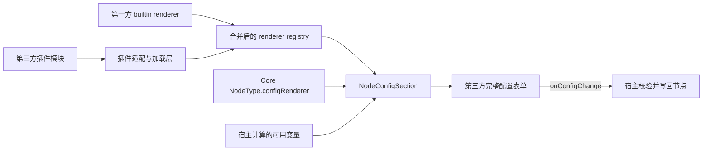

# 插件节点配置表单扩展方案

> 状态：设计决策，尚未实现。
>
> 本文记录第三方插件接管节点完整配置表单的扩展方向。当前代码仍以
> `@ai-workflow/core`、`@ai-workflow/form` 和 Web 内已有实现为准；正式实现插件加载后，应同步
> 更新对应 package 技能文档与公开 API 说明。
>
> 平台第一方可复用复杂字段的当前方案与剩余重构清单见
> [节点配置字段级 Renderer 重构清单](node-config-field-renderer-refactor.md)。本文继续约束无法形成
> 平台标准字段的第三方插件完整表单，不要求插件把专属业务控件注册为公共字段。

## 1. 背景

当前节点配置面板存在两种配置方式：

1. 普通配置通过 `NodeType.form` 声明字段，并由 `NodeConfigFields` 根据 `field.ui` 选择
   `@ai-workflow/form` 内置字段 renderer，或选择 Web 通过 `renderers` 注入的平台字段。
2. 复杂配置通过 `NodeType.configRenderer` 声明专属 renderer 名称，再由
   `NodeConfigSection` 从 renderer map 中选择完整配置表单。

Web 当前在
`apps/web/src/features/workflow/node-config-renderers/builtin.ts` 中分别维护需要 Web API 或应用
上下文的第一方字段 renderer 与整节点 renderer。LLM 模型选择器属于字段 renderer；当前第一方
整节点 registry 为空，但继续保留给无法按顶层配置字段拆分的后续能力。

如果把插件节点需要的变量选择、远程数据请求和复杂交互继续拆进普通 field，可能产生以下问题：

- `FIELD_UI_TYPES` 和 `builtinFields` 持续增长，平台字段协议与插件业务控件耦合。
- Web 的 `builtin.ts` 逐渐包含第三方节点映射，无法独立安装、卸载插件。
- 第三方 renderer 难以获取上游变量、认证请求能力和宿主运行时信息。
- 普通 field 的值类型可能与 Core Zod schema 不一致，例如界面写入变量引用对象，而 schema
  仍只接受字符串。

## 2. 设计结论

第三方插件需要自定义复杂配置时，由第三方开发完整的节点配置表单，并通过
`NodeType.configRenderer` 注册，不扩展普通 `form.ui`。

现有 Core、Form、Web 分层保持不变，后续只增加插件模块加载和 renderer 注册适配：

- `form.ui`：平台维护的标准字段类型，可由 Form 内置或由 Web 字段 registry 注入。
- `configRenderer`：第一方或第三方接管完整节点配置表单的扩展点。
- `NodeConfigRendererProps.availableVariables`：宿主向表单提供当前节点可用的变量候选。
- `onConfigChange`：配置表单写回节点配置的唯一入口。
- Core Zod schema：节点配置数据结构和合法性的唯一事实来源。
- Web `builtin.ts`：只注册依赖 Web 能力的第一方 renderer，不登记第三方插件。

因此当前架构不需要为了插件提前改造字段系统。只有未来出现明确的“多个插件都需要复用同一种
新标准字段”场景时，再单独设计可扩展的 field renderer registry。

## 3. 为什么使用 `configRenderer`

### 3.1 `form.ui` 的职责

`form.ui` 用于描述平台可以统一渲染的标准字段，例如：

- 文本输入。
- 数字输入。
- 多行文本。
- Select。
- Switch。
- Slider。
- Code Editor。
- 平台维护的键值表格。
- 平台维护的 HTTP Request Body。

这些字段由 `NodeConfigFields` 和 `builtinFields` 统一维护，适合简单、稳定、无应用业务依赖的
受控字段。

第三方只传入一个自定义 `form.ui` 字符串并不足以完成扩展。`NodeConfigFields` 虽然支持宿主注入
renderer，但插件字段仍需要同时解决：

- Core 的 `FieldUIType` 联合类型。
- `FieldSchemaByUI` 的 schema 映射。
- 宿主字段 registry 的命名空间、冲突与卸载。
- 自定义字段所需的变量、请求客户端等运行时依赖。

这会把插件业务重新耦合进平台字段协议。

### 3.2 `configRenderer` 的职责

`configRenderer` 本身已经是字符串扩展点，`NodeConfigSection` 也支持由调用方注入
`NodeConfigRendererMap`。第三方完整表单可以直接获得现有公共契约：

```ts
export interface NodeConfigRendererProps {
  config: Readonly<Record<string, unknown>>
  availableVariables?: readonly AvailableVariableOption[]
  errors?: NodeConfigFieldErrors
  disabled?: boolean
  onConfigChange: (config: Record<string, unknown>) => void
}
```

因此第三方可以自由组合 `@ai-workflow/form`、`@ai-workflow/ui` 或插件自己的组件，不需要让
平台提前知道表单内部有哪些字段。

## 4. 建议的插件模块契约

以下接口用于说明目标形态，名称和最终导出位置可在实现插件加载器时确定：

```ts
import type { NodeType } from '@ai-workflow/core'
import type { NodeConfigRendererMap } from '@ai-workflow/form/components/node-config-section'
import type { NodeUIRegistration } from '@ai-workflow/nodes-ui'

export interface WorkflowPluginModule {
  id: string
  nodes?: readonly NodeType[]
  nodeUIs?: readonly NodeUIRegistration[]
  configRenderers?: NodeConfigRendererMap
}
```

插件节点使用带命名空间的 renderer 名称，避免与平台或其他插件冲突：

```ts
export const acmeHttpNode = {
  schema: acmeHttpNodeSchema,
  definition: acmeHttpNodeDefinition,
  configRenderer: 'acme.http-request.config',
  createInitialConfig: () => ({
    endpoint: '',
    credentialId: '',
  }),
} satisfies NodeType<typeof acmeHttpNodeSchema>
```

插件在自己的包中提供完整表单和 renderer 映射：

```tsx
import type { NodeConfigRendererProps } from '@ai-workflow/form/components/node-config-section'

export function AcmeHttpRequestConfigForm({
  config,
  availableVariables = [],
  errors,
  disabled,
  onConfigChange,
}: NodeConfigRendererProps) {
  // 插件自行组合字段、变量选择器和插件自己的远程数据。
  // 节点配置只能通过 onConfigChange 写回。
  return null
}

export const configRenderers = {
  'acme.http-request.config': AcmeHttpRequestConfigForm,
} satisfies NodeConfigRendererMap
```

插件入口最终导出节点定义、画布 UI 和配置表单注册项：

```ts
export default {
  id: 'acme.http-request',
  nodes: [acmeHttpNode],
  nodeUIs: [acmeHttpNodeUI],
  configRenderers,
} satisfies WorkflowPluginModule
```

## 5. 宿主适配层

插件 renderer 不直接写入 Web 的 `builtin.ts`。插件管理器加载模块后，由宿主合并第一方和
第三方注册项：

```ts
const configRenderers = mergeNodeConfigRenderers(
  ...loadedPlugins.map((plugin) => plugin.configRenderers ?? {}),
)
```

合并逻辑必须：

- 检查 renderer 名称是否重复，冲突时快速失败，不允许后注册项静默覆盖前一项。
- 记录冲突所属插件，提供可诊断错误。
- 保留第一方 renderer 与插件 renderer 相同的调用契约。
- 支持插件卸载后移除对应注册项。
- 在插件异步加载失败或 renderer 渲染异常时隔离错误，不能使整个工作流编辑器崩溃。

`WorkflowConfigPanel` 最终只消费合并完成的 renderer map：

```tsx
<NodeConfigSection
  renderer={nodeType.configRenderer}
  renderers={configRenderers}
  config={form.config}
  availableVariables={availableVariables}
  errors={errors}
  disabled={disabled}
  onConfigChange={handleConfigChange}
/>
```

目标数据流：



## 6. 变量能力边界

### 6.1 上游节点变量

上游变量来自当前工作流编辑器中的 nodes 和 edges，其中可能包含尚未保存的本地修改。因此它们
不应该由插件通过 HTTP 接口重新获取。

宿主继续负责：

1. 根据当前节点和 Edge 计算所有可达上游节点。
2. 读取上游节点输出和动态输出端口。
3. 转换为 `AvailableVariableOption[]`。
4. 通过 `NodeConfigRendererProps.availableVariables` 传入第三方表单。

第三方表单可以直接复用 `VariableValueEditor`，也可以基于相同候选数据实现自己的组合界面，
但不得自行遍历 React Flow 或依赖 Web 编辑器内部 Hook。

### 6.2 系统变量和环境变量

当前 `availableVariables` 首期只包含上游节点变量。未来增加系统变量、环境变量或嵌套 Path
时，应由宿主统一聚合并扩展公共候选协议，不让每个插件分别实现一套来源解析。

## 7. 接口调用边界

第三方完整表单可以发起请求，但需要区分接口归属。

### 7.1 插件自己的接口

插件可以在自己的表单或插件内部 Hook 中调用自己的服务端接口，并自行处理加载、错误和缓存。
请求结果只用于编辑配置，最终配置仍通过 `onConfigChange` 写回。

### 7.2 平台接口

插件不应直接导入 `apps/web/src/api/*`，否则会依赖宿主内部目录、认证实现和路由环境。

后续需要访问平台模型、知识库、凭证等资源时，由插件适配层提供稳定的 Plugin SDK 或 Runtime
Context，例如：

```ts
interface WorkflowPluginRuntime {
  models: ModelCatalogClient
  knowledgeBases: KnowledgeBaseClient
  credentials: CredentialClient
}
```

该 Runtime 由宿主负责注入认证信息、租户信息、请求基础地址和权限控制。只在出现真实插件需求
后增加对应 capability，不提前把完整 Web API Client 暴露给插件。

### 7.3 禁止的依赖方式

- 插件不得导入 `apps/web/src/*` 内部模块。
- 插件不得直接读写工作流编辑器状态。
- 插件不得绕过 `onConfigChange` 修改节点。
- 插件不得把访问令牌、密钥或宿主内部对象写入 `node.config`。
- 插件不得假设平台 API 的内部 Axios 实现。

## 8. 表单状态与校验

插件接管完整表单不代表接管工作流保存和最终校验。

- 插件节点必须声明 Core Zod schema。
- 宿主使用该 schema 校验配置，并把错误通过 `errors` 传给 renderer。
- renderer 只通过 `onConfigChange` 提交下一份配置。
- renderer 内部如果组合暂存表单或 Dialog 表单，继续使用 `useFormData` 和
  `validateFormByZod`。
- renderer 必须处理 `disabled`，工作流不可编辑或资源不可用时不能继续修改配置。
- 插件请求错误不写入宿主 Zod 字段错误，应由插件自己的界面反馈。

插件配置必须保持可序列化。React 组件、请求客户端、函数和浏览器对象只能存在于 renderer
运行时，不能保存进 `node.config`。

## 9. 分阶段实施

### 阶段一：renderer 注册适配

- 定义正式的 `WorkflowPluginModule` 或等价插件导出契约。
- 让插件加载器收集 Core 节点、Nodes UI 和 config renderer 注册项。
- 增加 renderer 合并与重复名称检查。
- 将合并后的 `NodeConfigRendererMap` 注入 `WorkflowConfigPanel`。
- 给异步插件和第三方 renderer 增加加载态与 Error Boundary。
- 只有出现真实的第一方完整表单时才建立第一方 registry；没有注册项时不保留空 map 占位。

### 阶段二：平台能力 SDK

- 根据真实插件需求定义最小 capability。
- 通过 Provider 或明确 props 注入平台 Client。
- 统一认证、权限、错误协议和 API 版本。
- 明确插件卸载、会话失效和请求取消行为。

### 阶段三：评估插件字段协议

只有出现多个插件共享相同字段类型，并且完整 renderer 造成明显重复时，才评估：

- 如何把当前第一方使用的 `NodeConfigFields.renderers` 扩展为带插件命名空间、冲突检测和卸载
  能力的正式插件字段注册表。
- 自定义 `FieldSchema` 的命名空间和序列化协议。
- 字段运行时上下文。
- 字段值与 Core Zod schema 的类型关联。

在此之前，不给 `FIELD_UI_TYPES` 增加插件占位类型，也不让 `NodeConfigFields` 承担插件加载。

## 10. 验收标准

正式落地本方案后应满足：

- 安装插件后，其 Core 节点、画布 UI 和完整配置表单可以作为同一模块注册。
- 第三方 renderer 不需要修改 Web `builtin.ts`。
- 第三方表单可以获得当前节点的上游变量候选。
- 本地尚未保存的工作流修改会立即反映到变量候选中。
- 插件配置只能通过宿主入口写回，并始终经过 Core schema 校验。
- renderer 名称冲突会产生明确错误，不会静默覆盖。
- 单个插件加载或渲染失败不会导致整个工作流编辑器崩溃。
- 卸载插件后，其 renderer 和 UI 注册项会被移除。
- 插件不依赖 `apps/web/src/*` 私有模块。

## 11. 本方案明确不做

- 当前阶段不开放任意 `form.ui` 类型。
- 不把第三方 renderer 写入第一方 `builtin.ts`。
- 不让 Form 包请求 Web API 或遍历工作流图。
- 不让插件直接获取或修改 React Flow 实例。
- 不提前设计覆盖所有平台接口的通用 SDK。
- 不改变现有 `WorkflowNode.config`、`inputs` 和 `outputs` 顶层结构。
