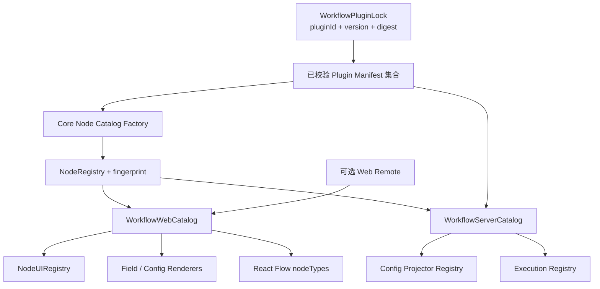

# 插件运行时目录重构方案

## 1. 文档状态

- 状态：方案设计，待分阶段实施
- 基线日期：2026-08-07
- 适用范围：Workflow Core、Web 编辑器、Server 校验与执行路由
- 目标：把 Web 与 Server 对全局 `nodeRegistry` 和内置路由表的直接依赖，统一收敛为按工作流插件锁构建的不可变运行时目录

本文只描述现有节点体系的装配和注入重构，不重新定义 `NodeType`、`NodeRegistry`、
`NodeUIRegistry`、表单协议或 Runtime 状态机。

## 2. 核心结论

这里的“统一目录”不是让 Web、Server 共用同一个包含 React、MQ 和执行函数的万能对象，而是：

1. Web 与 Server 使用同一份 `WorkflowPluginLock` 和同一批经过摘要校验的 manifest；
2. 两端分别从这些纯数据构建适合自身环境的不可变 Catalog；
3. Core Registry、节点 UI、表单 renderer、Runtime Config projector 和执行路由都必须属于同一个
   Catalog 版本；
4. Catalog 通过稳定 `fingerprint` 标识，插件安装或升级后创建新 Catalog，不修改已经挂载或正在执行的
   Catalog；
5. 未知节点和缺少执行路由都必须明确失败，不允许回退到内置 singleton 或通用 Queue。

推荐的分层如下：



Web 和 Server 的一致性来自相同的插件锁、manifest 和 fingerprint，不来自跨进程共享 JavaScript
对象。

## 3. 当前耦合点

### 3.1 Web 模块初始化时固定 Registry

`apps/web/src/components/workflow/workflow-nodes.tsx` 当前在模块加载时执行：

```ts
const nodeUIRegistry = createBuiltinNodeUIRegistry(nodeRegistry)
```

这会把 Core Registry 和 UI Registry 固定为内置节点集合。即使后续加载插件 manifest 或 Web Remote，
当前模块也无法切换到工作流对应的 Registry。

此外，Web 还有编辑器 Hook、连线校验、节点创建、保存校验、检查清单、配置面板和只读查看器等多个文件
直接导入全局 `nodeRegistry`。只替换画布渲染仍会导致“能够显示插件节点，但不能创建、连线、保存或
运行”的不一致状态。

### 3.2 React Flow `nodeTypes` 静态生成

同一文件当前在模块初始化时从全局 Registry 生成 `workflowNodeTypes`。React Flow 因而只认识构建 Web
应用时已经存在的内置节点类型。

现有 `WorkflowNode` 本身已经是通用适配器：它把逻辑节点转换给 `RenderNode`，后者再从
`NodeRegistry` 和 `NodeUIRegistry` 选择 BaseNode content 或完整自定义 renderer。因此不需要为每个
插件节点生成一个新的 React 组件，只需要让通用组件读取当前 Catalog，并为最终节点类型建立稳定映射。

### 3.3 Server 校验、Projector 和执行路由各自硬编码

Server 当前存在三组相互独立的数据源：

- 保存、发布和运行服务直接使用 Core 全局 `nodeRegistry`；
- `workflow-run.service.ts` 使用 `RUNTIME_NODE_CONFIG_PROJECTORS` 选择 Config projector；
- `workflow-execution-routing.service.ts` 使用 `classifiedRoutes` 选择执行类别和 Routing Key。

这三组映射可能产生漂移。例如节点已经进入 Core Registry，但缺少 projector 或 route 时，只会在运行链路
较晚阶段失败。插件节点也无法按其锁定版本解析对应能力。

## 4. Core：从全局 singleton 改为 Catalog 工厂

### 4.1 第一阶段保留兼容导出

先在 `@ai-workflow/core` 增加内置 Registry 工厂：

```ts
export function createBuiltinNodeRegistry(): NodeRegistry {
  return new NodeRegistry(Object.values(builtinNodeStrategies))
}

/** @deprecated 新代码应从工作流 Catalog 获取 Registry。 */
export const nodeRegistry = createBuiltinNodeRegistry()
```

保留旧导出只用于分批迁移，插件节点绝不能注册进该 singleton。全部调用点迁移完成后再移除旧导出。

### 4.2 装配完成后不可变

当前 `NodeRegistry` 暴露 `register()`，容易在编辑器挂载或运行开始后被继续修改。建议将“装配”和“读取”
分开：

```ts
export interface NodeRegistryReader {
  has(type: string): boolean
  get(type: string): NodeType | undefined
  getOrThrow(type: string): NodeType
  list(): readonly NodeType[]
}

export class NodeRegistryBuilder {
  register(node: NodeType): this
  registerAll(nodes: Iterable<NodeType>): this
  build(): NodeRegistryReader
}
```

如果第一阶段不希望改动现有类，可以先让 Catalog Factory 独占 `register()`，构建完成后只把
`NodeRegistryReader` 类型暴露给消费方。关键约束是消费方不能在运行期继续注册节点。

### 4.3 环境无关的核心目录

```ts
export interface WorkflowNodeCatalog {
  readonly fingerprint: string
  readonly pluginLock: WorkflowPluginLock
  readonly nodeRegistry: NodeRegistryReader
}
```

`fingerprint` 应由平台宿主版本和排序后的 `pluginId@version:digest` 计算。内置节点集合或 manifest
适配规则变化时也必须改变 fingerprint，避免复用过期缓存。

## 5. Web：在编辑器根部注入 `WorkflowWebCatalog`

### 5.1 Catalog 契约

```ts
export interface WorkflowWebCatalog {
  readonly fingerprint: string
  readonly nodeRegistry: NodeRegistryReader
  readonly nodeUIRegistry: NodeUIRegistry
  readonly fieldRenderers: NodeConfigFieldRendererMap
  readonly configRenderers: NodeConfigRendererMap
}
```

创建过程固定为：

1. 读取工作流插件锁；
2. 校验并适配内置节点和 manifest 节点，构建 Core Registry；
3. 注册内置节点 UI，再合并已经授权加载的插件 Web UI；
4. 合并 Form 内置字段、Web Host Field renderer 和插件 renderer；
5. 执行重复 key、未知节点和 `NodeUIRegistry.assertCompatible()` 检查；
6. 成功后冻结 Catalog，再挂载编辑器。

`apps/web/src/features/workflow` 增加 `WorkflowCatalogProvider` 和
`useWorkflowCatalog()`。Provider 应位于 `ReactFlowProvider` 内、`WorkflowEditor` 外，使节点组件、面板
和编辑器 Hook 读取同一个 Catalog 实例。

### 5.2 React 与纯函数采用不同注入方式

- React 组件通过 `useWorkflowCatalog()` 读取 Catalog；
- 纯工具函数显式接收 `NodeRegistryReader`，不在工具模块内部读取 Context，也不重新导入全局
  `nodeRegistry`；
- `useWorkflowEditor` 在入口接收 Catalog 或 Registry，并继续把它传给连线、节点创建、转换和校验函数；
- 保存、发布前检查和单节点运行检查必须使用编辑器当前 Catalog，不能另建内置 Registry。

推荐签名示例：

```ts
useWorkflowEditor({ canvasRef, initialSnapshot, catalog })
canConnect(workflow, connection, catalog.nodeRegistry)
createCanvasNode(type, position, catalog.nodeRegistry)
createWorkflowCheckListIssues(workflow, catalog.nodeRegistry)
```

配置面板直接使用 `catalog.nodeRegistry`、`catalog.fieldRenderers` 和
`catalog.configRenderers`。现有 `apps/web/src/features/workflow/node-config-renderers/builtin.ts`
通过 Host Field Registry 合并进 Catalog，不把该 Web 文件下沉或暴露给第三方直接导入。

### 5.3 迁移顺序

Web 应先以“只有内置节点的 Catalog”完成依赖注入，再接入插件加载，避免同时修改节点行为和加载协议：

1. 增加 `createBuiltinWorkflowWebCatalog()`，输出与当前行为相同的内置 Catalog；
2. Provider 包住编辑器，`WorkflowNode` 改为从 Context 读取 Core/UI Registry；
3. `useWorkflowEditor` 以及它调用的纯工具函数改为显式 Registry 参数；
4. 配置面板、节点选择器、保存、检查清单、运行面板和 viewer 改用 Catalog；
5. 删除 Web 对 Core 全局 `nodeRegistry` 的直接导入；
6. 最后让 Catalog Factory 合并插件 manifest、Host renderer 和 Web Remote。

## 6. React Flow：按 Catalog 动态生成稳定 `nodeTypes`

### 6.1 保留一个通用节点适配器

`WorkflowNode` 不再闭包引用模块级 Registry：

```tsx
function WorkflowNode(props: NodeProps<WorkflowCanvasNode>) {
  const catalog = useWorkflowCatalog()

  return (
    <RenderNode
      {...toRenderNodeProps(props)}
      nodeRegistry={catalog.nodeRegistry}
      uiRegistry={catalog.nodeUIRegistry}
    />
  )
}
```

插件的 `custom: false`、自定义 content 和 `custom: true` 完整外壳，继续由 `NodeUIRegistry` 在
`RenderNode` 内部分发。React Flow 不需要理解这些模式。

### 6.2 `nodeTypes` 工厂

```ts
export function createWorkflowNodeTypes(
  registry: NodeRegistryReader,
  observedNodeTypes: Iterable<string> = [],
): NodeTypes {
  const types = new Set([
    ...registry.list().map((node) => node.definition.type),
    ...observedNodeTypes,
  ])

  return Object.fromEntries([...types].map((type) => [type, WorkflowNode]))
}
```

`observedNodeTypes` 来自当前快照，用于让缺失插件的未知节点仍进入通用 `WorkflowNode`，再由
`RenderNode` 显示可诊断的未知节点外壳并保留原始数据。

`WorkflowEditor` 使用 `useMemo` 创建映射，依赖只包含：

- `catalog.fingerprint`；
- 当前画布出现过的 node type 集合，而不是完整 nodes 数组。

节点位置、选中状态或配置变化不能重新创建 `nodeTypes`。插件安装、卸载或升级时，应以新的 fingerprint
重建 Catalog，并使用 `key={catalog.fingerprint}` 有意重新挂载整个编辑器，避免 React Flow 在旧、新
Registry 之间保留半更新状态。

## 7. Server：按插件锁构建 `WorkflowServerCatalog`

### 7.1 Catalog 契约

Server 增加单例 `WorkflowCatalogResolver`，但它返回的是按插件锁区分的不可变 Catalog：

```ts
export interface WorkflowServerCatalog {
  readonly fingerprint: string
  readonly nodeRegistry: NodeRegistryReader
  readonly configProjectors: RuntimeNodeConfigProjectorRegistry
  readonly executionRegistry: WorkflowExecutionRegistry
}
```

Resolver 的输入不是 `nodeType`，而是当前草稿或不可变 WorkflowVersion 的完整插件锁：

```ts
resolveForWorkflow(ownerId: string, pluginLock: WorkflowPluginLock): Promise<WorkflowServerCatalog>
```

Catalog 可以按 fingerprint 使用有界 LRU/TTL 缓存。缓存对象必须不可变；权限、安装状态和 artifact
摘要在创建 Catalog 前校验，发布版本运行时必须解析其精确锁定版本，不能改用用户当前安装的最新版本。

### 7.2 分离三个 Registry，不创建 Server 万能 Map

Server Catalog 组合三个职责明确的 Registry：

1. `nodeRegistry`：Core 节点 schema、definition、端口和工作流校验；
2. `configProjectors`：逻辑 node type 到 Runtime Config projector；
3. `executionRegistry`：逻辑 node type 到执行模式、执行类别和分类 Routing Key。

建议执行登记使用判别联合：

```ts
type WorkflowNodeExecutionRegistration =
  | { nodeType: string; kind: 'runtime-control' }
  | { nodeType: string; kind: 'server-control'; handler: 'sub-workflow' }
  | {
      nodeType: string
      kind: 'executor'
      executionClass: Exclude<WorkflowExecutionClass, 'runtime-control'>
      classifiedRoutingKey: string
    }
  | { nodeType: string; kind: 'unsupported'; reason: string }
```

`unsupported` 允许插件节点在编辑器中存在，但发布或执行前给出稳定错误。第三方执行代码开放前，插件
节点不应因为有 Core 定义就自动获得通用 Queue。

三个 Registry 在 Catalog 创建时执行一致性检查：

- projector 和 execution registration 不得引用未知 Core node type；
- 重复 node type 立即失败；
- 会产生 MQ Dispatch 的节点必须有 `executor` route；
- Runtime/Server 本地控制节点不得拥有 MQ route；
- 使用 VariableValue 的 Config 必须有显式 projector，不能依赖递归猜测；
- 未声明第三方执行适配器的节点登记为 `unsupported`，禁止 fallback。

### 7.3 重构 `WorkflowExecutionRoutingService`

`classifiedRoutes` 从 `WorkflowExecutionRoutingService` 中移除，内置 route 改为内置 Server Catalog 的
注册数据。Routing Service 只保留部署策略：

```ts
resolve(
  nodeType: string,
  executionRegistry: WorkflowExecutionRegistry,
): WorkflowExecutionRoute {
  const registration = executionRegistry.getOrThrow(nodeType)
  // 检查 kind、EXECUTOR_ENABLED_CLASSES 和 legacy/classified 模式
  // 返回最终 executionClass 与 routingKey
}
```

该 Service 不再知道 `BuiltinNodeType`。它根据 Registry 获取分类 route，再应用现有
`EXECUTOR_ENABLED_CLASSES` 和 `WORKFLOW_EXECUTOR_ROUTING_MODE`。最终 route 仍在创建 Command Outbox
时持久化，Publisher 重试只使用 Outbox 中已经固定的值。

`RUNTIME_NODE_CONFIG_PROJECTORS` 同样移出 `WorkflowRunService`，作为内置 Server Catalog 的 projector
注册数据。插件只能通过 manifest 中受限的 Config binding 描述生成通用 projector，Server 不加载第三方
projector JavaScript。

### 7.4 Server 调用顺序

保存或编辑：

```text
workflowSchema.safeParse(raw)
  -> catalogResolver.resolveForWorkflow(ownerId, workflow.plugins)
  -> validateWorkflow(workflow, catalog.nodeRegistry)
  -> persist workflow + plugin reference projection
```

发布、测试运行或 API 运行：

```text
parse exact WorkflowVersion / submitted snapshot
  -> resolve exact WorkflowServerCatalog
  -> validateExecutorWorkflow(workflow, catalog.nodeRegistry)
  -> create runtime with catalog.configProjectors
  -> resolve dispatch route from catalog.executionRegistry
  -> persist route into Outbox
```

RuntimeState 恢复、Result 推进和子工作流启动也必须从对应不可变 WorkflowVersion 解析同一 Catalog，
不能在恢复路径重新使用全局内置 Registry。

### 7.5 Server 迁移顺序

1. 建立内置 `WorkflowServerCatalog`，内容与当前 Core Registry、projector map 和 route map 完全等价；
2. 注入 `WorkflowCatalogResolver`，先让空插件锁始终返回该内置 Catalog；
3. 迁移草稿保存、Studio 导入、发布、测试运行和 API 运行的校验入口；
4. 迁移 Runtime 创建/恢复路径和单节点运行；
5. 将 projector map 移入 Catalog；
6. 将 `classifiedRoutes` 移入 `WorkflowExecutionRegistry`，Routing Service 退化为部署策略适配器；
7. 删除 Server 对 Core 全局 `nodeRegistry` 的直接导入；
8. 最后接入 Workflow plugin lock、manifest 解析和 Catalog 缓存。

## 8. 一致性和生命周期

一个编辑器或一次运行必须只使用一个 fingerprint：

```text
Workflow plugin lock
  = Web Catalog fingerprint
  = Server Catalog fingerprint
  = 发布版本记录的插件 artifact 集合
```

建议 Server 返回给 Web 的 runtime catalog 响应携带 fingerprint。保存、发布和测试运行请求同时携带
客户端 fingerprint；Server 解析插件锁后发现不一致时返回 `409`，提示重新加载编辑器，避免管理员在用户
编辑期间升级插件导致两端使用不同能力集合。

插件安装状态可以变化，但已发布 WorkflowVersion 的 artifact 必须保持可读取。安装禁用只阻止新建和升级，
不能让历史运行静默改用另一版本。

## 9. 预计代码影响范围

| 范围                                                            | 重构内容                                                             |
| --------------------------------------------------------------- | -------------------------------------------------------------------- |
| `packages/workflow-core/src/node`                               | Registry 只读接口或 Builder、内置 Registry 工厂                      |
| `packages/workflow-core/src/nodes`                              | 保留兼容 singleton，新增 `createBuiltinNodeRegistry()`               |
| `apps/web/src/features/workflow`                                | `WorkflowWebCatalog`、Provider、Catalog Factory 和 Registry 参数注入 |
| `apps/web/src/components/workflow/workflow-nodes.tsx`           | 删除模块级 Registry，通用节点从 Context 读取 Catalog                 |
| `apps/web/src/features/workflow/components/workflow-editor.tsx` | 动态、稳定地创建 React Flow `nodeTypes`                              |
| `apps/web/src/utils/workflow`                                   | 纯函数显式接收 `NodeRegistryReader`                                  |
| `apps/server/src/services`                                      | 保存、发布、运行和恢复链路解析 `WorkflowServerCatalog`               |
| `apps/server/src/infra/workflow-mq`                             | `WorkflowExecutionRegistry` 与只处理部署策略的 Routing Service       |
| `packages/workflow-runtime`                                     | 继续消费注入的 projector，不持有插件或 Server Registry               |

## 10. 完成标准

- Web 与 Server 业务代码不再直接导入 Core 全局 `nodeRegistry`；
- Catalog 构建完成后不能被调用方继续注册或覆盖节点；
- Core、画布、配置表单、连线、保存校验和执行前校验使用同一 fingerprint 对应的节点集合；
- React Flow `nodeTypes` 只在 Catalog 或 node type 集合变化时重建；
- 缺失插件的节点仍能只读诊断并保留原始数据；
- `WorkflowExecutionRoutingService` 不再导入 `BuiltinNodeType`；
- projector 和执行 route 都经过 Catalog 创建期兼容性检查；
- 未知或不支持执行的插件节点在 Outbox 创建前失败，没有 fallback Queue；
- Outbox 继续固定 `executionClass` 和最终 `routingKey`，重试期间不重新解析可变 Catalog。
