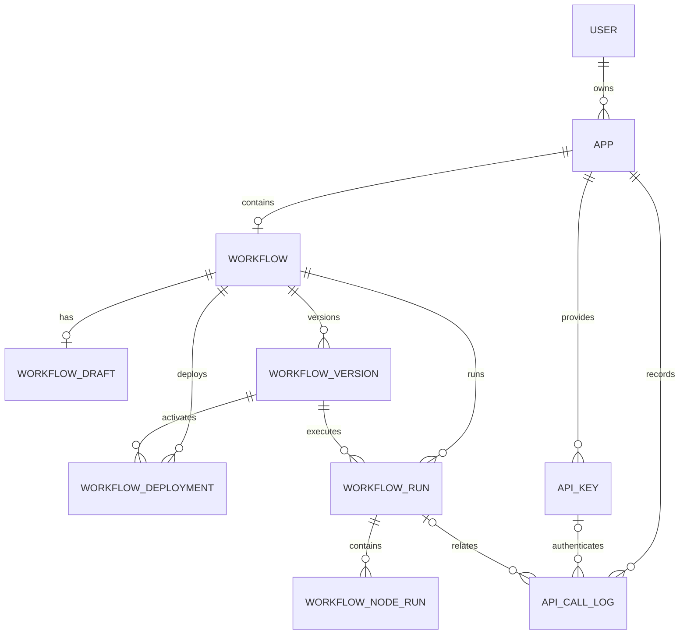

# 工作流数据库设计

> 状态：Prisma 多文件 Schema 已定义，尚未生成 migration，也尚未接入服务端业务代码。

## 设计结论

工作流数据采用“关系表管理生命周期，JSONB 保存完整画布文档”的混合设计：

- 应用信息、用户归属、版本、发布、API Key 和运行日志使用独立关系表。
- 工作流节点、连线、输入输出配置作为一个完整定义保存在 JSONB 中。
- React Flow 的位置、尺寸和视口单独保存在 layout JSONB 中，不参与工作流执行。
- 暂不把每个 Node、Edge 拆成数据库行。编辑、校验、发布和执行都需要读取完整工作流，
  节点配置又随节点类型变化，过早关系化会增加多态表和事务复杂度。

单表不适合当前业务：应用元数据、草稿、不可变版本、API 调用日志和运行日志具有不同的
更新频率、保留周期和索引方式，把它们放在同一张表会导致热行竞争、数据膨胀和历史记录
难以管理。

## 关系概览



## 表职责

| 表                     | 职责                   | 主要关系和约束                                         |
| ---------------------- | ---------------------- | ------------------------------------------------------ |
| `users`                | 用户和登录凭据         | 已存在；一个用户拥有多个 App                           |
| `apps`                 | 工作室中的应用基本信息 | `ownerId` 对应 User；一个 App 当前对应一个 Workflow    |
| `workflows`            | 工作流稳定身份         | `appId` 唯一；不直接保存易变画布                       |
| `workflow_drafts`      | 当前可编辑草稿         | `workflowId` 唯一；保存 definition、layout 和 revision |
| `workflow_versions`    | 不可变工作流快照       | 同一 Workflow 内 `version` 唯一                        |
| `workflow_deployments` | 环境当前激活的版本     | 同一 Workflow 和 environment 唯一                      |
| `api_keys`             | App 的 API 访问凭据    | 只保存 Key 前缀和哈希，不保存原始 Key                  |
| `api_call_logs`        | HTTP/API 调用记录      | 即使鉴权或参数校验失败，也可以单独存在                 |
| `workflow_runs`        | 一次完整工作流运行     | 绑定不可变 WorkflowVersion                             |
| `workflow_node_runs`   | 运行中的节点执行明细   | 支持重试和 Loop 内同一节点多次执行                     |

## 工作流 JSON 边界

### Definition

`workflow_drafts.definition` 和 `workflow_versions.definition` 保存 Core 中的可执行数据：

```json
{
  "nodes": [],
  "edges": [],
  "outputs": []
}
```

工作流 `id` 来自 `workflows.id`，名称和描述来自 `apps`。服务端读取后组装为完整的
`Workflow`：

```ts
const workflow = {
  id: workflowRecord.id,
  name: app.name,
  description: app.description ?? undefined,
  ...definition,
}
```

外部请求、数据库 JSON 和导入 DSL 都不能直接信任。保存前先调用
`workflowSchema.safeParse()` 和 `validateWorkflow()`；发布、测试运行和正式执行前调用
`validateExecutorWorkflow()`。

### Layout

`layout` 只保存前端编辑器状态：

```json
{
  "positions": {
    "node-id": {
      "x": 120,
      "y": 180
    }
  },
  "sizes": {
    "loop-node-id": {
      "width": 640,
      "height": 420
    }
  },
  "viewport": {
    "x": 0,
    "y": 0,
    "zoom": 1
  }
}
```

Definition 和 Layout 分开后，拖动节点不会改变执行定义，也不会影响发布内容的计算和比较。

## Prisma 模型设计

以下内容与 `apps/server/prisma/` 中的多文件模型保持一致。后续生成 migration 前仍需检查
SQL 和已有数据兼容性。

```prisma
enum WorkflowVersionSource {
  MANUAL
  PUBLISH
  TEST_RUN
  IMPORT
}

enum DeploymentEnvironment {
  STAGING
  PRODUCTION
}

enum WorkflowRunTrigger {
  API
  MANUAL
  TEST_RUN
  SCHEDULE
  SUB_WORKFLOW
}

enum WorkflowRunStatus {
  QUEUED
  RUNNING
  SUCCEEDED
  FAILED
  CANCELLED
  TIMED_OUT
}

enum WorkflowNodeRunStatus {
  PENDING
  RUNNING
  SUCCEEDED
  FAILED
  SKIPPED
  CANCELLED
  TIMED_OUT
}

model User {
  id        String   @id @default(uuid()) @db.Uuid
  phone     String   @unique
  username  String
  password  String
  createdAt DateTime @default(now())
  updatedAt DateTime @updatedAt

  apps                    App[]
  updatedWorkflowDrafts   WorkflowDraft[]      @relation("WorkflowDraftUpdatedBy")
  createdWorkflowVersions WorkflowVersion[]    @relation("WorkflowVersionCreatedBy")
  workflowDeployments     WorkflowDeployment[] @relation("WorkflowDeploymentDeployedBy")
  createdApiKeys          ApiKey[]              @relation("ApiKeyCreatedBy")
  triggeredWorkflowRuns   WorkflowRun[]         @relation("WorkflowRunTriggeredBy")

  @@map("users")
}

model App {
  id          String    @id @default(uuid()) @db.Uuid
  ownerId     String    @db.Uuid
  name        String
  description String?
  icon        String?
  kind        AppKind   @default(WORKFLOW)
  deletedAt   DateTime?
  createdAt   DateTime  @default(now())
  updatedAt   DateTime  @updatedAt

  owner       User         @relation(fields: [ownerId], references: [id], onDelete: Restrict)
  workflow    Workflow?
  apiKeys     ApiKey[]
  apiCallLogs ApiCallLog[]

  @@index([ownerId, deletedAt, updatedAt])
  @@map("apps")
}

model Workflow {
  id        String   @id @default(uuid()) @db.Uuid
  appId     String   @unique @db.Uuid
  createdAt DateTime @default(now())
  updatedAt DateTime @updatedAt

  app         App                  @relation(fields: [appId], references: [id], onDelete: Cascade)
  draft       WorkflowDraft?
  versions    WorkflowVersion[]
  deployments WorkflowDeployment[]
  runs        WorkflowRun[]

  @@map("workflows")
}

model WorkflowDraft {
  id            String   @id @default(uuid()) @db.Uuid
  workflowId    String   @unique @db.Uuid
  schemaVersion Int      @default(1)
  definition    Json     @db.JsonB
  layout        Json     @db.JsonB
  revision      Int      @default(1)
  updatedById   String?  @db.Uuid
  createdAt     DateTime @default(now())
  updatedAt     DateTime @updatedAt

  workflow  Workflow @relation(fields: [workflowId], references: [id], onDelete: Cascade)
  updatedBy User?    @relation("WorkflowDraftUpdatedBy", fields: [updatedById], references: [id], onDelete: SetNull)

  @@map("workflow_drafts")
}

model WorkflowVersion {
  id            String                @id @default(uuid()) @db.Uuid
  workflowId    String                @db.Uuid
  version       Int
  source        WorkflowVersionSource
  schemaVersion Int                   @default(1)
  definition    Json                  @db.JsonB
  layout        Json                  @db.JsonB
  note          String?
  createdById   String?               @db.Uuid
  createdAt     DateTime              @default(now())

  workflow  Workflow @relation(fields: [workflowId], references: [id], onDelete: Cascade)
  createdBy User?    @relation("WorkflowVersionCreatedBy", fields: [createdById], references: [id], onDelete: SetNull)

  deployments WorkflowDeployment[]
  runs        WorkflowRun[]

  @@unique([workflowId, version])
  @@index([workflowId, createdAt])
  @@map("workflow_versions")
}

model WorkflowDeployment {
  id           String                @id @default(uuid()) @db.Uuid
  workflowId   String                @db.Uuid
  versionId    String                @db.Uuid
  environment  DeploymentEnvironment @default(PRODUCTION)
  deployedById String?               @db.Uuid
  createdAt    DateTime              @default(now())
  updatedAt    DateTime              @updatedAt

  workflow Workflow        @relation(fields: [workflowId], references: [id], onDelete: Cascade)
  version  WorkflowVersion @relation(fields: [versionId], references: [id], onDelete: Restrict)
  deployedBy User?         @relation("WorkflowDeploymentDeployedBy", fields: [deployedById], references: [id], onDelete: SetNull)

  @@unique([workflowId, environment])
  @@index([versionId])
  @@map("workflow_deployments")
}

model ApiKey {
  id          String    @id @default(uuid()) @db.Uuid
  appId       String    @db.Uuid
  name        String
  prefix      String
  keyHash     String    @unique
  createdById String?   @db.Uuid
  lastUsedAt  DateTime?
  expiresAt   DateTime?
  revokedAt   DateTime?
  createdAt   DateTime  @default(now())
  updatedAt   DateTime  @updatedAt

  app       App   @relation(fields: [appId], references: [id], onDelete: Cascade)
  createdBy User? @relation("ApiKeyCreatedBy", fields: [createdById], references: [id], onDelete: SetNull)

  callLogs ApiCallLog[]

  @@index([appId, revokedAt])
  @@map("api_keys")
}

model ApiCallLog {
  id           String   @id @default(uuid()) @db.Uuid
  appId        String   @db.Uuid
  apiKeyId     String?  @db.Uuid
  runId        String?  @db.Uuid
  requestId    String   @unique
  method       String
  path         String
  statusCode   Int
  durationMs   Int?
  clientIp     String?
  userAgent    String?
  errorCode    String?
  errorMessage String?
  createdAt    DateTime @default(now())

  app    App          @relation(fields: [appId], references: [id], onDelete: Cascade)
  apiKey ApiKey?      @relation(fields: [apiKeyId], references: [id], onDelete: SetNull)
  run    WorkflowRun? @relation(fields: [runId], references: [id], onDelete: SetNull)

  @@index([appId, createdAt])
  @@index([apiKeyId, createdAt])
  @@index([runId])
  @@map("api_call_logs")
}

model WorkflowRun {
  id                String            @id @default(uuid()) @db.Uuid
  workflowId        String            @db.Uuid
  workflowVersionId String            @db.Uuid
  triggeredById     String?           @db.Uuid
  parentRunId       String?           @db.Uuid
  traceId           String            @unique
  trigger           WorkflowRunTrigger
  status            WorkflowRunStatus @default(QUEUED)
  input             Json
  output            Json?
  errorCode         String?
  errorMessage      String?
  errorDetails      Json?
  queuedAt          DateTime          @default(now())
  startedAt         DateTime?
  finishedAt        DateTime?
  durationMs        Int?

  workflow    Workflow        @relation(fields: [workflowId], references: [id], onDelete: Cascade)
  version     WorkflowVersion @relation(fields: [workflowVersionId], references: [id], onDelete: Restrict)
  triggeredBy User?           @relation("WorkflowRunTriggeredBy", fields: [triggeredById], references: [id], onDelete: SetNull)

  parentRun   WorkflowRun?  @relation("WorkflowRunParent", fields: [parentRunId], references: [id])
  childRuns   WorkflowRun[] @relation("WorkflowRunParent")
  nodeRuns    WorkflowNodeRun[]
  apiCallLogs ApiCallLog[]

  @@index([workflowId, queuedAt])
  @@index([workflowId, status, queuedAt])
  @@index([workflowVersionId])
  @@index([parentRunId])
  @@map("workflow_runs")
}

model WorkflowNodeRun {
  id           String                @id @default(uuid()) @db.Uuid
  runId        String                @db.Uuid
  nodeId       String
  nodeType     String
  executionKey String
  attempt      Int                   @default(1)
  status       WorkflowNodeRunStatus @default(PENDING)
  input        Json?
  output       Json?
  errorCode    String?
  errorMessage String?
  errorDetails Json?
  startedAt    DateTime?
  finishedAt   DateTime?
  durationMs   Int?
  createdAt    DateTime              @default(now())

  run WorkflowRun @relation(fields: [runId], references: [id], onDelete: Cascade)

  @@unique([runId, executionKey, attempt])
  @@index([runId, createdAt])
  @@index([nodeId])
  @@map("workflow_node_runs")
}
```

## 关键业务流程

### 创建应用

在一个事务中完成：

1. 创建 `App`，写入 `ownerId`、名称、描述、图标和类型。
2. 创建与 App 一对一的 `Workflow`。
3. 创建 `WorkflowDraft`，写入初始 Start 节点、空边和初始布局。

### 保存草稿

1. 从 App、Workflow 和提交的 definition 组装完整 Core Workflow。
2. 完成结构校验和保存态业务校验。
3. 使用 `workflow_drafts.revision` 做乐观锁更新。
4. 同一事务中更新 App 的 `updatedAt`，供工作室列表展示最近编辑时间。

### 发布

1. 对当前 Draft 执行运行态校验。
2. 创建不可变 `WorkflowVersion`。
3. Upsert 对应环境的 `WorkflowDeployment`，使其指向新版本。
4. API 始终读取 Deployment 指向的版本，不直接运行 Draft。

`WorkflowDeployment.workflowId` 和 `versionId` 必须属于同一个 Workflow。当前参考模型通过
应用服务在事务中校验；落地时也可以增加复合唯一键和复合外键强化数据库约束。

### API 调用与运行

1. 校验 API Key 哈希、吊销时间和过期时间。
2. 创建或最终补全 `ApiCallLog`。
3. 找到当前 Deployment，创建 `WorkflowRun`。
4. Runtime 每执行一个节点，创建或更新 `WorkflowNodeRun`。
5. 运行完成后更新 WorkflowRun 的状态、输出和耗时，并将 ApiCallLog 与 Run 关联。

API 请求可能在鉴权或参数校验阶段失败，因此 ApiCallLog 的 `runId` 允许为空；手动运行、
测试运行和子工作流运行不一定来自 API，因此 WorkflowRun 也不强制关联 ApiCallLog。

## 安全、索引与保留策略

- API Key 原始值只在创建时返回一次，数据库只保存可展示前缀和哈希。
- 密码、Token、API Key、环境变量密文不得写入运行日志。
- Run input/output 和错误详情可能包含敏感数据，应提供脱敏、大小限制和可配置保留期。
- 日志列表主要按照 `workflowId/appId + createdAt` 查询，设计中已提供对应索引。
- 数据量增长后，优先按 `createdAt` 对 API 调用日志和运行日志做定期清理；达到较大规模后
  再通过自定义 migration 引入 PostgreSQL 时间分区。
- App 使用 `deletedAt` 软删除。硬删除和级联清理应由明确的后台任务执行。

## 后续扩展

- Core 已支持 `env.variableId`，环境变量应单独建表，敏感值加密后保存，系统变量不落库。
- `sub_workflow.workflowId` 和 RAG 的 `knowledgeBaseIds` 位于 JSON 中，数据库无法直接建立
  外键。发布时必须校验引用；需要删除保护和依赖分析时，可生成独立依赖投影表。
- 如果未来一个 App 包含多个 Workflow，移除 `workflows.appId` 的唯一约束，并在 App 中增加
  明确的入口 Workflow。
- 如果未来支持多人协作，在 App 与 User 之间增加成员表和角色，不把成员列表塞入 JSON。
