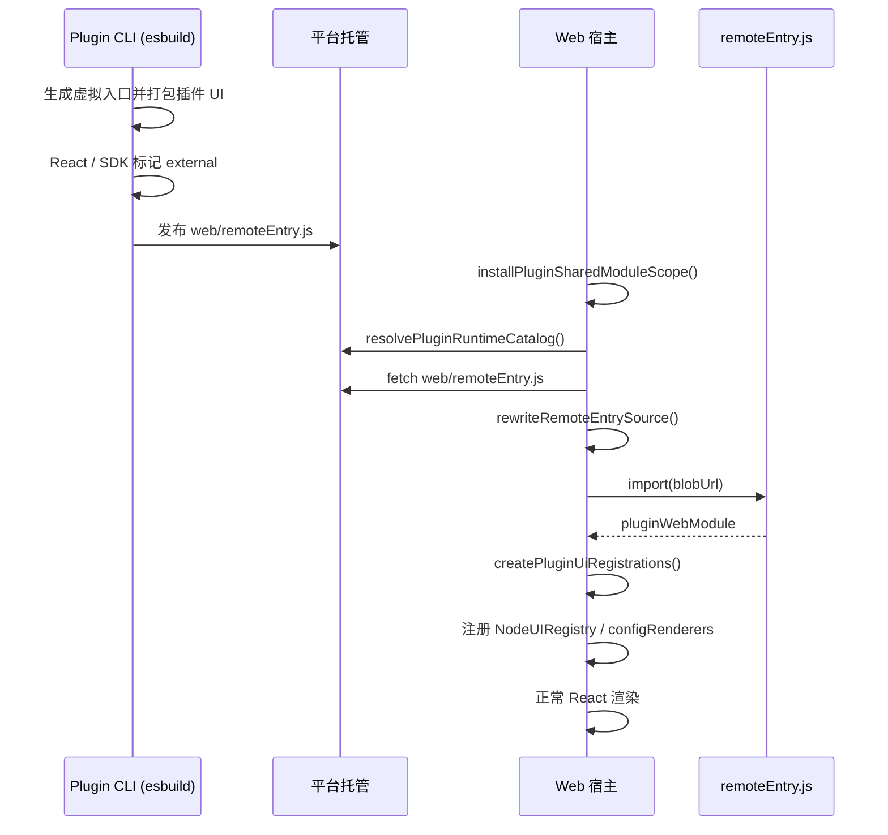

# 远程组件动态加载方案

## 1. 文档状态

- 状态：Web 宿主运行时已实施；Plugin CLI Web Remote 构建已实施
- 基线日期：2026-08-09
- 适用范围：`apps/web` 插件运行时、`packages/workflow-plugin-cli` Web Remote 构建、第三方插件自定义 UI
- 目标：说明工作流编辑器如何在不使用 Webpack Module Federation 的前提下，动态加载并渲染插件 Remote UI

本文描述当前已落地的 Web Remote 加载与注册方案，不表示 Server 或 Executor 侧已经具备同等能力。

## 2. 核心结论

当前方案**不是 Webpack Module Federation**，而是**借鉴 Module Federation 的核心思想**，用更轻量的自研运行时实现：

1. 插件侧通过 esbuild 生成单个 ESM 文件 `web/remoteEntry.js`；
2. 宿主在页面启动时安装共享模块作用域，注入 React、React DOM 和 `@ai-workflow/plugin/ui` 单例；
3. 工作流页按 Runtime Catalog 拉取 `remoteEntry.js`，改写其中的 external import，再通过原生 `import(blobUrl)` 执行；
4. 宿主从导出对象 `pluginWebModule` 中取出 React 组件，注册进 `NodeUIRegistry` 与配置 renderer map；
5. 最终与内置节点共用同一 React 树、同一 Context 和同一套渲染路径。

该方案与 Module Federation 共享同一组设计目标——Remote Entry、Shared Singleton、运行时动态加载、宿主消费 Remote 导出——但不引入 MF 容器协议、版本协商和 async chunk 联邦图。

## 3. 与 Module Federation 的对应关系

| Module Federation 概念 | 当前实现                                                               |
| ---------------------- | ---------------------------------------------------------------------- |
| Remote Entry           | `web/remoteEntry.js`                                                   |
| Shared Singleton       | `globalThis.__AI_WORKFLOW_PLUGIN_SHARED__`                             |
| External 依赖          | esbuild `external: ['react', 'react-dom', '@ai-workflow/plugin', ...]` |
| 运行时动态加载         | `fetch` → import 改写 → `import(blobUrl)`                              |
| 稳定导出契约           | `pluginWebModule.nodes[nodeKey].{content, renderer, configRenderer}`   |
| Host 消费 Remote       | 注册到 `NodeUIRegistry` / `NodeConfigRendererMap`                      |

| 维度     | Webpack Module Federation              | 当前方案                       |
| -------- | -------------------------------------- | ------------------------------ |
| 运行时   | MF 容器协议                            | 原生 ESM + Blob dynamic import |
| 共享依赖 | `shared` 配置 + 版本协商               | 全局对象手动注入               |
| 产物结构 | `remoteEntry` + 多个 async chunks      | 单个 `remoteEntry.js`          |
| 构建工具 | Webpack / Rspack MF 插件               | esbuild                        |
| 加载方式 | `container.init()` + `container.get()` | fetch 文本 + import 改写       |

## 4. 何时生成与加载 Web Remote

只有 Manifest 声明了以下任一能力时，Plugin CLI 才会生成 `web/remoteEntry.js`，Web 才会尝试加载：

- `node.ui.node.custom: true`：完整自定义节点 renderer
- `node.ui.node.remoteExport`：自定义节点 content
- `node.ui.form.custom: true`：完整自定义配置 renderer

声明式节点、schema 驱动表单和 BaseNode 默认 content **不会**进入 Web Remote。

## 5. 端到端流程



## 6. 构建侧：Plugin CLI

构建入口位于 `packages/workflow-plugin-cli/src/pipeline/artifacts.ts`。

CLI 不会要求插件作者手写 remote entry，而是根据 Manifest 中的 UI 声明生成虚拟入口，再交给 esbuild 打包：

```ts
export const pluginWebModule = {
  nodes: {
    [nodeKey]: {
      content?: PluginNodeContentComponent
      renderer?: PluginNodeRendererComponent
      configRenderer?: PluginConfigRendererComponent
    },
  },
}

export default pluginWebModule
```

关键约束：

- `bundle: true`，输出单个 `web/remoteEntry.js`
- `format: 'esm'`，`platform: 'browser'`
- React、React DOM、`@ai-workflow/plugin` 及其子路径必须 `external`
- 同时生成 `web/remote-manifest.json`，记录 entry、shared 列表和 export 映射

这样插件 bundle 只包含第三方 UI 逻辑，共享依赖由宿主在运行时注入。

## 7. 宿主侧：共享模块作用域

代码入口：`apps/web/src/features/workflow/plugin-runtime/install-plugin-shared-scope.ts`

Web 应用启动后，宿主会把以下模块挂到全局对象：

```ts
globalThis.__AI_WORKFLOW_PLUGIN_SHARED__ = {
  react,
  'react/jsx-runtime',
  'react/jsx-dev-runtime',
  'react-dom',
  'react-dom/client',
  '@ai-workflow/plugin',
  '@ai-workflow/plugin/ui',
}
```

作用等价于 Module Federation 的 `shared: { react: { singleton: true } }`：

- 避免每个插件各自打包 React
- 保证 Hook、Context 和 `@ai-workflow/plugin/ui` 与宿主处于同一运行时实例

## 8. 宿主侧：动态加载 remoteEntry

代码入口：`apps/web/src/features/workflow/plugin-runtime/load-plugin-web-remote.ts`

加载步骤：

1. 通过认证接口拉取 `web/remoteEntry.js` 文本；
2. 执行 `rewriteRemoteEntrySource()`，把 external import 改写成读取 `__shared__`；
3. 将改写后的源码写入 Blob URL；
4. 使用 `import(/* @vite-ignore */ blobUrl)` 动态执行；
5. 从 `default` 或 `pluginWebModule` 导出中取出 `PluginWebModule`。

典型改写：

```js
// 原始（esbuild external 保留的 import）
import { jsx as _jsx } from 'react/jsx-runtime'

// 改写后
const { jsx: _jsx } = __shared__['react/jsx-runtime']
```

改写规则覆盖：

- `import * as X from 'specifier'`
- `import { foo as bar } from 'specifier'`
- `import Default from 'specifier'`

其中 `import { foo as bar }` 必须改写为 JS 解构语法 `{ foo: bar }`，不能直接保留 TypeScript import alias 的 `as`，否则会在 blob 模块执行时报语法错误。

Blob URL 无法像 Vite/Webpack 那样解析 npm 包路径，因此共享依赖桥接是这套方案必须自研维护的部分。

## 9. 宿主侧：注册与渲染

代码入口：

- `apps/web/src/features/workflow/plugin-runtime/create-workflow-plugin-runtime.ts`
- `apps/web/src/features/workflow/plugin-runtime/create-plugin-ui-registrations.ts`

Runtime Catalog 返回当前工作流锁定的插件版本后，宿主对每个需要 Web Remote 的插件并行执行：

1. `loadPluginWebRemote(assetUrl)`
2. `createPluginUiRegistrations(manifest, webModule)`
3. 把组件注册进 `NodeUIRegistry` 和 `NodeConfigRendererMap`
4. 与内置 Catalog 合并，生成 `WorkflowPluginRuntime`

三种 UI 模式与注册结果：

| Manifest 声明       | 导出字段         | 注册目标                             | 渲染行为                     |
| ------------------- | ---------------- | ------------------------------------ | ---------------------------- |
| `remoteExport`      | `content`        | `NodeUIRegistry`，`kind: 'content'`  | 在 BaseNode 内渲染自定义内容 |
| `node.custom: true` | `renderer`       | `NodeUIRegistry`，`kind: 'renderer'` | 完整接管节点外壳             |
| `form.custom: true` | `configRenderer` | `NodeConfigRendererMap`              | 完整接管配置面板             |

注册完成后，Remote 组件与内置节点没有第二套渲染器，仍通过现有 `WorkflowEditor` / `NodeUIRegistry` 路径渲染。

## 10. 失败处理与编辑器降级

Web Remote 加载或 UI 注册失败时：

- 错误写入 `WorkflowPluginRuntime.pluginRemoteErrors`
- 若 Manifest 声明的 Remote 组件未能全部注册，`hasUnresolvedRemoteUi = true`
- 工作流编辑器进入只读模式，并通过 toast 提示错误
- 声明式节点可继续展示 BaseNode；完整 `custom` UI 依赖未满足时禁止保存

这与 [插件开发与运行架构](./plugin-development-architecture.md) 中的故障策略一致。

## 11. 安全边界

Remote UI 与宿主 React 运行在同一页面上下文，可以访问 DOM 和页面内存，**不是安全沙箱**。

因此：

- `node.custom: true`、`form.custom: true` 和自定义 content 都必须声明 `web:execute` 权限
- 安装时需要用户明确授权
- 平台重新托管插件产物，不直接加载作者域名 URL
- 若未来需要完全不可信 UI，应使用 sandboxed iframe + `postMessage`，那是另一套能力，不应伪装成普通插件 renderer

## 12. 代码归属

| 路径                                                                              | 职责                                                |
| --------------------------------------------------------------------------------- | --------------------------------------------------- |
| `packages/workflow-plugin-cli/src/pipeline/artifacts.ts`                          | 生成 `web/remoteEntry.js` 与 `remote-manifest.json` |
| `apps/web/src/features/workflow/plugin-runtime/install-plugin-shared-scope.ts`    | 安装共享模块作用域                                  |
| `apps/web/src/features/workflow/plugin-runtime/load-plugin-web-remote.ts`         | 拉取、改写并动态执行 remoteEntry                    |
| `apps/web/src/features/workflow/plugin-runtime/create-workflow-plugin-runtime.ts` | 合并 Catalog、加载 Remote、构建运行时               |
| `apps/web/src/features/workflow/plugin-runtime/create-plugin-ui-registrations.ts` | 把 Remote 组件注册进 UI Registry                    |
| `apps/web/src/pages/app/workflow.tsx`                                             | 工作流页触发 Runtime 创建                           |
| `examples/remote-render`                                                          | 覆盖 content / renderer / configRenderer 的示例插件 |

## 13. 示例与验证

示例插件 `@examples/remote-render` 提供三种 Remote UI 模式，可用于验证加载链路：

1. 执行 `pnpm plugin:build` 生成 `dist/web/remoteEntry.js`
2. 发布并安装插件
3. 在工作流中添加节点，确认画布与配置面板渲染正常

## 14. 相关文档

- [插件开发与运行架构](./plugin-development-architecture.md)
- [插件运行时目录重构方案](./plugin-runtime-catalog-refactor.md)
- [Plugin CLI 实现说明](./plugin-cli-implementation.md)
