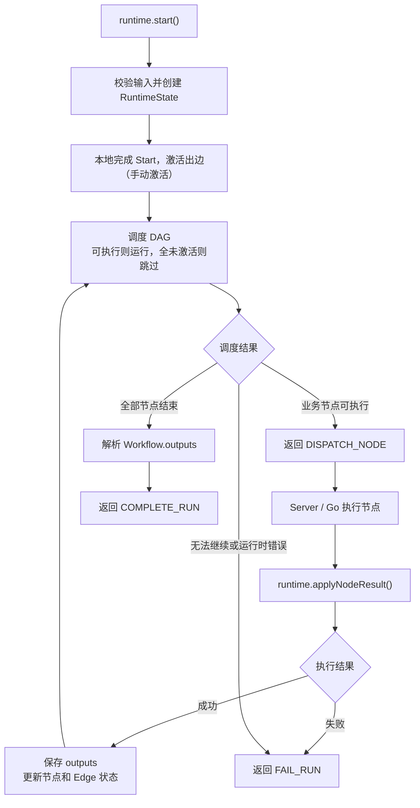

# @ai-workflow/runtime

@ai-workflow/runtime是整个工作流的“状态机+调度器”，不负责执行节点，也不负责操作数据库和mq。只根据Workflow和当前的RuntimeState，决定下一步哪些节点该执行，哪些节点该跳过，以及工作流是否完成或失败



## 一、核心职责

### 1. 建立 ExecutionPlan

创建 Runtime 时，先把 Workflow 转换成便于查询的内存索引：

> 具体看 [packages/workflow-runtime/src/compiler/execution-plan.ts](src/compiler/execution-plan.ts)

```ts
{
  workflow,
  nodeById,
  incomingEdges,
  outgoingEdges,
  childrenByScope,
  edgesByScope,
}
```

这样调度时可以直接查询某个节点的入边、出边和所在 Scope，不需要反复遍历整个 Workflow。

### 2. 保存 RuntimeState

RuntimeState 是一次 WorkflowRun 的可持久化执行快照，主要包含：

> 具体看 [packages/workflow-runtime/src/runtime/runtime-state-schema.ts](src/runtime/runtime-state-schema.ts)

```ts
{
  schemaVersion,
  revision,
  runId,
  workflowId,
  workflowVersionId,
  status,

  startInput,
  systemVariables,

  nodeStates,
  edgeStates,
  executions,

  nextExecutionSequence,
}
```

其中有三组关键状态：

1. 节点状态

```text
WAITING → RUNNING → SUCCEEDED
                  ↘ FAILED

WAITING → SKIPPED
```

2. Edge状态

```text
WAITING → ACTIVE
        → INACTIVE
```

3. Execution 状态

```text
RUNNING → SUCCEEDED
        → FAILED
```

### 3. 解析运行时变量

Runtime 统一解析四种值：

- 直接填写的值
- 上游节点输出
- 系统变量
- 环境变量

Runtime 会找到某一个最近一次成功的 Execution，从 outputs.result.data.name 中读取值。

相当于就是把动态的变量，换为具体运行后的结果。系统变量和环境变量只作为引用解析上下文，
不会自动展开并追加到节点输入；例如声明输入 `user_id` 引用了系统变量，Executor 收到的是
`user_id: <真实值>`，而不是额外的 `sys.user_id` 字段。

### 4. 解析节点 Config

node.inputs 的结构已经由 Core 明确为 VariableValue，所以 Runtime 可以统一解析。

但 node.config 不能递归扫描并猜测哪些字段是变量。每个支持的节点类型必须注册 Config projector：

```ts
const configResolver = createRuntimeNodeConfigResolver({
  code: projectStaticJsonNodeConfig,
  llm: projectLlmNodeConfig,
  http: projectHttpNodeConfig,
  condition: projectConditionNodeConfig,
})
```

HTTP projector 解析 Headers、Params 和 Body 中的 VariableValue，Condition projector 解析每条规则的
左右值，LLM projector 解析上下文消息中的变量 Token。Go Executor 只接收投影后的静态 JSON，不理解
Core 的变量引用结构。

### 5. 产生 Effect

Runtime 不执行外部操作，只返回 Effect：

```ts
type RuntimeEffect = DispatchNodeEffect | CompleteRunEffect | FailRunEffect
```

分别表示：

- DISPATCH_NODE：Server 应该派发业务节点
- COMPLETE_RUN：Server 应该完成 WorkflowRun
- FAIL_RUN：Server 应该将 WorkflowRun 标记为失败

## 二、Runtime 的核心调度规则

最重要的逻辑在 drainRootScope()。对于每个 WAITING 节点：

- 先等待全部入边离开 WAITING
- 只要至少一条入边是 ACTIVE，节点就执行一次
- 如果全部入边都是 INACTIVE，节点变成 SKIPPED
- 被跳过节点的全部出边变成 INACTIVE
- Skip 会继续向下传播，直到整个 DAG 状态稳定

如图：

```text
所有入边都已确定
        ↓
至少一条 ACTIVE？── 是 ─→ 执行节点
        │
        否
        ↓
     SKIPPED
```

Runtime 不要求所有入边都为 ACTIVE，只要求所有入边都已经确定，并且至少有一条 ACTIVE。

## 三、启动流程 runtime.start()

### 1. 创建 Runtime

```ts
const runtime = createWorkflowRuntime(workflow, {
  workflowVersionId,
  configResolver,
})
```

### 2. 调用 start()

```ts
const transition = runtime.start({
  runId,
  input,
  systemVariables,
})
```

### 3. 校验系统变量

Runtime 检查：

- 系统变量键是否完整
- 是否存在未知字段
- 每个变量是否为合法 JSON
- dataType 是否匹配
- workflow_id 是否等于当前 Workflow
- workflow_run_id 是否等于当前 Run

### 4. 归一化 Start 输入

根据 Start 节点的 outputs 定义处理：

- 拒绝未知字段
- 检查必填字段
- 应用 defaultValue
- 拒绝非 JSON 值
- 检查 dataType

### 5. 创建初始 RuntimeState

初始状态类似：

```text
所有 Node  = WAITING
所有 Edge  = WAITING
Run        = RUNNING
revision   = 0
```

### 6. 本地完成 Start

Start 不发送给 Go Executor。
Runtime 会：

- 为 Start 创建一个成功 Execution
- 将归一化输入保存为 Start outputs
- 将 Start 的已连接出边设为 ACTIVE

### 7. 推进 DAG

Runtime 调用 drainRootScope()：

- 跳过未激活分支
- 本地完成已经到达的 End
- 为 Ready 业务节点解析 inputs/config
- 创建 RUNNING Execution
- 产生 DISPATCH_NODE

### 8. 返回第一次 Transition

```ts
{
  state: runtimeState,
  effects: [dispatchNodeEffect],
}
```

此时 revision 会更新为 1。

Server 负责持久化 State，并将 DISPATCH_NODE 转换成 Protocol Command。

## 四、节点结果回流 applyNodeResult()

Go Executor 返回结果后，Server 完成 Protocol、租约和幂等校验，再调用：

```ts
runtime.applyNodeResult(state, result)
```

具体顺序如下。

### 1. 恢复 RuntimeState

Runtime 先通过 Zod Schema 重新解析 State，得到一个新的可修改副本，不直接修改调用方传入的旧快照。

然后检查：

- runId
- workflowId
- workflowVersionId
- 系统变量身份
- Node/Edge 索引
- executionKey 与 Execution 记录
- latestExecutionKey
- Node 与 Execution 状态
- sequence 是否重复
- nextExecutionSequence 是否正确
- Run 整体状态是否一致

### 2. 检查 Run 是否已经终态

如果已经 `SUCCEEDED` 或 `FAILED`，拒绝继续应用结果：

```text
RUN_ALREADY_TERMINAL
```

### 3. 查找对应 Execution

通过：

```ts
result.executionKey
```

查找当前 RUNNING Execution。

重复、迟到或者错误的 executionKey 会直接抛给 Server，不会把一个有效 Run 错误地改成失败。

### 4. 处理失败结果

如果 Executor 返回：

```ts
{
  status: 'FAILED',
  error: {
    code,
    message,
    retryable,
    details,
  },
}
```

Runtime 会：

1. 转换成稳定的 `RuntimeErrorData`
2. Execution 变成 FAILED
3. Node 变成 FAILED
4. Run 变成 FAILED
5. revision 加一
6. 返回 `FAIL_RUN`

当前 v1 不做业务自动重试。

### 5. 处理成功结果

如果返回成功：

```ts
{
  status: 'SUCCEEDED',
  outputs,
  activatedHandles,
}
```

Runtime 会：

1. 根据节点 `outputs` 定义投影可引用变量
2. 忽略未声明字段；原始 Executor 输出仍由 Server 保存到 NodeRun
3. 检查必填字段
4. 应用默认值
5. 检查 JSON 和 dataType
6. Execution 变成 SUCCEEDED
7. Node 变成 SUCCEEDED

### 6. 收敛节点出边

Runtime 根据 `activatedHandles` 设置出边：

```ts
activatedHandles.has(edge.sourceHandle) ? 'ACTIVE' : 'INACTIVE'
```

例如 Condition 返回：

```ts
activatedHandles: ['yes']
```

那么：

```text
yes 对应 Edge → ACTIVE
no  对应 Edge → INACTIVE
```

Runtime 不重新计算 Condition 表达式，只解释 Executor 返回的 Handle。

### 7. 再次推进 DAG

继续调用 `drainRootScope()`：

```text
节点结果回来
    ↓
更新 Execution 和 Node
    ↓
设置出边 ACTIVE / INACTIVE
    ↓
传播 SKIPPED
    ↓
派发新的 Ready 节点
    ↓
或者完成/失败
```

### 8. 返回下一次 Transition

可能返回三种结果。

继续派发：

```ts
{
  state,
  effects: [{ type: 'DISPATCH_NODE', ... }],
}
```

全部结束：

```ts
{
  state,
  effects: [{
    type: 'COMPLETE_RUN',
    outputs,
  }],
}
```

运行失败：

```ts
{
  state,
  effects: [{
    type: 'FAIL_RUN',
    error,
  }],
}
```

---

## 五、工作流如何完成

当满足以下条件时：

- 没有 RUNNING 节点
- 没有 WAITING 节点
- 所有分支已经执行或跳过
- Workflow outputs 可以成功解析

Runtime 将：

1. 从 `Workflow.outputs[].value` 解析最终输出
2. 把 Run 状态设置为 `SUCCEEDED`
3. 返回 `COMPLETE_RUN`

最终结果不读取 End.config。

End 只是控制节点，表示某条路径已经到达终点。真正的工作流公开结果来自：

```ts
workflow.outputs
```

---

## 六、它与其他模块的边界

```text
workflow-core
  负责 Workflow 静态正确性
          ↓
workflow-runtime
  负责动态状态、变量解析和 DAG 调度
          ↓
apps/server
  负责数据库、事务、MQ、租约和幂等
          ↓
workflow-protocol
  负责 TS/Go 消息格式
          ↓
Go Executor
  负责单个业务节点的真实执行
```

Runtime 明确不负责：

- Prisma 持久化
- RabbitMQ
- Outbox/Inbox
- nodeRunId 和 commandId
- leaseToken 和 deadline
- HTTP、LLM、RAG、Code 的业务执行
- 重复消息幂等
- Workflow 静态校验
- Start/End 的 MQ 往返

## 7、完整流程



核心就是一个循环：

```text
启动 → 调度节点 → 等待结果 → 更新状态 → 继续调度 → 完成或失败
```
